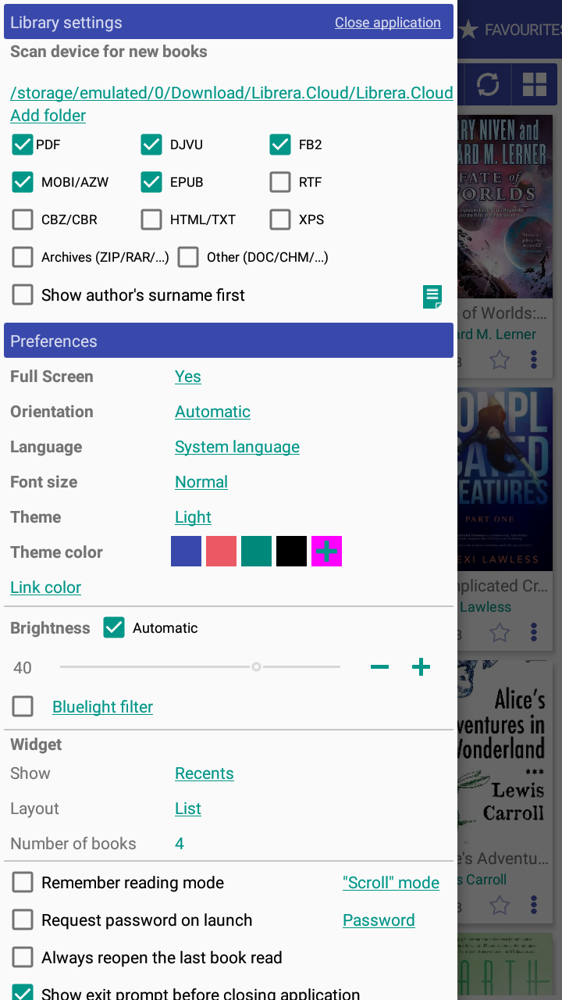
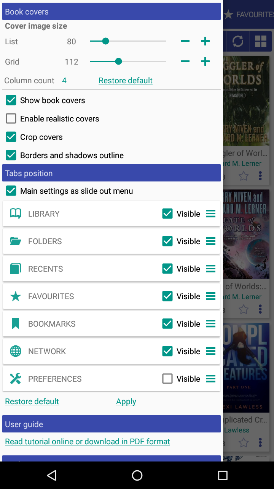

## en

# Left Menu

> Left menu allow user to configure many application settings.

* 1 - Library settings
* 2 - App Preferences
* 3 - Cover and tabs settings

|1|2|3|
|-|-|-|
|||

## ru

# Левое меню

> В левом меню приложения доступно множество настроек прилоежия

* 1 - Настройки библиотеки
* 2 - Настройки приложения
* 3 - Обложки и позиция вкладок

|1|2|3|
|-|-|-|
|||