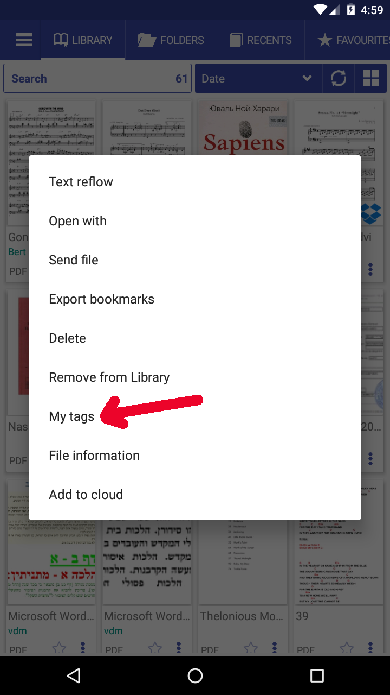
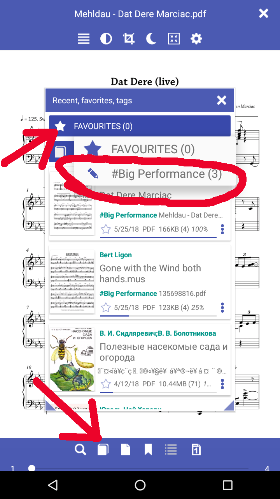

# Customs Tags supoprt

Lorem Ipsum is simply dummy text of the printing and typesetting industry. 
Lorem Ipsum has been the industry's standard dummy text ever since the 1500s, 
when an unknown printer took a galley of type and scrambled it to make a type specimen book. 
It has survived not only five centuries, but also the leap into electronic typesetting, remaining essentially unchanged. 
It was popularised in the 1960s with the release of Letraset sheets containing Lorem Ipsum passages, 
and more recently with desktop publishing software like Aldus PageMaker including versions of Lorem Ipsum.

>Phlebas was an old one too; it was written just after The Wasp Factory, in 1984. 
I've found that rewriting an old book took much more effort than writing one from scratch, 
but I had to go back to do right by these things. Now I can go on and start completely new stuff.

|Click menu|My tags|Create tag|
|-|-|-|
|||

|Assign tag|Favorite tags list|Filter by tag|
|-|-|-|
|||

|All tags in recent menu|Books list with tags|
|-|-|
|