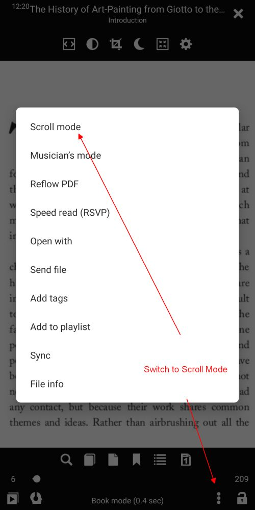
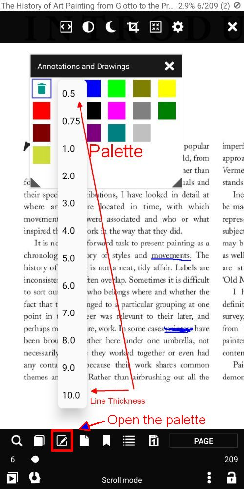
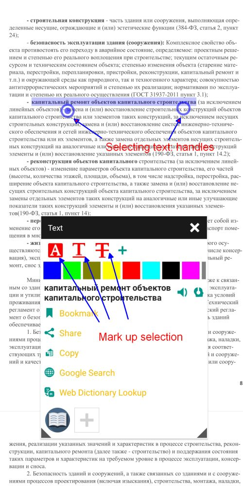
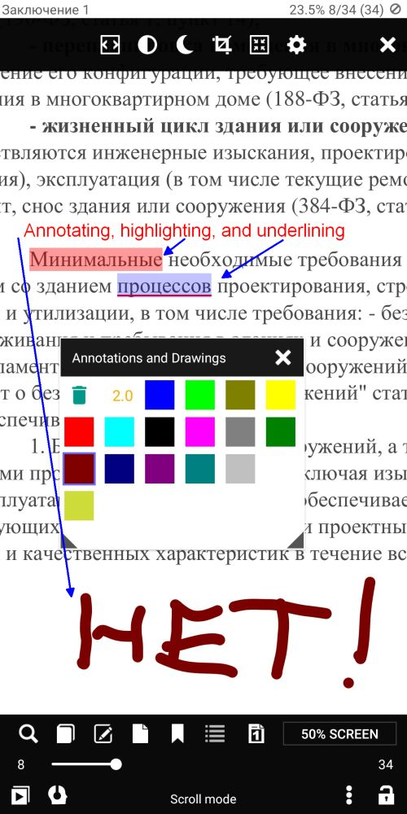
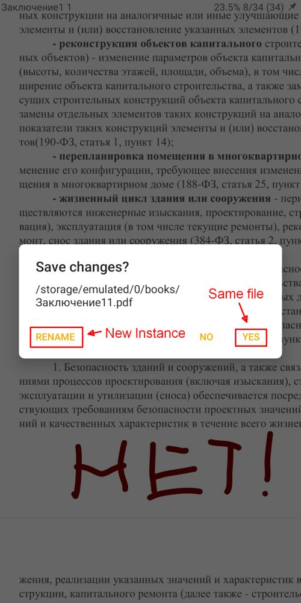
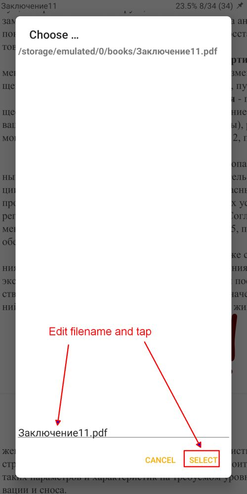
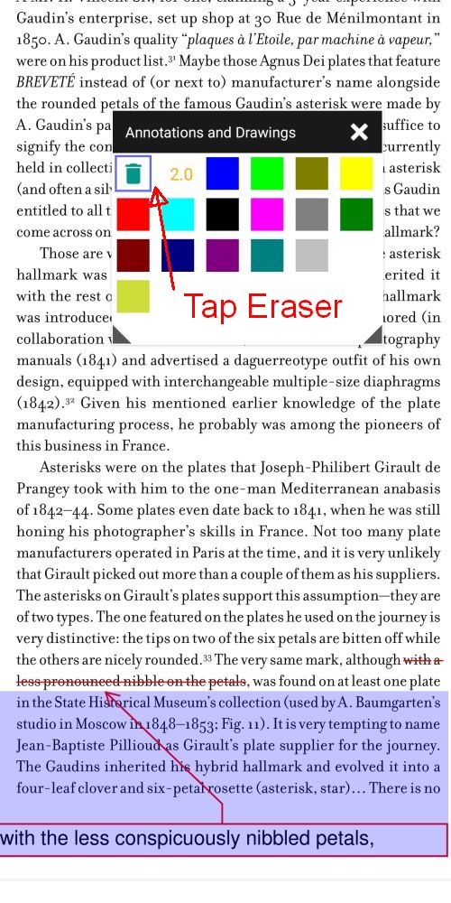
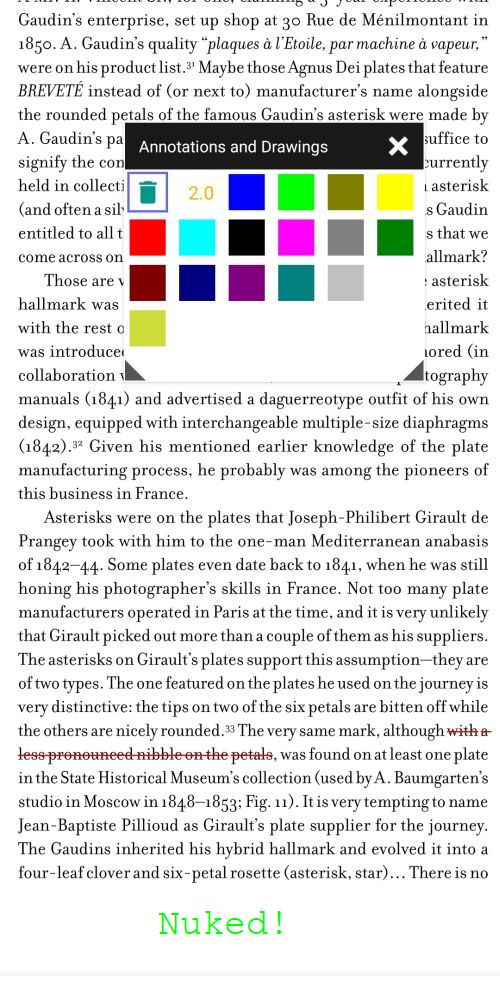

# Анотування та малювання у файлах PDF

> _Librera_ підтримує основні інструменти анотації та розмітки малювання в документах PDF.

> NB! **Ці інструменти працюють лише в режимі SCROLL**

Щоб зробити PDF-документ придатним для малювання та/або анотування, користувачу слід перейти в режим прокручування.
Це відкриє значок _Редагувати_ у нижньому меню.

## Файли PDF без текстового шару
- Рукописні нотатки
- Малюнки від руки (настійно рекомендується мати стилус)
- Витирання тексту, зображень, даних кредитної картки тощо.
- Стирання попередніх позначок
> Порада: зафіксуйте «замок» у нижньому правому куті, щоб запобігти бічним переміщенням!

||||
|-|-|-|
||||

## PDF-файли з текстовим шаром
На додаток до вищевказаних позначок:
- Виділення тексту
- Підкреслення
- Пробиваючи
> Порада: просто виберіть слово (тривалим натисканням), щоб відкрити набір інструментів

|||
|-|-|
|||

## Розмітка за допомогою попередньо встановлених інструментів
Знак **+** дозволяє користувачеві додати до списку інструментів лише один із трьох у поточному вибраному кольорі.
Це створює попередній набір інструментів, за допомогою якого ви можете швидко вказати слова та послідовності слів, пов’язані один з одним або заслуговують на вашу особливу увагу (наприклад, ім’я _Girault_ у прикладі нижче)

|||
|-|-|
|||

## Збереження відредагованих файлів
*Жест _Закрити_ відкриє вікно _Зберегти зміни?_
*Ви можете зберегти змінений файл, натиснувши _YES_
*Ви можете зберегти зміни до нового, перейменованого файлу. Торкніться _RENAME_
*Відредагуйте назву файлу внизу вікна _Choose_ і торкніться _SELECT_

|||
|-|-|
|||

> Примітка. Гумка в палітрі _Анотації та малюнки_ може використовуватися, щоб загострити малюнки, залишені іншими програмами.

> Ви можете викликати палітру:
- Натискання на розмітку
- Торкніться значка _Редагувати_ у нижньому меню

> Виберіть _Eraser_ (Він для сміття), натиснувши на нього, а потім натисніть на позначки, які ви збираєтеся видалити.

|||
|-|-|
|||
