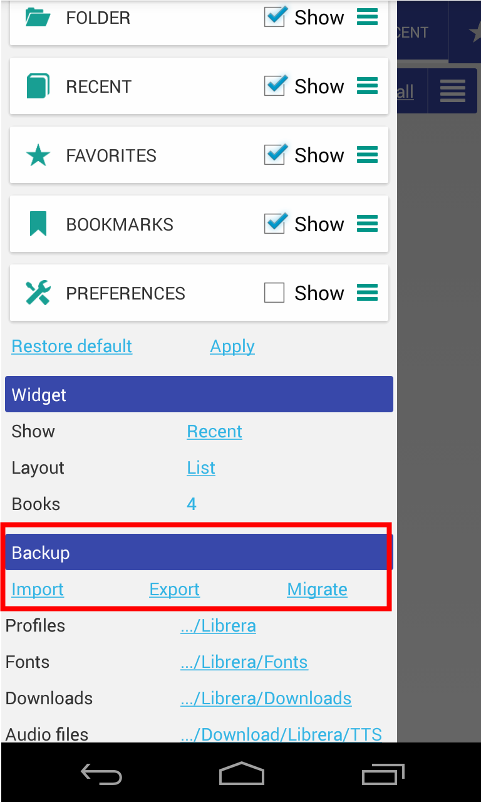
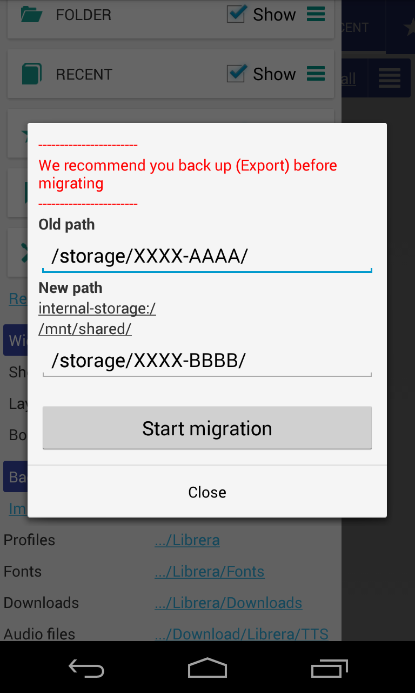

# Copia de seguridad de datos y migración

> Se necesita una copia de seguridad de datos si necesita transferir libros a un nuevo dispositivo oa una nueva carpeta o nueva tarjeta SD

# Exportar (copia de seguridad)

Presione el botón de exportación para guardar todas las configuraciones de la aplicación en el archivo .zip

Exportación guarda:

* Configuración de la aplicación
* Marcadores
* Progreso de lectura
* Etiquetas de usuario
 
# Importar
Presione importar para restaurar la copia de seguridad del archivo .zip
Comience la migración si es necesario

# Migración

La migración solo reemplaza las rutas de los archivos en los archivos de configuración de la aplicación.

La ruta completa del libro se almacena en la configuración, por ejemplo, si sus libros se colocaron en una carpeta

/storage/Books/example.pdf

y luego mueve el libro a la carpeta **MyBooks**

Debes establecer la ubicación de los nuevos libros en la configuración de la aplicación

/storage/MyBooks/example.pdf

Debe ejecutar &quot;Migración&quot; y reemplazar:

Camino antiguo: **/ Libros /**
Nueva ruta: **/ MyBooks /**

Si coloca libros en **tarjeta SD externa**, es fácil arreglar rutas para un nuevo lugar
Migración:/almacenamiento/AAAA-AAAA/Libros a/almacenamiento/BBBB-BBBB/Libros

ruta anterior: **/ almacenamiento/AAAA-AAAA /**
nueva ruta: **/ almacenamiento/BBBB-BBBB /**

 
 

|1|2|3|
|-|-|-|
||||
