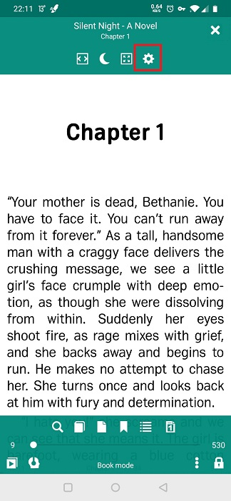
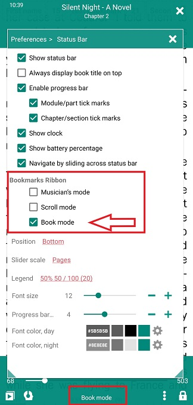
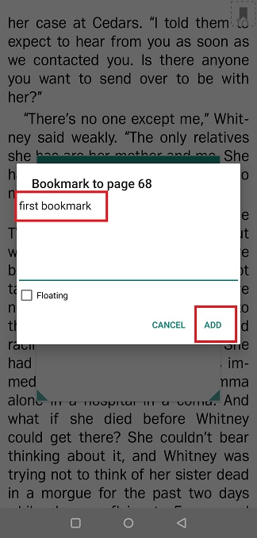
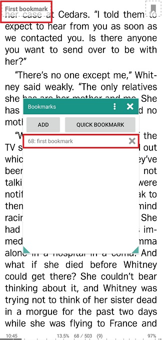
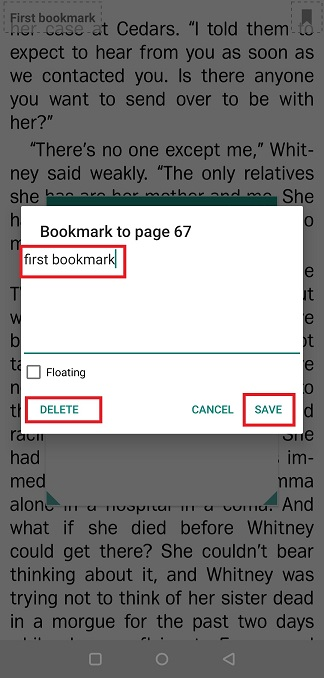
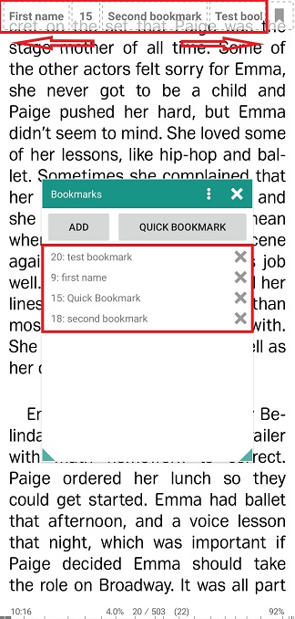
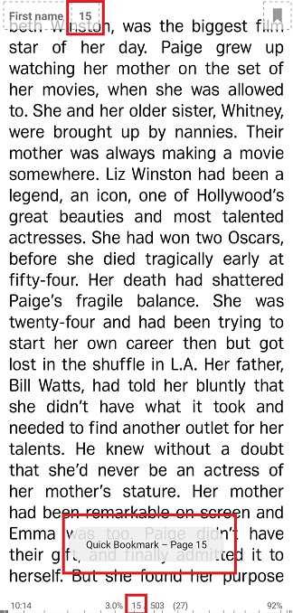
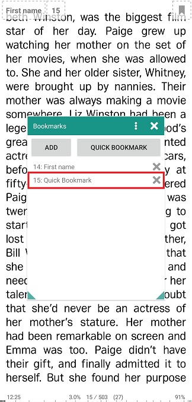

# Utilizzo dei segnalibri in modalità estesa (barra dei segnalibri)

> Puoi fare in modo che **Librera** mostri i tuoi segnalibri sullo schermo in qualsiasi momento durante la lettura di un libro. Verranno mostrati nella parte superiore dello schermo in un cosiddetto _Bookmarks Ribbon_. Questa modalità di segnalibro estesa dovrebbe tornare utile quando è necessario aggiungere nuovi segnalibri o passare da uno all'altro in un istante.
> Ci aspettiamo che questa fantastica funzionalità sia molto richiesta dai musicisti, mentre si esegue l'app in modalità _Musician's_. Quindi, viene fornito con la barra multifunzione abilitata in questa modalità per impostazione predefinita.

Per abilitarlo nelle altre modalità:

* Tocca l'icona _Settings_ per aprire la finestra **Preferenze**
* Tocca la scheda _Status Bar_
* Nel pannello _Libri Marks_ Ribbon_, selezionare la casella accanto alla modalità per cui si intende abilitare la barra multifunzione.

||||
|-|-|-|
||||

Le operazioni con la barra multifunzione _Bookmarks sono illustrate in modalità _Book_. Funziona tutto allo stesso modo per tutte e tre le modalità.

> Se non è più necessario il _Book Ribbon_, è possibile disabilitarlo deselezionando la rispettiva casella nella scheda _Status bar_.

||||
|-|-|-|
||||

**Aggiunta di segnalibri**

> Il floater segnalibro nell'angolo in alto a destra indica che sei attualmente in modalità _Book Marks Ribbon_.

* Tocca il segnalibro mobile sulla pagina che stai per aggiungere ai segnalibri
* Tocca _ADD_ per aggiungere effettivamente il segnalibro tramite la finestra _Bookmarks_
* Aggiungi un commento al segnalibro. Nota che il nome del segnalibro deriva dal tuo commento (**primo segnalibro** nel nostro esempio).
* Tocca **AGGIUNGI** per completare la procedura.

||||
|-|-|-|
||||

Il tuo nuovo segnalibro apparirà nella finestra _Bookmarks_ e allo stesso tempo lo vedrai nella barra multifunzione _Bookmarks_ in alto. Ora, per tornare a questo segnalibro, devi solo toccarlo nella barra multifunzione.

> Nota: una pressione prolungata su un segnalibro nella barra multifunzione apre una finestra di modifica.
* Salva i risultati della modifica toccando **SALVA**
* Oppure puoi eliminare il segnalibro toccando **ELIMINA**
Il nastro diventerà un nastro in piena regola sullo schermo quando hai molti segnalibri. Puoi spostarti attraverso di loro con le dita.

||||
|-|-|-|
||||

**Aggiunta di segnalibri rapidi**

* Tocca il galleggiante dei segnalibri nell'angolo in alto a destra per aprire la finestra _Bookmarks_.
* Tocca **QUICK BOOKMARK**
* Viene così creato un &quot;segnalibro rapido&quot;, indicato dal numero di pagina nella barra multifunzione in alto. Nell'elenco nella finestra _Bookmarks_, andrà come la pagina # e _Quick Bookmark_ accanto.
> È possibile premere a lungo su un segnalibro rapido nell'elenco per abilitarne la modifica o l'eliminazione in una finestra di modifica dei segnalibri a comparsa.

||||
|-|-|-|
||||

> È possibile ignorare alcune operazioni quando si aggiungono o si eliminano i segnalibri utilizzando la barra multifunzione _Bookmarks:

* Una pressione prolungata sul floater dei segnalibri nell'angolo in alto a destra aggiungerà un segnalibro rapido.
* Premendo a lungo su un segnalibro nella barra multifunzione _Bookmarks verrà aperto un prompt che ti suggerisce di eliminarlo.
