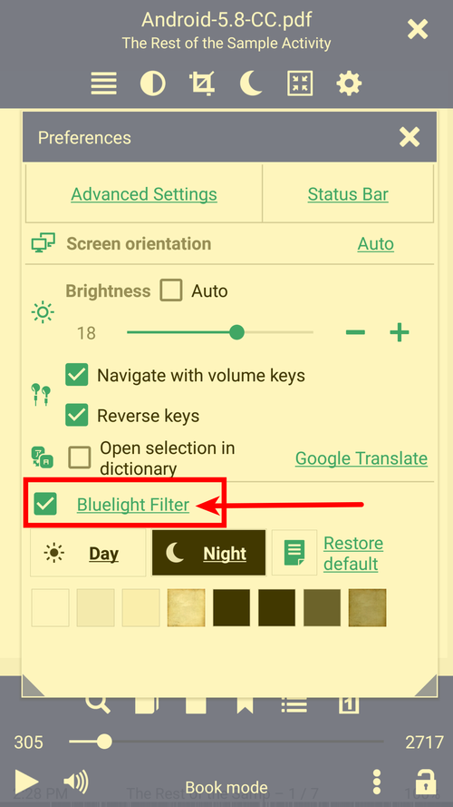
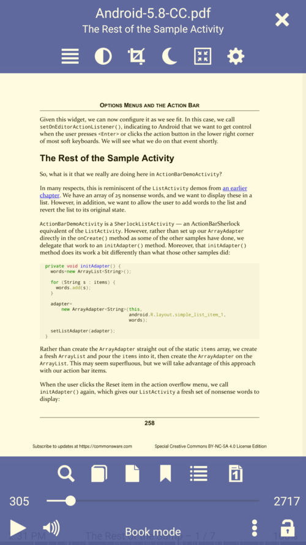

# Регулювання яскравості та фільтр синього світла

> Регулювання яскравості в **Librera Reader** може бути автоматичним, відповідно до налаштувань системи, або користувач може встановити яскравість вручну.
Яскравість можна змінити у вікні **Налаштування** або проведіть пальцем по лівому краю екрана (поставте прапорець, щоб увімкнути цей режим).
Негативна яскравість вказує на те, що ваше налаштування темніше, ніж у системі.
Негативна яскравість включає фільтр синього світла та колір чорний за замовчуванням.

*Налаштуйте автоматичне змінення яскравості залежно від навколишнього освітлення (налаштування системи)
*Змініть яскравість, проведіть пальцем по лівому краю екрана
*Торкніться піктограми яскравості, щоб перейти в режим **Автоматичний**
*Увімкніть/вимкніть слайди по лівому краю на вкладці _Додаткові налаштування_

||||
|-|-|-|
||||

**Фільтр синього світла**
> Фільтр синього світла залежить від вашого налаштування яскравості, він вмикається автоматично, коли налаштування яскравості має негативне значення.

*Фільтр синього світла можна ввімкнути вручну, поставивши прапорець у вікні **Налаштування**
*Фільтр синього світла ввімкнено
*Торкніться _Bluelight Filter_, щоб налаштувати бажаний відтінок (колір)

||||
|-|-|-|
||||
