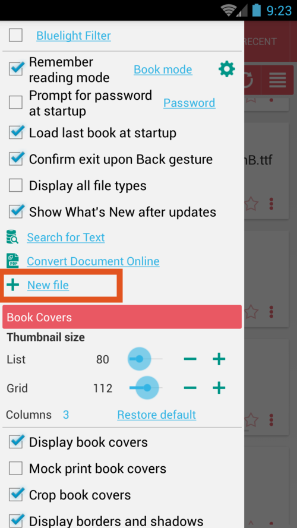
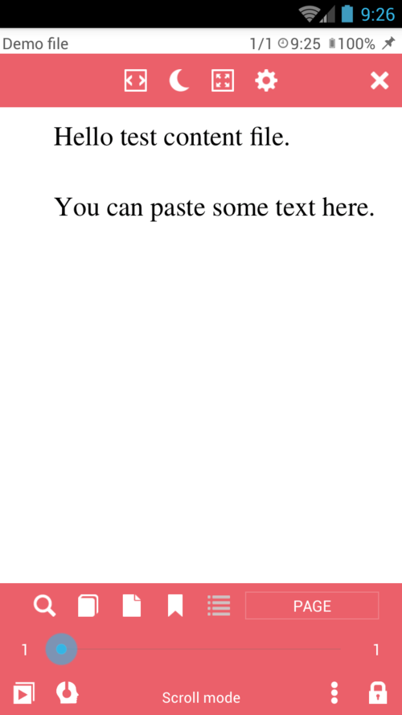

# Erstellen einer neuen TXT-Datei für Notizen, Zitate usw.

> Mit der Notepad-Funktion von **Librera** können Sie Ihre eigenen Dateien im TXT-Format erstellen. Dies ist nützlich, wenn Sie eine Zusammenstellung von Zitaten aus den Büchern erstellen, die Sie gerade lesen (durch Kopieren/Einfügen), Ihre Notizen in ein Buch eintragen, eine Datei für Audioaufnahmen (TTS) zusammenstellen usw.

So erstellen Sie eine neue Datei:
* Tippen Sie auf der Registerkarte &quot;Einstellungen&quot; (Menü) auf den Link &quot;Neue Datei&quot;.
* Geben Sie einen aussagekräftigen Namen für Ihre Datei ein, der mit &quot;.txt&quot; endet.
* Geben Sie den Inhalt dieser neuen TXT-Datei ein oder fügen Sie ihn ein und tippen Sie auf _SAVE_.
> **Die neue Datei wird im Ordner _Downloads_ auf Ihrem Gerät (interner Speicher) gespeichert.**

||||
|-|-|-|
||||
