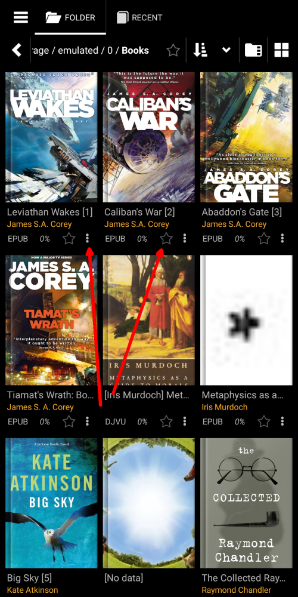
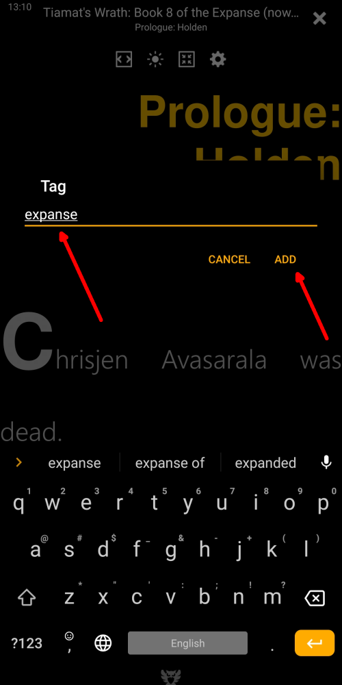
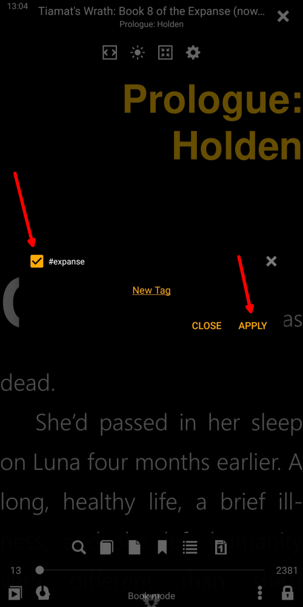
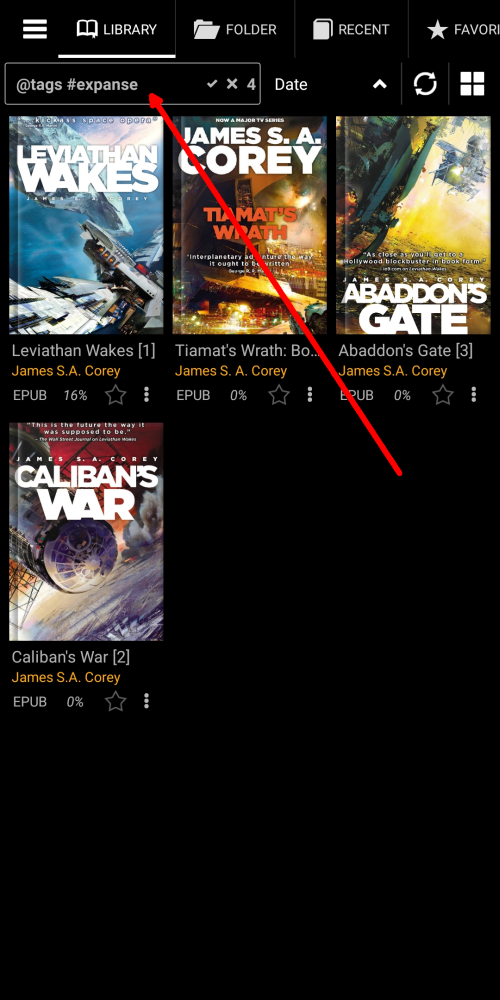
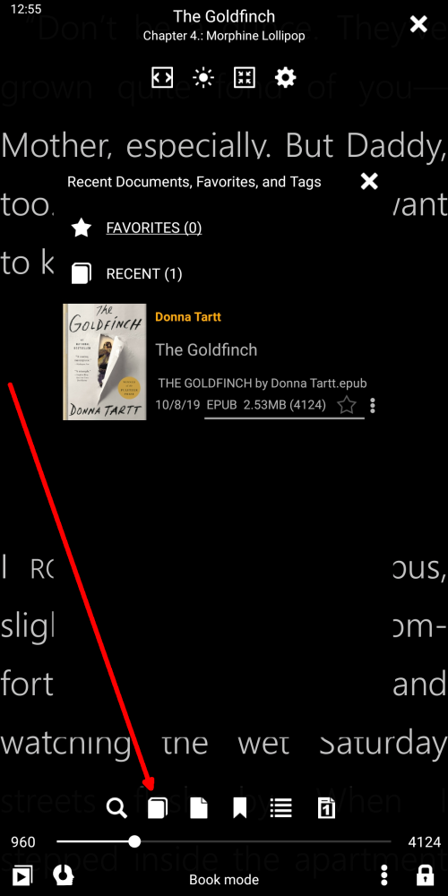
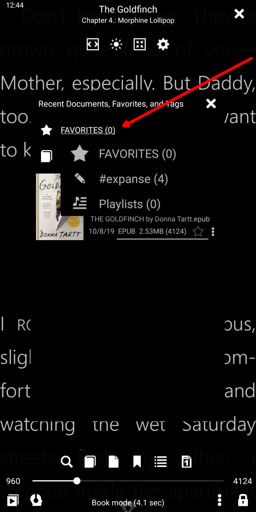

# Добавление и обработка пользовательских тегов

> Добавляя пользовательские теги к книгам в нашей библиотеке, мы добавляем некоторую значимую (для нас) информацию в метаданные книг. Эти теги пригодятся в наших будущих ссылках на книги, которым мы присвоили теги. Они помогут нам организовать книги в Библиотеке, отсортировать их по своему вкусу, создать пользовательские списки книг, легко найти книги в Библиотеке и т. Д.
> Пользовательские теги будут использоваться для всех мыслимых целей наряду с уже существующими обычными тегами электронных книг, такими как [Series](), [Authors](), [Keywords](), [Genres]() и т. Д.

> Есть много способов добавить **новый тег** в книгу.

* Длительным нажатием на значок звездочки (Избранное)
* Вызвав меню книги и нажав _Добавить теги_
* Через окно _File info_ (Подсказка: долгое нажатие на обложку книги приведет вас туда)

|1|2|3|
|-|-|-|
||||

## Добавление и удаление тегов (просто как пирог)

* Нажмите на _Новый тег_
* Добавить содержательную информацию здесь
* Чтобы удалить тег, коснитесь _x_ рядом с ним, а затем подтвердите удаление
> Удаленный тег будет удален из всех книг, которым он назначен.

|4|5|6|
|-|-|-|
||||

## Создание настраиваемого списка книг

* Присвойте метку книге, выбрав ее и нажав _APPLY_
* Ваши собственные списки книг появятся на вкладке **Избранное**
* Нажмите на имя списка, чтобы открыть его на вкладке **Библиотека**

|7|8|9|
|-|-|-|
||||

## Вызов вашего пользовательского списка _Favor_ из книги, которую вы читаете

* Нажмите на значок списка книг в меню.
* Нажмите на _Flected_, чтобы открыть выпадающий список
* Выберите свой заказ и наслаждайтесь

|10|11|12|
|-|-|-|
||||
