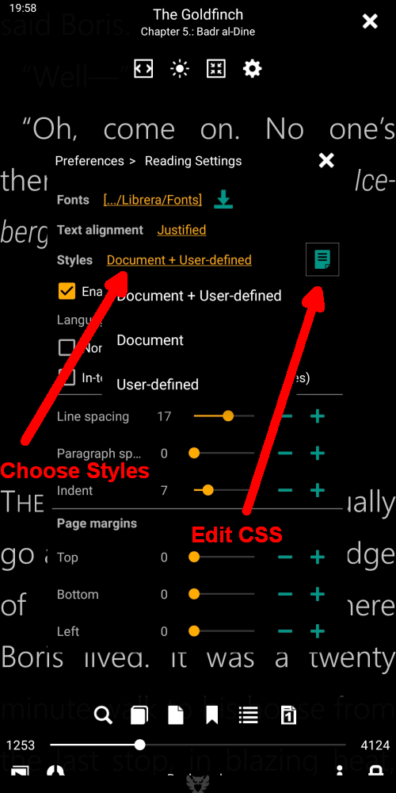
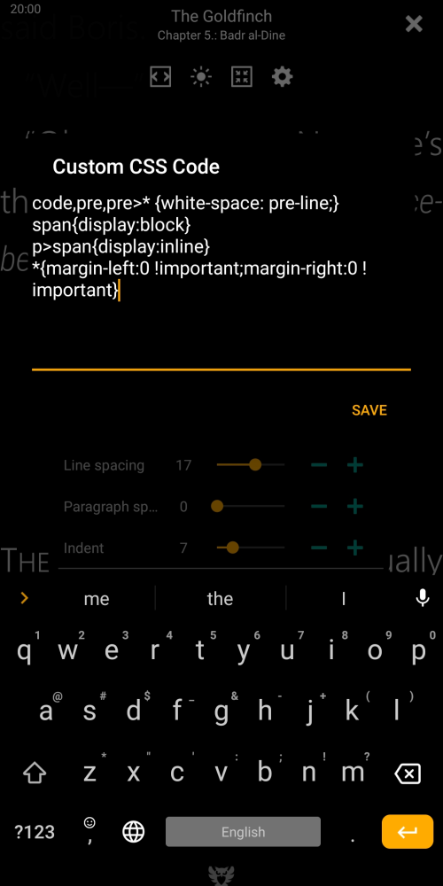

# Benutzerdefinierte CSS-Codierung

> Beim Rendern von Büchern übernimmt **Librera** normalerweise die Formatvorlagen aus der CSS-Datei des Buches und wendet Ihre Einstellungen auch im Fenster **Einstellungen** an. Es kann auch das eine oder andere separat nutzen. Aber manchmal ist es nicht genug. Einige Bücher haben so eigenartigen CSS-Code, dass Sie keine andere Wahl haben, als die CSS-Dateien zu bearbeiten, um die Lesbarkeit zu verbessern. **Librera** bietet Ihnen jedoch eine weitere Option: Fügen Sie vorübergehend benutzerdefinierten CSS-Code hinzu, der nach Abschluss des herausgeforderten Buches einfach entfernt werden kann.

Es werden drei **Styles** -Modi unterstützt:

1. Dokument + Benutzerdefiniert (nimmt die guten Sachen aus den zwei Welten)
2. Dokument (verwendet nur die CSS-Einstellungen des Buches)
3. Benutzerdefiniert (verwendet nur die in den Registerkarten des Fensters **Einstellungen** angegebenen Einstellungen des Benutzers)

* Der Benutzer kann über eine Dropdown-Liste zwischen den Modi wechseln, die beim Tippen auf den Link neben _Styles_ aufgerufen wird.
* Tippen Sie auf das Symbol neben der _Styles_-Liste, um das Fenster **Benutzerdefinierter CSS-Code** zu öffnen und es aufzurufen.

|1|2|3|
|-|-|-|
||||

Dokument + Benutzerdefinierter Modus ist standardmäßig aktiviert

Das Beispiel in Abb. 3 ist aus dem wirklichen Leben übernommen.

{white-space: pre-line;}
Sequenzen von Leerzeichen werden reduziert. Zeilen werden bei Zeilenumbrüchen um umbrochen   und nach Bedarf, um Zeilenfelder zu füllen.

{white-space: pre;}
Sequenzen von Leerzeichen bleiben erhalten. Zeilen werden nur bei Zeilenumbrüchen in der Quelle und bei unterbrochen   Elemente.

span {display: block}
p&gt; span {display: inline}
Beseitigt störende Leerzeilen zwischen den Seiten (Behebung von muPDF-Fehlern).
