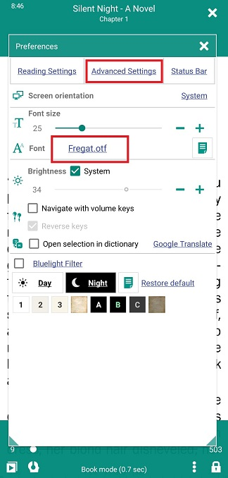
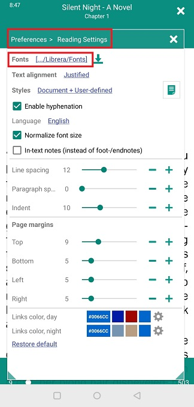
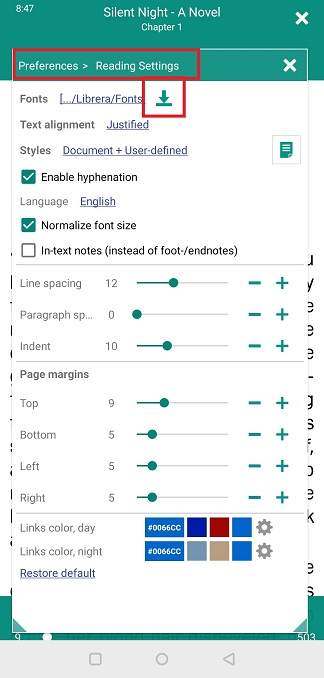
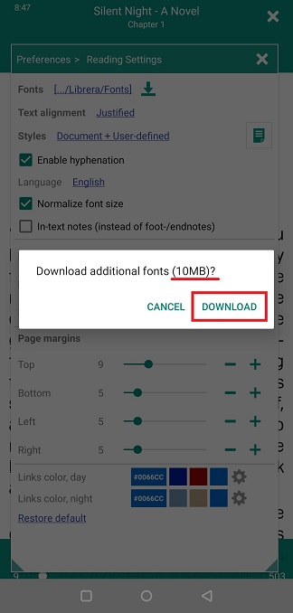
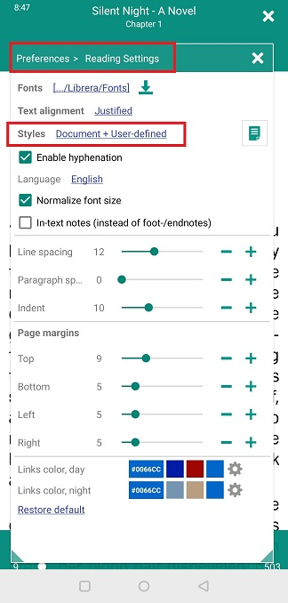
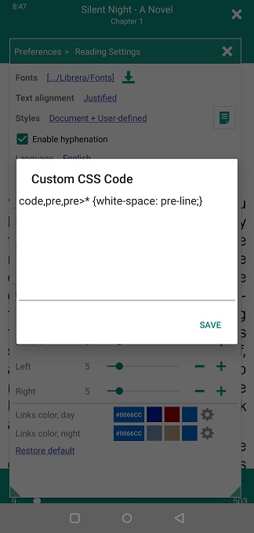

# Configurando fontes e estilos

> **O Librera** permite personalizar a aparência do documento que você está lendo - escolha as fontes ao seu gosto e ajuste seu tamanho, ajuste estilos CSS e altere as primeiras letras em iniciais iniciais (FB2).

Você fará tudo isso acima na guia principal da janela **Preferência** e, obviamente, na guia _Reading Settings_.

> Toque no ícone **Configurações** para abrir a janela **Preferências**.

||||
|-|-|-|
||||

## Ajustes de fonte

* Selecione sua fonte principal tocando no link _Font_ e percorrendo a lista suspensa de fontes disponíveis.

> Você pode adicionar suas fontes favoritas à lista:
1. Crie uma pasta chamada _Fonts_ no armazenamento interno do seu dispositivo.
> Nota: Há outra pasta _Fonts_ em seu armazenamento interno já criada automaticamente pelo **Librera**.
2. Salve suas fontes favoritas na pasta _Fonts_ (ou na pasta _Fonts_ do **Librera**).
> (Você também pode baixar algumas boas fontes do nosso site. Consulte a seção **Configurações de leitura** para obter instruções.)
> Lembre-se de que suas fontes serão respeitadas apenas se os _Styles_ que você selecionou na guia **Configurações de leitura** tiverem _User-defined_ neles.

Para configurar fontes específicas do usuário para diferentes estilos de fonte, toque no ícone ao lado do link _Fonts_ para abrir a janela _Configure Fonts_.

* Toque na configuração de cada estilo e selecione uma fonte para ele.
* Use os botões **para cima** e **para baixo** para pular para a próxima fonte da lista (às vezes isso será suficiente para o seu propósito).
* Não se esqueça de tocar em **APLICAR** quando terminar.

||||
|-|-|-|
||||

||||
|-|-|-|
||||

## Iniciais principais nos livros do FB2

Você pode fazer com que cada capítulo de seu livro comece com uma inicial bonita.
 
> Esta configuração não será exibida durante a leitura em qualquer outro formato.

* Toque no ícone ao lado do link _Fonts_ para abrir a janela _Configure Fonts_
* Marque a caixa de seleção _Lead capítulos com iniciais_ para ativar as iniciais
* Toque no link da fonte para selecionar uma fonte para sua inicial em uma lista suspensa
* Agora escolha o tamanho e a cor da sua inicial tocando nos respectivos links
* Toque em **APLICAR** para salvar as configurações

||||
|-|-|-|
||||

## A guia **Configurações de leitura**

> Essas são as configurações definidas pelo usuário. Eles substituem principalmente as configurações de estilo codificadas no arquivo .css do seu livro. Você precisa escolher estilos definidos pelo usuário para fazê-lo funcionar.

* Selecione seu alinhamento de texto preferido na lista suspensa.
* Use controles deslizantes ou **-** e **+** para ajustar o espaçamento entre linhas e parágrafos, recuos de texto e margens da página.
* Ao normalizar o tamanho da fonte, você torna todas as fontes do documento iguais (1em, regular).
* Você também pode especificar a cor dos links no seu documento para cada modo (dia e noite).

||||
|-|-|-|
||||

**Escolha _Styles_ para o seu livro com sabedoria**

* _Document_, as configurações .css do livro serão usadas
* _ Definido pelo Usuário_, as configurações desta guia serão usadas
* _Documento + Definido pelo usuário_ (padrão, recomendado), nossa tentativa de incorporar as configurações do usuário nas configurações .css do livro (ou o caminho a seguir). Funciona na maioria das vezes!

## A janela **Código CSS personalizado**

Essa janela é aberta ao tocar no ícone ao lado de _Styles_

Aqueles familiarizados com a codificação CSS podem fazer algumas customizações ad-hoc à maneira como seu livro é exibido. (Veja mais em Perguntas frequentes **Personalizar estilos CSS de livros**).

> Não se esqueça de remover o código quando terminar o livro! Pode não funcionar no próximo.

||||
|-|-|-|
||||

||||
|-|-|-|
||||
