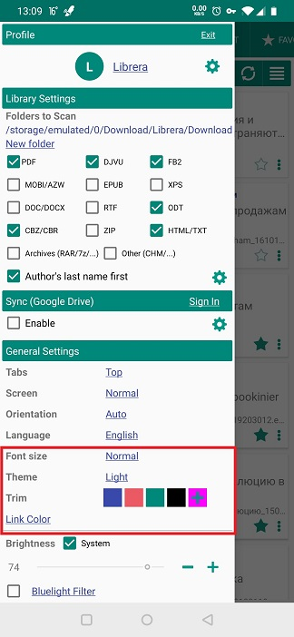
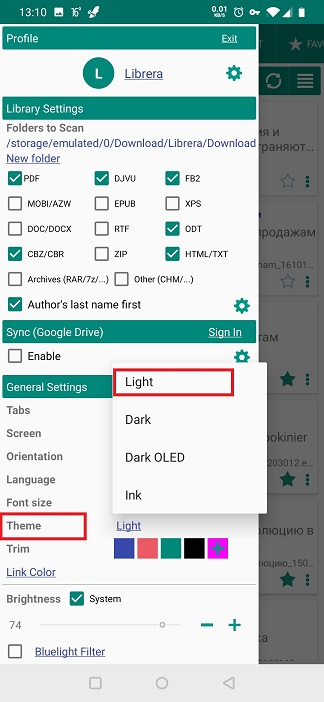
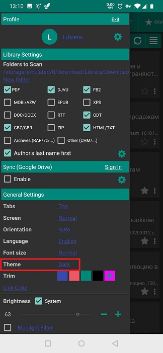

# Interface utilisateur de Theming Librera

> **Librera** vous permet de personnaliser chaque détail de l'interface utilisateur.

Dans le panneau &quot;Paramètres généraux&quot; de l'onglet **Préférences**, vous pouvez choisir votre nom personnel:

* Taille de la police
* Motif et couleur du thème
* Couleur de rognage
* Couleur du lien

||||
|-|-|-|
||||

**Paramètre de taille de police**

* Appuyez sur _Font Taille du texte_ pour ouvrir une liste déroulante de tailles de police relatives.
* Choisissez la taille de la police en diminuant ou en augmentant votre taille de police actuelle.

||||
|-|-|-|
||||

**Paramètre de thème général**

* Appuyez sur _Theme_ pour ouvrir une liste déroulante des thèmes disponibles.
* Sélectionnez le thème souhaité. Vous pouvez également choisir le thème des écrans E-Ink.

> _Quelques thèmes supplémentaires viendront de votre choix de couleurs et de polices lors de la configuration de vos modes de lecture jour/nuit_

||||
|-|-|-|
||||

**Paramètres de couleur d'en-tête et de titre (Rogner)**

* Vous pouvez sélectionner l'un des préréglages disponibles en appuyant dessus.
* Ou vous pouvez choisir quelque chose de complètement différent en appuyant sur **+**.
* Sélectionnez votre couleur dans la palette de couleurs ouverte.

||||
|-|-|-|
||||

**Paramètres de couleur des liens**

* Vous devez activer les couleurs personnalisées en remplaçant les paramètres système.
* Sélectionnez l'un des paramètres prédéfinis disponibles en appuyant dessus.
* Ou vous pouvez choisir quelque chose de complètement différent en appuyant sur **+**.
* Sélectionnez votre couleur dans la palette de couleurs ouverte.

||||
|-|-|-|
||||

> **La meilleure chose offerte par * Librera * est la possibilité de thème chaque profil que vous créez individuellement. Vous pouvez cibler vos profils créés en fonction de vos changements d'humeur, de vos lectures de jour et de nuit, des genres de livres, etc.**
