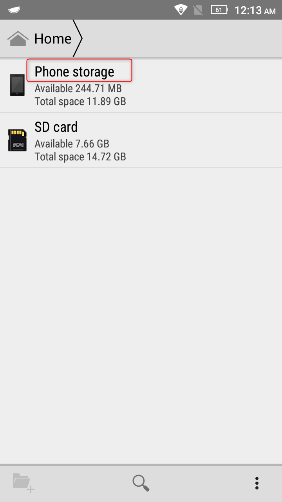
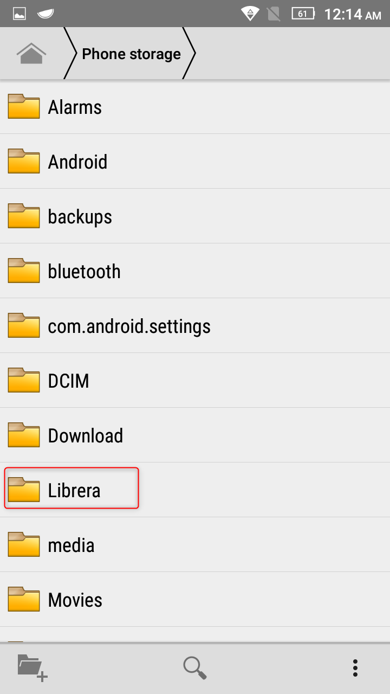
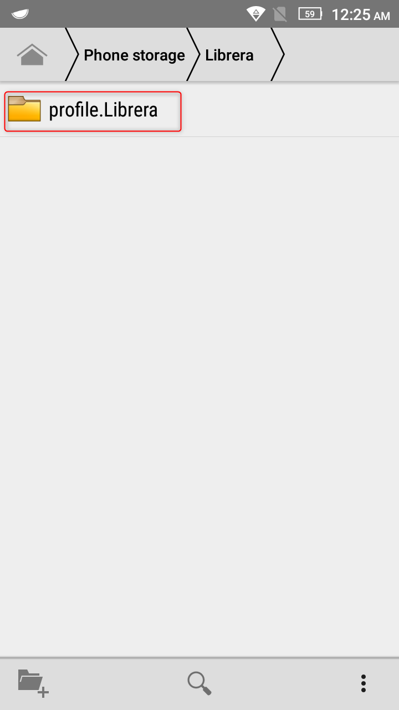
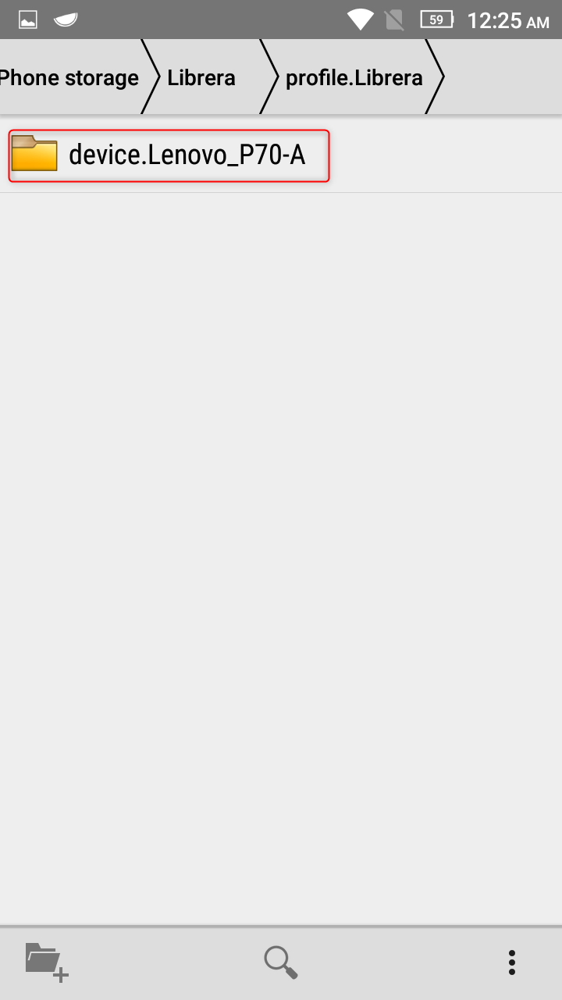
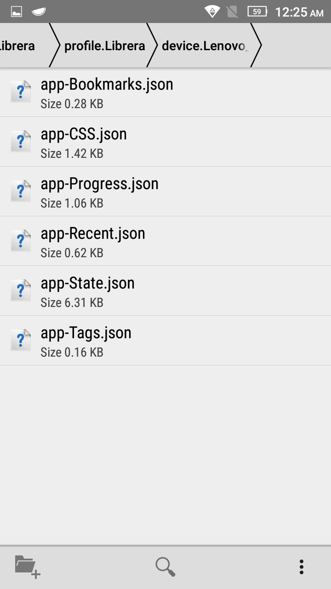

# Elimina e ripristina tutte le impostazioni di Librera

> Per eliminare manualmente le impostazioni dell'applicazione, è necessario aprire il file manager e andare in questo percorso -
> **Memoria telefono/Librera/profile.Librera/device._name of your device_** ed elimina tutti i file dalla cartella.

1. Selezionare la memoria del telefono
2. Trova la cartella Libreria
3. Aprire la cartella profile.Librera: questa cartella contiene cartelle con profili
4. Apri la cartella &quot;device._your device name_&quot;

Se hai creato il tuo profilo, devi selezionare la cartella con il tuo profilo.
Se non hai creato un profilo, il pacchetto _device.name del tuo dispositivo_ viene creato per impostazione predefinita

5. Elimina i file

||||
|-|-|-|
||||
||||

*app-Bookmarks.json - segnalibri
*app-CSS.json: stili e markup del libro
*app-Progress.json: avanzamento della lettura
*app-Recent.json: elenco di libri letti
*app-State.json: impostazioni generali dell'applicazione
*app-Tags.json: tag libro

