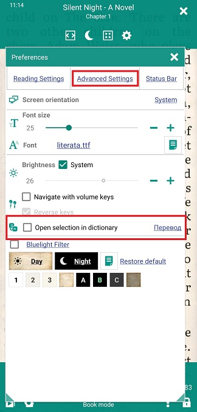
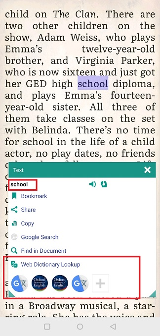
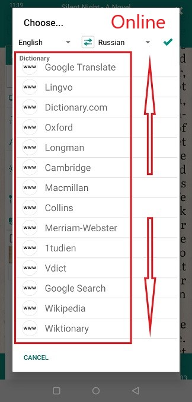

# Использование словарей и переводчиков

> Когда вы читаете книгу, особенно на иностранном языке, вам может понадобиться найти значение слова, которого вы не знаете, в словаре. С **Librera** вы можете сделать это легко, в один клик, как в автономном режиме, так и в автономном режиме.

**Librera** позволяет вам искать одно слово или переводить целые отрывки с помощью онлайн-переводчиков (словарей).

В Интернете множество **онлайн-словарей и переводчиков **. Они позволяют вам проверить значение слова, не устанавливая ничего на ваше устройство.
> **Librera** откроет для вас окно браузера с выбранным словом в поле поиска выбранного словаря.
 
Вы можете выбрать один из следующих вариантов (назвать несколько):

* Лингво
* Оксфорд
* Longman
* Кембридж
* Макмиллан
* Коллинз
* Merriam-Webster
* 1tudien
* Vdict
* Википедия
* Викисловарь
* Academic.ru
* Vocabulary.com
* Deepl.com
* Treccani.it и др.

**Автономные** словари и переводчики должны быть установлены на вашем устройстве из Google Play (или в другом месте). У них появится окно с переводом или определением выбранного слова, и они не будут работать в Интернете.

1. Список самых популярных бесплатных словарей и переводчиков в Google play выглядит следующим образом:
* Переводчик Google
* Microsoft Translator
* Мультитранский словарь русского языка
* Оксфордский словарь
* Яндекс.Переводчик и др.
2. Вы также можете установить **словарь-оболочку**, который будет обрабатывать словари, созданные сторонними компиляторами, например:
* GoldenDict
* словарь форумов и др.
 
> **Если вы не нашли в * Librera * искомого онлайн-ресурса, отправьте запрос разработчикам по адресу librera.reader@gmail.com или поднимите вопрос о github.**

**Поиск словаря в один клик**
Чтобы включить немедленный поиск в словаре выбранного слова, вам необходимо:
* Откройте окно **настроек**, коснувшись значка **Настройки**
* Проверьте выбор _Open в словаре_ на главной вкладке
* Выберите слово (или последовательность слов) долгим нажатием (и перетаскиванием)
||||
|-|-|-|
||||

**Настройка словаря по умолчанию**
Вы также можете настроить свой словарь по умолчанию (тот, чье окно появится при выборе слова):
* Нажмите на ссылку _Dictionary_ рядом с полем _Open selection_
* Выберите словарь, который вы предпочитаете, из выпадающего списка словарей и переводчиков (Примечание: в списке представлены как онлайн, так и автономные словари)

||||
|-|-|-|
||||

**Не оставляя флажок выбора**
Если вы оставите флажок _Open selection_ не отмеченным, вы увидите окно **Text** после выбора слова или последовательности слов. Здесь вы сможете:
* Найдите или переведите это слово (последовательность) в выбранном вами онлайн-ресурсе (нажав _Web Dictionary Lookup_)

||||
|-|-|-|
||||

* Найдите (нажав **+**, если необходимо) предпочитаемый вами установленный словарь или переводчик.
* Нажмите на его значок, чтобы вызвать его всплывающее окно с переводом слова (определение)

||||
|-|-|-|
||||

> Быстрое напоминание: не забудьте выбрать свой словарь по умолчанию, ПРЕЖДЕ ЧЕМ проверять выбор _Open in dictionary_.

||||
|-|-|-|
||||
