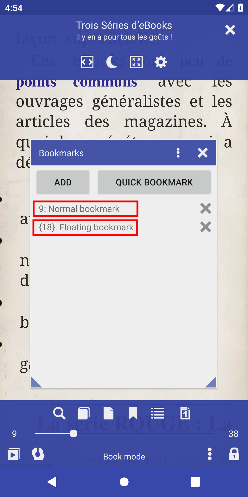
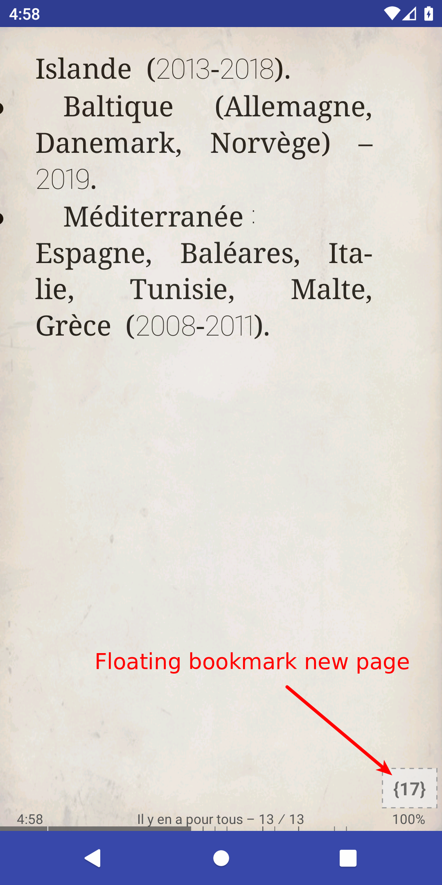
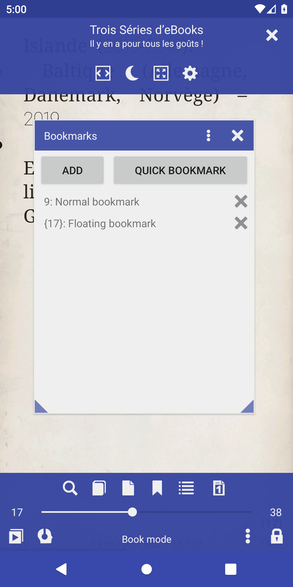

# Editar texto do marcador, número da página, marcador flutuante

> O Librera suporta dois tipos de favoritos: favorito normal e flutuante.

O marcador** normal** sempre se refere ao mesmo número de página

O marcador** flutuante** refere-se ao número da página dinâmica

Você pode editar o texto dos favoritos e digitar (pressione e segure)

Se você precisar alterar o número da página para um marcador normal, defina-o como &quot;flutuante&quot;, consulte o novo local e defina-o como &quot;normal&quot;

|1|2|3|
|-|-|-|
||||

