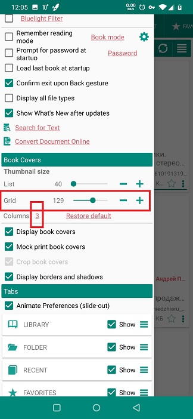

# Personnalisation de l'apparence de votre bibliothèque

> **Librera** vous permet d'ajuster l'affichage de vos livres sur les &quot;étagères&quot; de votre bibliothèque. Vous pouvez modifier le nombre de livres sur une étagère, leur apparence, leur taille, le regroupement et la liste des livres, etc.

Vos livres sont affichés dans l'onglet _Bibliothèque_, où vous pouvez ajuster la présentation du livre. Les paramètres supplémentaires qui affectent votre vue Bibliothèque se trouvent dans l’onglet _Prefer_ de la diapositive, le panneau _Book Covers_.

* Pour modifier la présentation du livre (liste, grille, résumé, etc.), touchez l'icône de hamburger dans le coin supérieur droit de l'onglet _Bibliothèque_
* Balayez vers la droite depuis le bord gauche de l'écran pour ouvrir l'onglet &quot;Préférences&quot;.

> Si vous avez coché la case _Preferences_ (pas d’animation), vous trouverez l’onglet _Preferences_ à côté de l’onglet _Library_ au-dessus.

* Faites glisser votre doigt vers le bas pour trouver le panneau &quot;Couvertures de livres&quot;.

||||
|-|-|-|
||||

* Vous trouverez ci-dessous des exemples de vues de quelques choix de modèles:
 
> Rappelez-vous, une autre disposition est juste à deux coups. Vous pouvez passer au plus commode à tout moment.

||||
|-|-|-|
||||

## Le panneau &quot;Couvertures de livres&quot;

* Vous pouvez désactiver l'affichage des couvertures de livres en décochant la case correspondante.
* Vous avez encore de nombreuses options de mise en page.

||||
|-|-|-|
||||

* Vos manipulations avec la taille des couvertures de livre dépendront de la mise en page choisie (liste ou grille).
* Pour &quot;liste&quot;, utilisez le curseur correspondant pour modifier la taille des couvertures du livre (taille de la tablette).

||||
|-|-|-|
||||

Vous aurez plus d'options pour &quot;grille&quot;.

* Utilisez le curseur respectif pour modifier la taille des couvertures de livre.
* Vous pouvez également choisir le nombre de colonnes dans la grille de votre bibliothèque.

> Remarque: vous pouvez toujours rétablir vos paramètres initiaux en appuyant sur _Restore default_ et en confirmant l'opération avec _OK_.

**Si vous choisissez d'afficher les couvertures de vos livres, utilisez les autres options du panneau &quot;Couvertures de livres&quot; pour améliorer la vue.**

||||
|-|-|-|
||||
