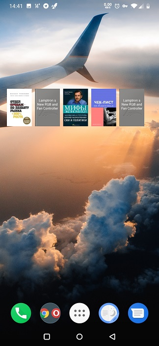
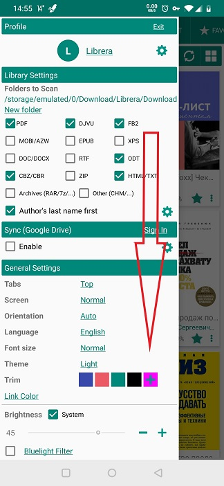
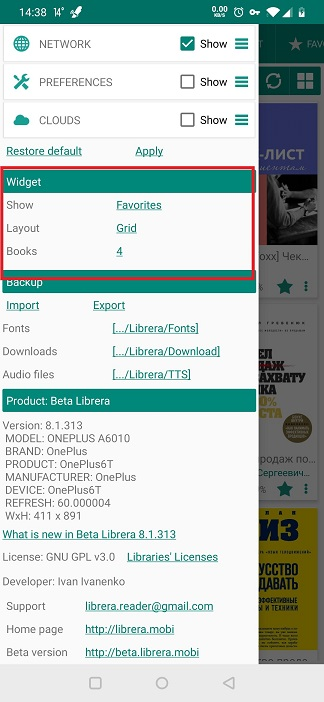
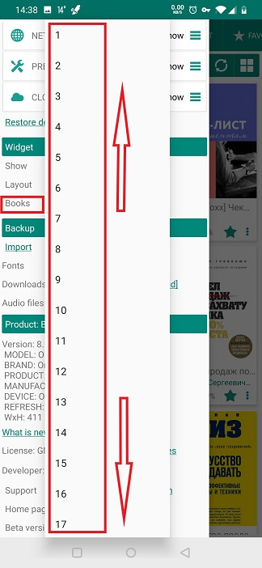

# Usando o widget de _Librera_

> O widget ajudará você a iniciar o **Librera** diretamente da área de trabalho do seu dispositivo. E com o livro de sua escolha.

Para começar a usar o widget de **Librera**, você deve colocá-lo na área de trabalho através da guia _Widgets_ no seu iniciador.

||||
|-|-|-|
||||

## Personalizando o widget

* Abra a guia deslizante **Preferências** e deslize para baixo até o painel _Widget_

||||
|-|-|-|
||||

* Você pode dizer ao widget o que exibir escolhendo entre os documentos _Favoritos_ e _Recent_
* Selecione o layout dos livros no widget do **Librera**
* Você pode escolher o tamanho do widget do **Librera** aumentando ou diminuindo o número de livros na estante do seu widget

||||
|-|-|-|
||||
