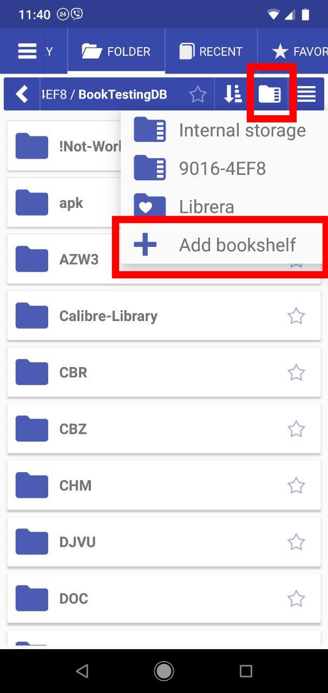
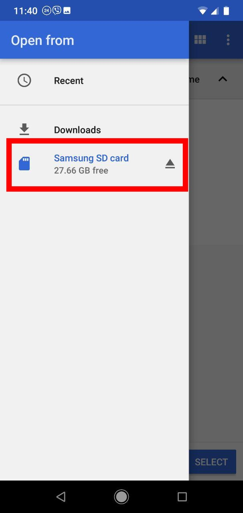
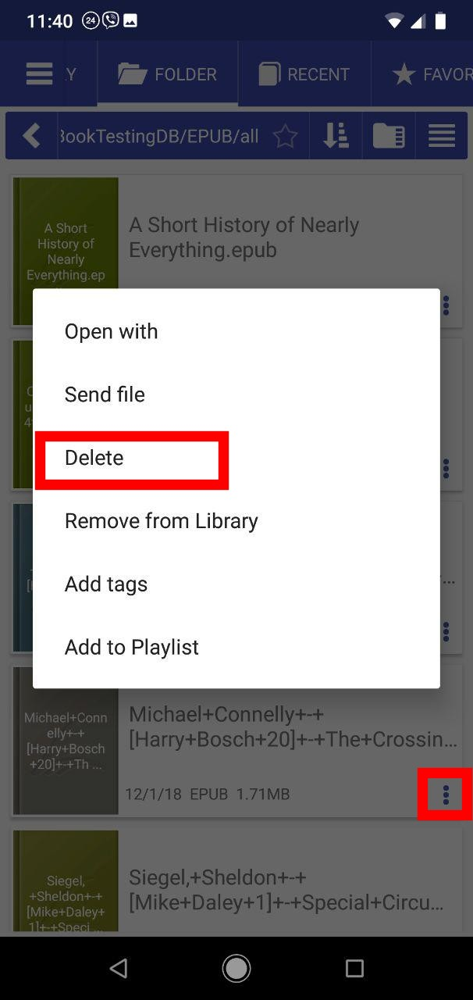

# Como excluir um livro de um cartão SD externo

> Por motivos de segurança, o sistema não permitirá que os usuários excluam arquivos de cartões SD externos no Android 7+.

No **Librera**, você precisa adicionar seu cartão SD como um recurso (_bookshelf_) e permitir a exclusão.

* Na guia _Pasta_, toque no ícone do gerenciador de arquivos para abrir a lista de recursos suspenso
* Toque em **+** para adicionar uma estante de livros
* Selecione seu cartão SD
* Pressione _SELECT_ para permitir a exclusão do local escolhido

||||
|-|-|-|
||||

* Escolha seu cartão SD na lista de recursos do menu suspenso
* Abra o menu de arquivo do livro que você deseja excluir tocando no ícone de três pontos
* Pressione _Delete_ e confirme a operação

||||
|-|-|-|
||||
