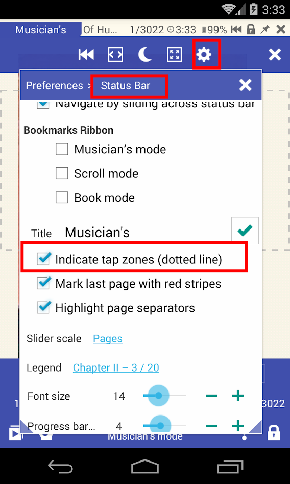

# So deaktivieren Sie gestrichelte Linien, rote Linien im &quot;Musiker-Modus&quot;

* Öffne das Buch
* Klicken Sie auf das Einstellungssymbol
* Öffnen Sie den Statusleistenabschnitt
* Sie können gestrichelte Linien deaktivieren
* Sie können rote Linien deaktivieren (die das Ende des Dokuments anzeigen).

