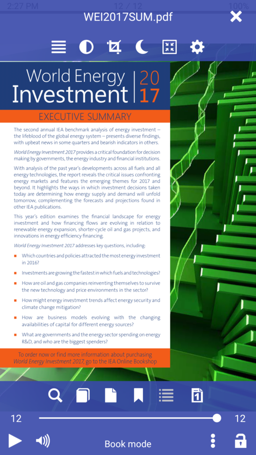

# Augmentation de la taille de la police dans les documents PDF

Pour améliorer la lisibilité de votre document PDF (taille de caractère trop petite), vous pouvez le convertir au format **Librera** vers un autre format de fichier (EPUB):
* Ouvrez votre document PDF dans le **Librera**.
* Ouvrez le menu général en appuyant sur l'écran central
* Tapez sur l'icône du menu du livre (icône à trois points) en bas de l'écran.
* Appuyez sur l'élément _Reflow PDF_, attendez la fin de la conversion, puis modifiez la taille de la police dans la fenêtre **Préférences**.

|1|2|3|
|-|-|-|
||||
