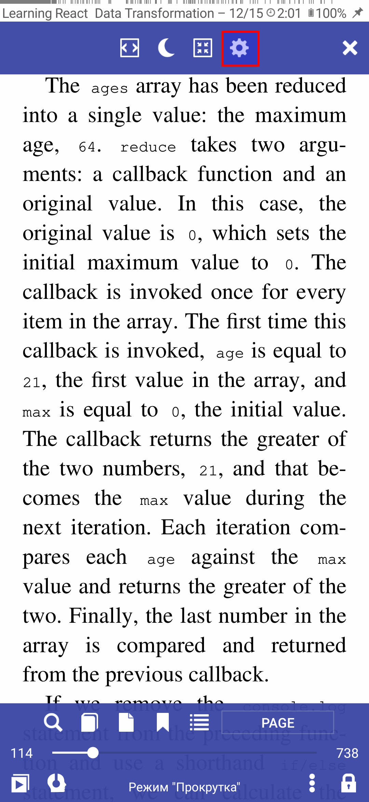
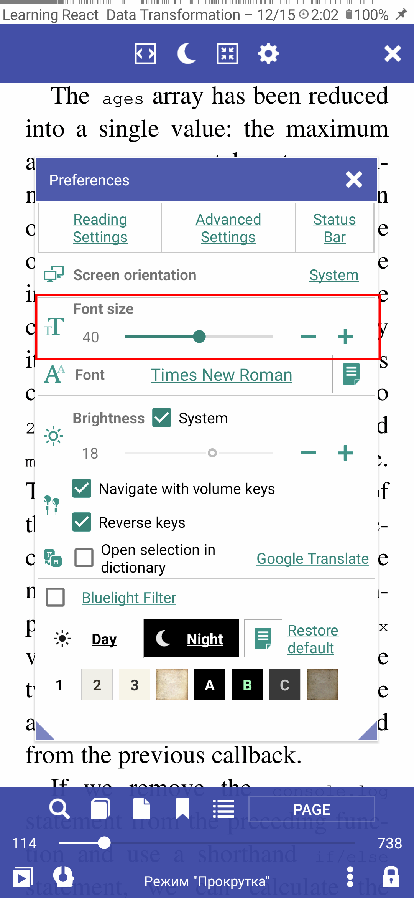
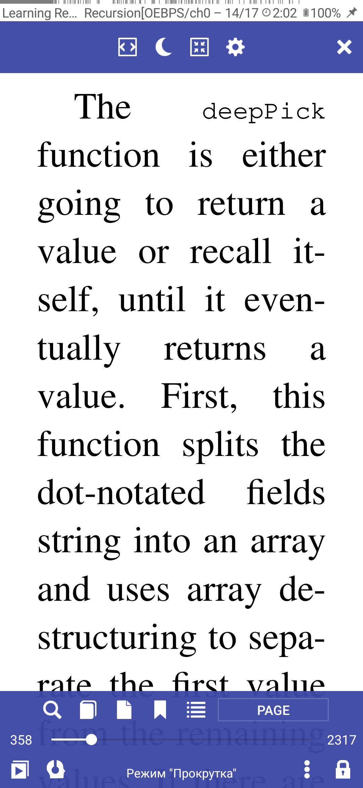

# Increasing Font-Size in PDF Documents

To improve readability of your PDF document (too small character size), you can convert it in **Librera** to another file format (EPUB):
* Open your PDF document in **Librera**
* Open the general menu by tapping at center screen
* Tap on the book menu icon (three-dot icon) at the bottom of the screen
* Tap on the _Reflow PDF_ item, wait for the conversion to end, and then change the font-size in the **Preferences** window.

|1|2|3|
|-|-|-|
||||
||||

