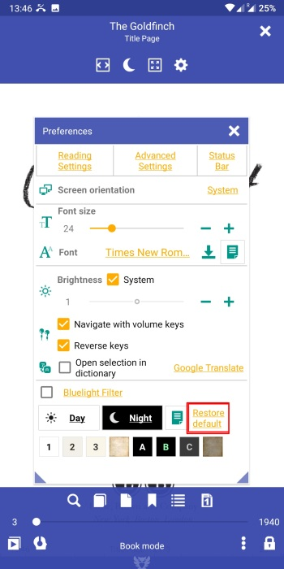
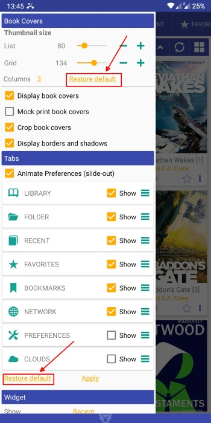
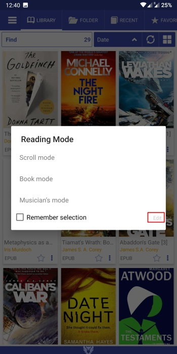

# كيفية استعادة الإعدادات الافتراضية/مسح ذاكرة التخزين المؤقت

> **Librera** هو تطبيق مرن للغاية يتيح لك العبث وضبط الكثير من إعداداته ، بما في ذلك واجهة المستخدم وظروف القراءة. من الواضح ، قد يحدث أنك لن تحب بعض نتائج تجاربك مع إعداد **Librera**. لا داعى للقلق! هناك دائمًا طريقة لإعادة التطبيق بسهولة وبسرعة إلى حالته الأصلية. في العديد من الجوانب ، يشبه مسح ذاكرة التخزين المؤقت (وأحيانًا يكون بالضبط ما هو عليه).

## إعادة تعيين ملف التعريف

> في بعض الأحيان يكون من السهل تجاهل التغييرات غير المرغوب فيها على مستوى ملف التعريف ، عن طريق إعادة ملف التعريف الحالي إلى حالته الأصلية (لحظة الإنشاء). فقط اتبع هذه الخطوات السهلة:
* الضغط لفترة طويلة على اسم ملفك الشخصي الحالي في لوحة _Profile_ من علامة التبويب **التفضيلات**
* أكد نيتك في مربع حوار منبثق عن طريق النقر فوق _OK_

**ملاحظة: لن يتم حذف أو إعادة تعيين الإشارات المرجعية وعلامات تقدم القراءة الخاصة بك!**

||||
|-|-|-|
||||

## استعادة ضبط القيم الافتراضية

> توقعًا لتجربتك الشاملة بإعدادات **Librera** ، قدمنا لعددًا كبيرًا منها أداة سهلة الاستخدام لتجاهل التغييرات واستعادة قيمها الأولية.
* فقط اضغط على رابط _Restore default_ الموجود بالجوار ، وابدأ من جديد
> انظر الأمثلة أدناه:

||||
|-|-|-|
||||

## إعادة تسمية أوضاع القراءة وإلغاء التغييرات

> بمرونته اللامتناهية ، يمنحك **Librera** خيار تغيير أسماء أوضاع القراءة. كما يسمح لك باستعادتها في خطوة واحدة سهلة فقط.
* اضغط على أيقونة الإعدادات بجانب _Remember read mode_ في علامة التبويب **التفضيلات**
* اضغط _Edit_ في نافذة **وضع القراءة** لجعل الأسماء قابلة للتعديل
* إعادة تسمية الأوضاع واضغط على _Save_
* لتجاهل التغييرات والعودة إلى الأسماء الافتراضية ، اضغط لفترة طويلة على _Edit_

||||
|-|-|-|
||||

> **إذا ، لأي سبب من الأسباب ، كنت متمسكًا بشيء لن يعمل بشكل صحيح وتحتاج إلى &quot;قائمة نظيفة&quot; ، يمكنك إلغاء تثبيت _Librera Reader_ من النظام وحذف مجلد _Librera_ يدويًا من وحدة التخزين الداخلية على جهازك.**
