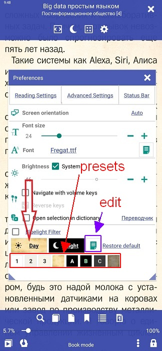
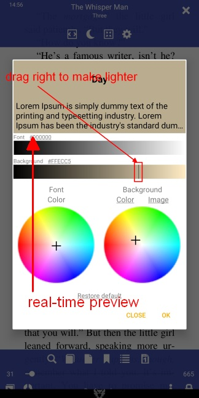
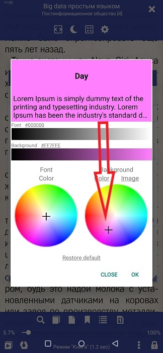
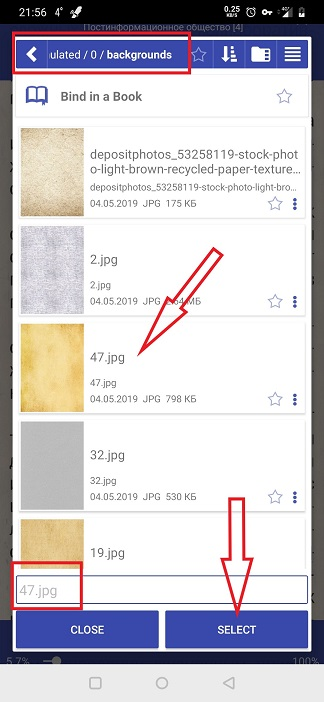

# Настройка фона страницы

> **Librera** позволяет пользователю читать свои книги на настраиваемом фоне. Пользователь может иметь определенный фон для каждого профиля, настраиваемый отдельно для дневного и ночного режимов чтения. Фон может быть просто сплошным цветом, или пользователь может добавить к ним текстуры (или рисунки), либо из файлов примеров **Librera**, либо используя свои собственные изображения.

## Настройка собственного фона
* Нажмите значок настроек, чтобы открыть окно **Настройки**
* Нажмите _Day_, чтобы изменить фон для дневного режима (или _Night_ для ночного режима).
* На панели _Background_ вы сможете изменить цвет и текстуру фона (или просто повесить свою картинку на заднем плане)
* Прозрачность фонового изображения можно изменить, перетащив ползунок _Transparency_

||||
|-|-|-|
||||

## Замена сплошного фона
* Нажмите **Цвет**, чтобы открыть цветовую палитру с крестиком и перетащите крестик вокруг палитры (следите за изменениями в режиме предварительного просмотра страницы в реальном времени вверху)
* Вы можете сделать свой однотонный фон светлее или темнее, перетаскивая ползунок по цветовой полосе
* Не забудьте нажать _OK_, чтобы сохранить изменения, как только вы закончите

||||
|-|-|-|
||||

## Добавление текстуры или рисунка на фон
* Нажмите **Изображение** на панели _Background_
* Вы можете использовать любой из встроенных файлов текстур, нажав на него
* Чтобы добавить собственное изображение, нажмите **+** и перейдите в папку с изображением, которое вы собираетесь добавить.
* Найдите свое изображение, нажмите на него, а затем нажмите _SELECT_
* Настройте прозрачность с помощью предварительного просмотра в реальном времени
* Нажмите _OK_, когда вы закончите

||||
|-|-|-|
||||

> Вы всегда можете использовать предустановки фона и шрифта, показанные на рис. 2. Их можно довольно легко редактировать в окне **Настройка** (коснитесь значка редактирования, обозначенного фиолетовой стрелкой).
