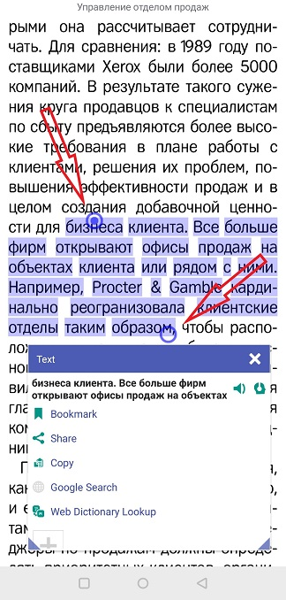

# Cómo seleccionar texto en _Librera_

Las opciones de selección de texto de&gt; **Librera** son bastante sofisticadas. Con una pulsación larga (y arrastrando), puede seleccionar palabras, pasajes y páginas enteras. Luego, puede fácilmente, con un solo toque, copiar texto para pegarlo en otra aplicación, compartir su selección con otros usuarios, hacer un marcador, enviarlo a un motor TTS (para leerlo en voz alta) o activar/desactivar- traductores/diccionarios de línea, etc.

Para habilitar la selección de texto:
* Toque en la pantalla central para abrir el menú
* Toque el icono de configuración para abrir la ventana **Preferencias**
* Vaya a la pestaña _Configuración avanzada_ y marque la casilla correspondiente

||||
|-|-|-|
||||

## Opciones de selección de texto
* Los usuarios impacientes pueden marcar la casilla _Single-tap to select_. (Esta opción funciona muy bien con la opción _Abrir selección en diccionario_ en la pestaña principal de la ventana **Preferencias**)
* La opción _Seleccionar texto letra por letra_ debería ser útil al seleccionar texto en algunos idiomas asiáticos

## Selección de segmentos de texto y páginas enteras
* Mantenga presionada una palabra en el pasaje que desea seleccionar
* Arrastre el dedo en la dirección de selección. Cuando vea los controles de inicio y fin, puede soltar el dedo, cerrar la ventana _Texto_ y continuar seleccionando texto arrastrando los controles
* Para seleccionar una página completa, abra la ventana _Vaya a la página_ tocando el icono de vista en miniatura
* Mantenga presionada la página que desea seleccionar y elija una opción de la lista desplegable

||||
|-|-|-|
||||
