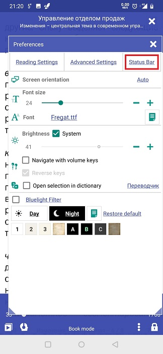
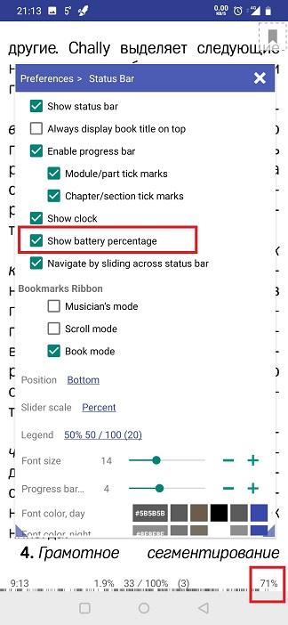
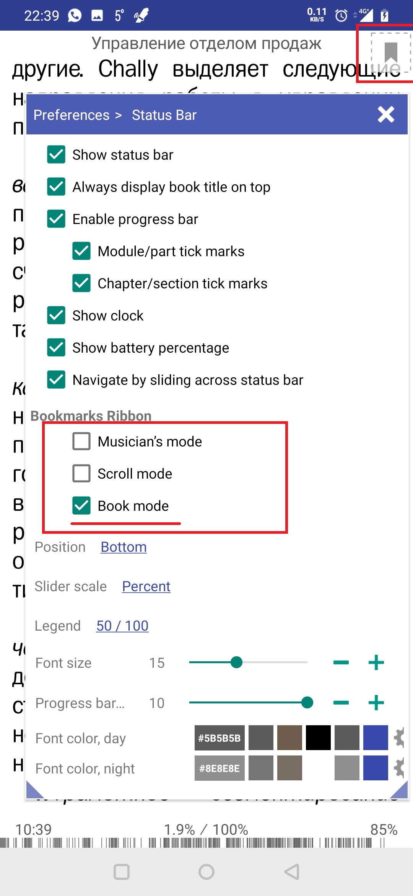
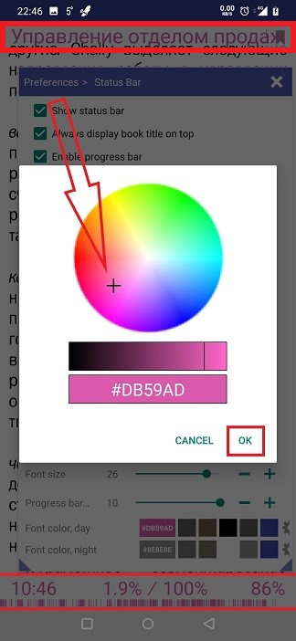

# Configuration de la barre d'état

> Vous pouvez configurer la barre d'état de **Librera** pour afficher des tonnes d'informations utiles sur votre écran de lecture ... ou vous pouvez les supprimer complètement, comme une distraction ennuyeuse.

Vous pouvez apporter toutes les modifications à la barre d'état dans l'onglet _Status Bar_:
* Appuyez sur sur l'écran central pour appeler le menu principal
* Appuyez sur l'icône des paramètres
* Ouvrez l'onglet _Status Bar_

||||
|-|-|-|
||||

Par défaut, la barre d'état est située en bas de l'écran. Utilisez la liste déroulante _Position_ pour modifier son emplacement.
> Remarque! Si le paramètre _Top_ est sélectionné, le _Toujours afficher le titre du livre en haut_ est grisé.
* La case _Afficher la barre d'état_ doit être cochée, si vous souhaitez afficher des informations pendant que vous lisez un livre

||||
|-|-|-|
||||

Cochez/décochez les cases selon vos préférences. Vous pouvez également:
* Modifiez l'échelle du curseur qui apparaît en bas sur un toucher de l'écran central
* Sélectionnez le mode d'affichage des informations numériques (dynamiques) dans la barre d'état (chapitres, pages, pages de gauche à la fin du chapitre, etc.)
* Modifier la taille et la couleur de la police de la barre d'état pour les modes jour et nuit
* Activer/désactiver le ruban de signets sur l'écran de lecture

||||
|-|-|-|
||||

* Si la position de la barre d'état est _Bottom_, vous pouvez opter pour l'affichage permanent d'un titre de livre en haut de l'écran (même si la barre d'état ne s'affiche pas)
* De plus, vous pouvez sélectionner l'heure actuelle et l'autonomie restante de la batterie à afficher avec l'état du livre
> **Si la barre d'état est désactivée, vous pouvez toujours jeter un œil à l'horloge en appuyant au centre sur l'écran (regardez dans le coin supérieur gauche)**
 
||||
|-|-|-|
||||

* Activer ou désactiver la barre de progression de la lecture
* Sélectionnez les graduations sur la barre de progression que vous préférez (le cas échéant)
* Choisissez d'afficher le ruban du signet sur votre écran de lecture

||||
|-|-|-|
||||

* Modifier la taille et la couleur de la police de la barre d'état
* Modifier la hauteur de la barre de progression

||||
|-|-|-|
||||
