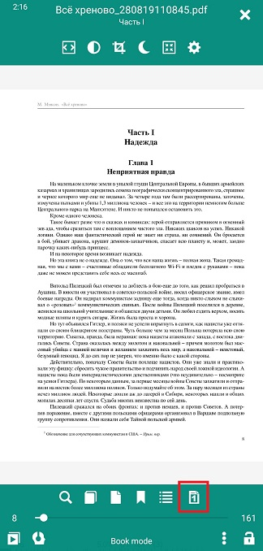
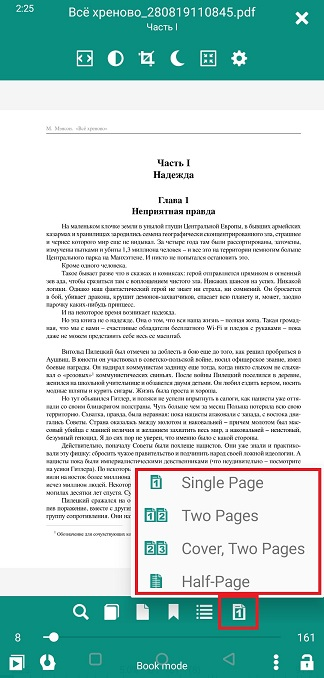

# Options d'affichage/de mise en page

> Pour garantir une lecture confortable, **Librera** permet à l'utilisateur de régler la mise en page dans tous les formats de livre électronique pris en charge.

Pour accéder aux options de visualisation:
* Appuyez au centre de votre écran pour ouvrir le menu
* Appuyez sur l'icône de disposition en bas à droite pour ouvrir une liste déroulante d'options

## Réglage de la mise en page dans EPUB, MOBI, FB2, AWZ, etc.

* _La mise en page à une seule publication est préférée pour l'orientation de l'écran _Portrait_
* Si l'orientation de votre écran change (automatiquement ou manuellement) en _Landscape_, vous pouvez poursuivre en passant à la disposition _Dwo Pages_
* Revenez à la _Saisie unique après avoir fait pivoter votre appareil en orientation _Portrait_

> **Vous pouvez prédéfinir des combinaisons d'orientations d'écran et de mises en page et utiliser ces combinaisons en fonction du profil.**

||||
|-|-|-|
||||

## Réglage de la mise en page dans PDF/DjVu

La &quot;rigidité&quot; de la page en PDF/DjVu et la taille de votre écran dicteront vos choix de mise en page:
* _Mode unique ou _Deux pages_ pour l'orientation _Portrait_ sur les grands écrans
* Mode _Deux pages_, préféré pour les grands écrans et l'orientation _Paysage_
* Parfois, la page de couverture doit être présentée séparément, en particulier si les illustrations de votre livre sont réparties sur plusieurs feuilles (choisissez _Cover, Two Pages_ dans ce cas)

||||
|-|-|-|
||||

* _Le mode demi-publication est très pratique dans les mises en page à deux colonnes. Divisez simplement votre page en deux en choisissant cette option

||||
|-|-|-|
||||
