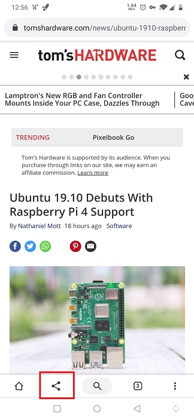
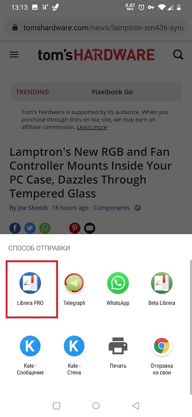
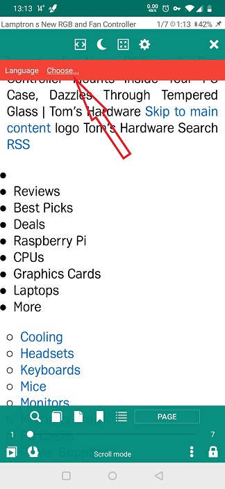
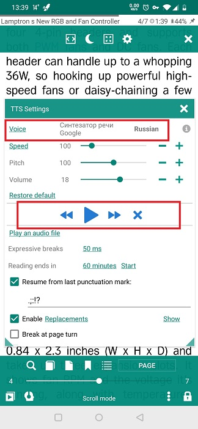
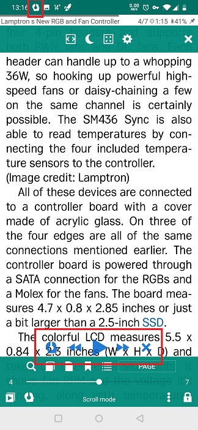

# Utilisation de la fonctionnalité TTS pour la lecture de partages à partir d'autres applications
> Vous pouvez partager des supports de lecture avec **Librera** à partir de toute application de votre appareil prenant en charge le partage.
> Par exemple, vous pouvez partager des pages Web, des articles et d’autres contenus intéressants sur Internet avec **Librera**, les enregistrer et utiliser les outils TTS de **Librera**.

Pour lire une page Web à haute voix dans **Librera**:
* Ouvrez la page dans votre navigateur.
* Appuyez sur l'icône _Share_ dans le menu de votre navigateur (Google Chrome, dans notre exemple).
* Sélectionnez **Librera** dans la liste déroulante des applications disponibles.
* Sélectionnez un mode de lecture pour le partage de votre navigateur. Remarque: vous pouvez vous souvenir du mode sélectionné pour les références futures en cochant la case correspondante.

||||
|-|-|-|
||||

À présent, une fois que l'article Web du navigateur est ouvert dans **Librera**, vous pouvez affiner sa lisibilité: activez la césure, pour commencer.

||||
|-|-|-|
||||

À présent, vous pouvez faire **Librera** lire la page Web:
* Appuyez sur l'icône **TTS** dans le coin inférieur gauche.
* Dans la fenêtre **Paramètres TTS**, vérifiez si un moteur TTS est installé (ou sélectionnez celui que vous utiliserez si vous en avez suffisamment). S'il n'y en a pas, nous vous recommandons d'installer Google TTS Engine dans Google Play.
* Sélectionnez la langue d'utilisation du moteur.
* Appuyez sur _Play_ et profitez-en.

> Vous pouvez fermer la fenêtre **Paramètres TTS** si vous n'avez pas besoin de peaufiner davantage. Les commandes de lecture resteront pour votre commodité au bas de l’écran.
* Pour quitter le mode TTS, appuyez sur l'icône _X_.

||||
|-|-|-|
||||
