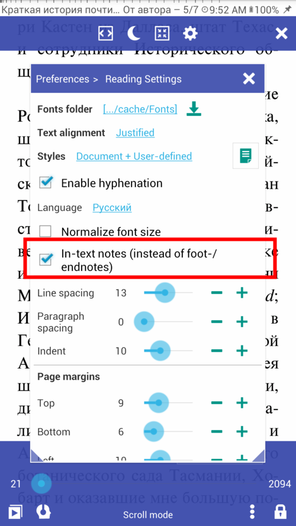
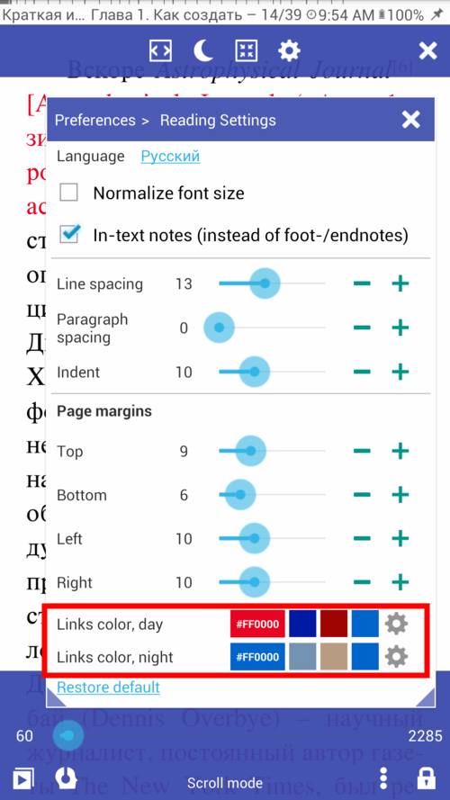

# Notes dans le texte et notes de bas de page
> Pour votre commodité et **pour le plaisir de lire TTS**, **Librera** remplacera les notes de bas de page ou de fin de document par des notes intégrées au texte, qui suivront immédiatement les indicateurs de note.
Pour opter pour la présentation dans la note:
* Accédez à l'onglet &quot;Paramètres de lecture&quot; de la fenêtre **Préférences**.
* Cochez la case &quot;Notes en texte&quot; et profitez-en
* Vous pouvez configurer la couleur de vos notes pour chaque condition de lecture (jour, nuit) séparément.
> Cette fonctionnalité fonctionne aux formats EPUB, FB2 et AZW/MOBI.
**Conseil: nous vous recommandons d'utiliser des notes dans le texte pour _TTS Reading_**

||||
|-|-|-|
||||
