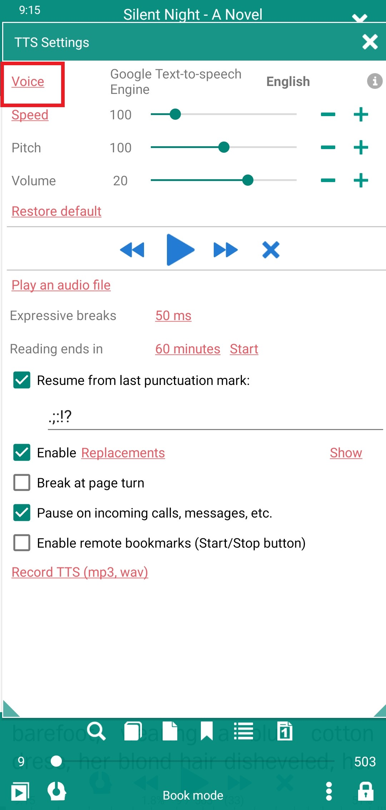
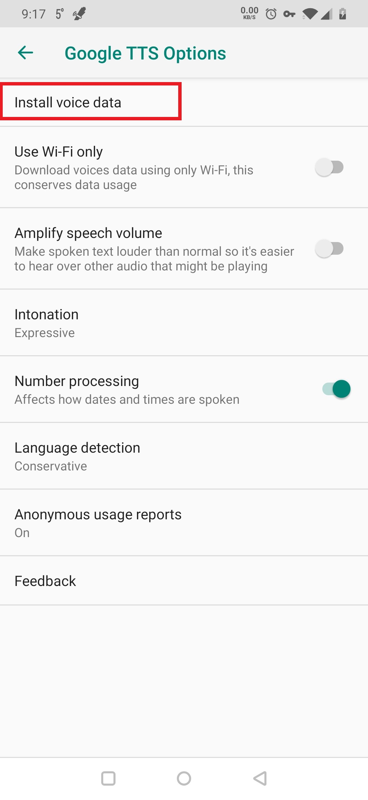

# Uso de un motor de texto a voz con _Librera_

> **Librera** puede leer sus libros (y otros documentos) en voz alta utilizando un motor de texto a voz (TTS) de terceros instalado en su sistema Android. Admite lectura en voz alta para una gran cantidad de formatos de libros electrónicos, desde EPUB a Kindle a PDF.

# Elección de un motor TTS

* Toque el icono TTS en la parte inferior de la pantalla para abrir la ventana **Configuración TTS**
* Toque **&quot;i&quot;** para abrir una lista desplegable de motores TTS
* Seleccione el motor que desee. Si el motor que ha elegido aún no está instalado en su sistema, será redirigido a Google Play Store. Siga las instrucciones de su motor preferido para configurarlo, descargar voces principales y adicionales, etc.

> Nota: Es posible que los desarrolladores del motor le cobren funciones adicionales, por ejemplo, voces adicionales.

||||
|-|-|-|
||||

## Ejemplo: Configuración de Google Text-to-Speech Engine

* En la ventana **Configuración de TTS** de **Librera**, siga el enlace _Voz_ a la página de configuración de **Salida de texto a voz** de su sistema
* Toque el ícono de configuración junto a _Motor preferido_
* Toque _Instalar datos de voz_ para seleccionar su idioma y voz TTS
* Pruebe la voz que ha seleccionado tocando _PLAY_ en la página **Salida de texto a voz**

> Puede ajustar la configuración del motor (p. Ej., Velocidad de lectura, tono y/o volumen) en la ventana **Librera** '**Configuración TTS** de Librera**.

||||
|-|-|-|
||||

||||
|-|-|-|
||||

> Nota: La configuración de voz en otros motores TTS se realiza de manera similar. Recuerde que los archivos de datos de voz pueden ser bastante grandes. Para ahorrar sus planes de datos celulares limitados, asegúrese de que se descarguen solo a través de la conexión WiFi.
