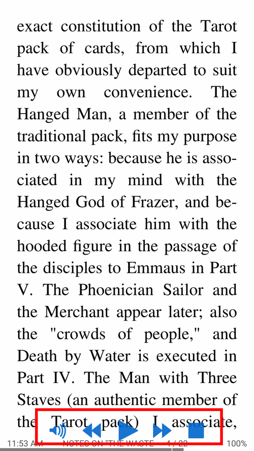
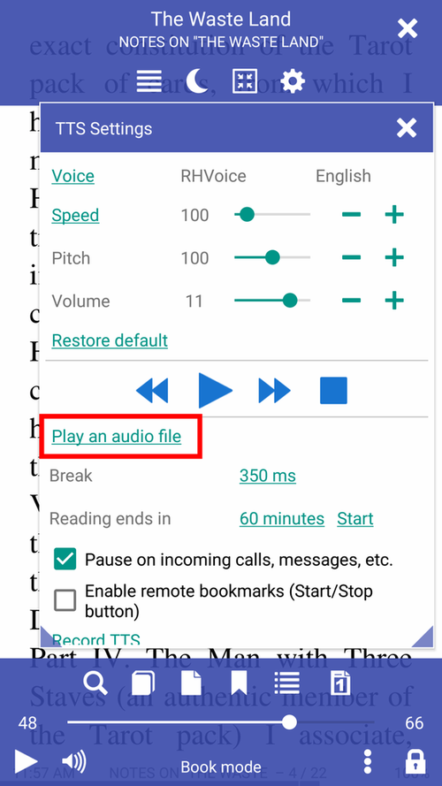
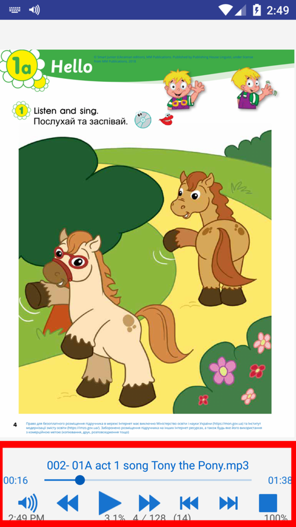

# **Librera** pour l'apprentissage des langues étrangères

> **Librera** est un excellent outil pour ceux qui apprennent une langue étrangère ... ou se contentent de lire un livre dans une autre langue.

Utilisez simplement votre doigt (n'importe quel doigt) pour mettre en surbrillance/sélectionner du texte
* Traduisez facilement et rapidement un mot, un passage ou une page sélectionné
* Configurer **Librera** pour fonctionner avec des traducteurs et/ou des dictionnaires en ligne et hors ligne

||||
|-|-|-|
||||

* Activer la recherche de dictionnaire par simple pression (appui long) (cochez la case)
* Cela vaut également pour les traductions de passages si votre &quot;dictionnaire de choix&quot; est, par exemple, Google Translate (assurez-vous que votre connexion Internet est opérationnelle)
> Remarque! Vous pouvez configurer **Librera** pour sélectionner des mots en un seul clic dans l'onglet _Paramètres avancés_ (non recommandé)

||||
|-|-|-|
||||

Si la sélection _Ouvrir dans le dictionnaire_ n'est pas cochée, vous aurez plusieurs choix dans la fenêtre _Texte_:
* Faites **Librera** prononcer le mot pour vous ou relisez votre sélection à haute voix
* Faites-le lire tout le livre à haute voix (lecture accompagnée par la voix)
* Ouvrez le mot/passage dans un autre dictionnaire/traducteur
* Pages de signets avec des séquences de mots significatives

||||
|-|-|-|
||||

> Vous pouvez lire des fichiers audio externes avec **Librera**. Il prend en charge tous les formats audio fréquemment utilisés, par exemple, .mp3, .mp4, .wav, .ogg, .m4a et .flac.
* Lisez des livres audio à côté de leurs copies de livres électroniques (lecture accompagnée par la voix)
* Gérez le rythme de votre lecture avec les commandes de lecture en bas
* Utilisez la fenêtre **Signets** pour parcourir le livre

||||
|-|-|-|
||||

> **Un appui long sur le bouton Lecture/Pause permet de rembobiner la piste au tout début.**
