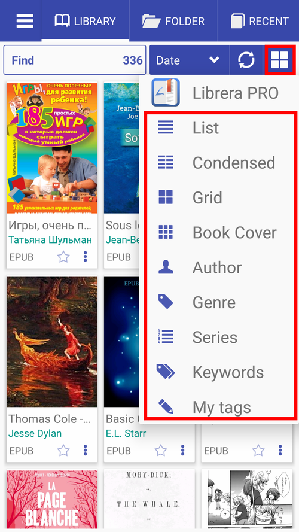
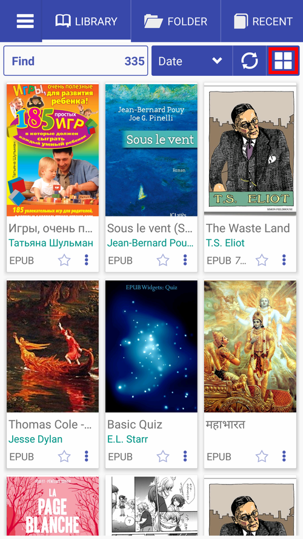
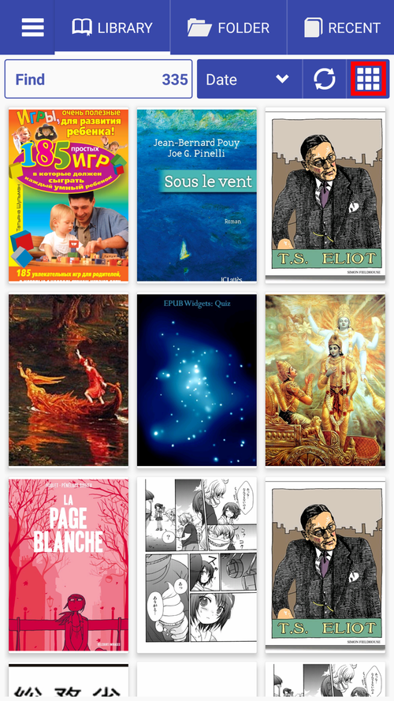
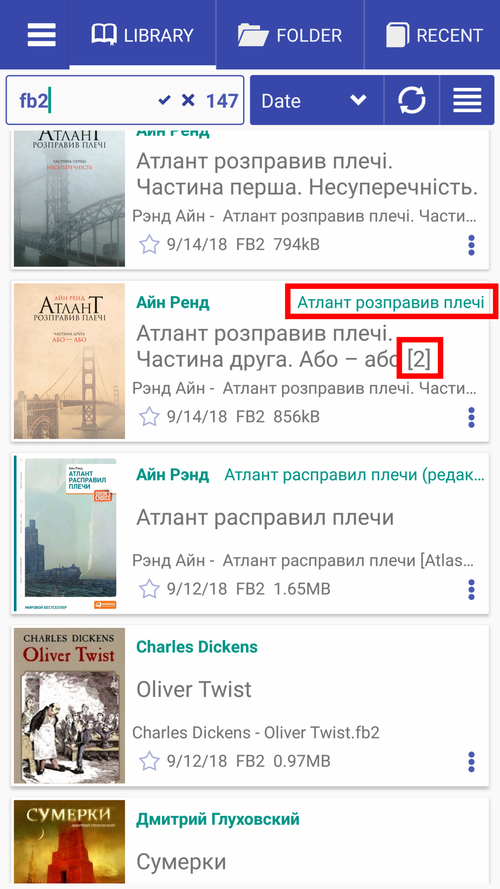
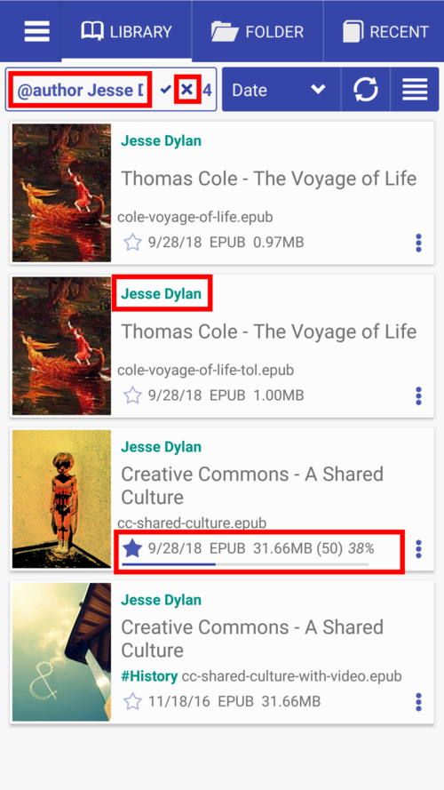

# Navigation dans l'onglet _Bibliothèque_

> Une fois installé, **Librera** par défaut s'ouvrira avec l'onglet _Bibliothèque_, riche en informations utiles sur les livres (et autres documents) présents sur votre appareil. Voici un guide rapide sur l’onglet _Bibliothèque_.

* Onglet _Bibliothèque_, vue par défaut
* Triez les livres sur les étagères de votre bibliothèque en fonction de certains critères (par nom de fichier, auteur, date, etc.).
* Vous pouvez modifier la présentation de vos livres sur les étagères en modifiant la présentation de la bibliothèque (liste, grille, couvertures de livre, etc.).

||||
|-|-|-|
||||

* Vue condensée (deux colonnes)
* Affichage en grille
* couvertures de livres uniquement

||||
|-|-|-|
||||

* Recherche de livres dans votre bibliothèque
* Appuyez sur l'icône étoile pour ajouter un livre à **Favoris**.
* Appuyez sur l'icône à trois points pour ouvrir le menu du livre.
* Un appui long sur l’icône étoile vous invite à ajouter une balise personnalisée.
* Appuyez sur #Historique pour ajouter une étiquette personnalisée à un livre.
* Appuyez longuement sur la couverture d'un livre pour ouvrir la fenêtre **Informations sur le livre**.

||||
|-|-|-|
||||

* Rechercher un livre par extension (FB2, dans notre exemple ci-dessous)
* Appuyez sur le nom de l'auteur pour rechercher tous les livres de cet auteur dans la bibliothèque.
* Appuyez sur _x_ pour effacer les résultats de la recherche.
* Appuyez longuement sur la coche pour afficher et modifier l'historique de recherche et la liste de saisie semi-automatique.
* Afficher les **informations sur le livre** et vérifier votre état d'avancement dans ce livre (Conseil: vous pouvez réinitialiser votre progression de lecture via le menu du livre).

||||
|-|-|-|
||||
