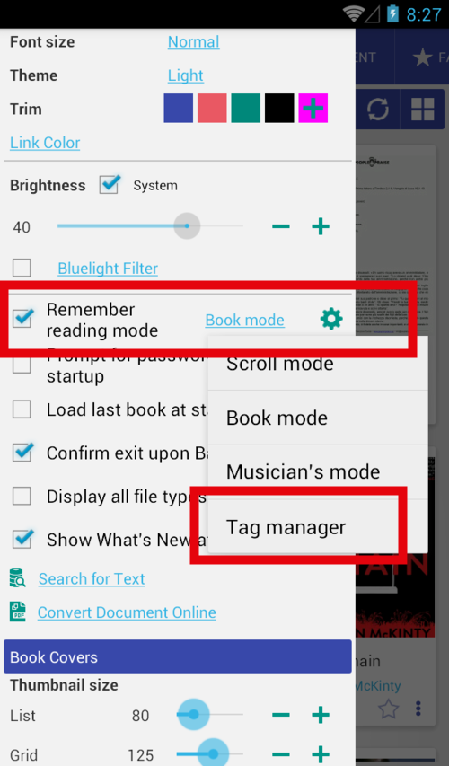
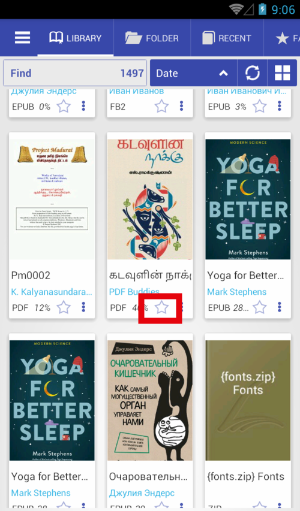
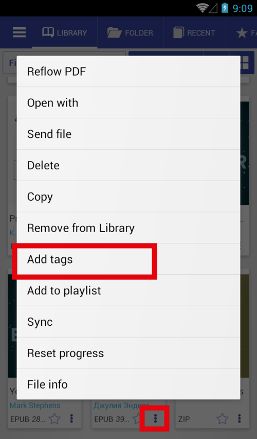

# Livre ouvert avec &quot;Gestionnaire de balises&quot;

> Il est possible d'organiser des livres dans des collections avec des étiquettes. &quot;Tag Manager&quot; simplifie ce processus

Il n'est pas possible de définir une étiquette pour plusieurs livres, mais il est possible d'ouvrir le gestionnaire de balises avant d'ouvrir un livre.

* Définissez Ouvrir avec (rappelez-vous le mode de lecture) sur &quot;Gestionnaire de balises&quot;.
* Cliquez sur n'importe quel livre dans la boîte de dialogue.
* Vous pouvez définir \ supprimer des balises et cliquer sur &quot;Appliquer&quot;.
* Vous pouvez définir \ supprimer des balises et cliquer sur &quot;Lire&quot;. Les balises seront également appliquées.
* Nouveaux tags que vous pouvez trouver dans l'onglet &quot;Favoris&quot;

||||
|-|-|-|
||||

# Ouvrir le gestionnaire de balises

Il y a plusieurs façons de définir/supprimer des balises pour les livres

* Appuyez longuement sur l'icône étoile pour ouvrir le gestionnaire de balises
* Ouvrez le menu du livre, cliquez sur &quot;Ajouter des tags&quot;.
* Boîte de dialogue d'informations sur les fichiers &quot;Ajouter des balises&quot;

||||
|-|-|-|
||||
