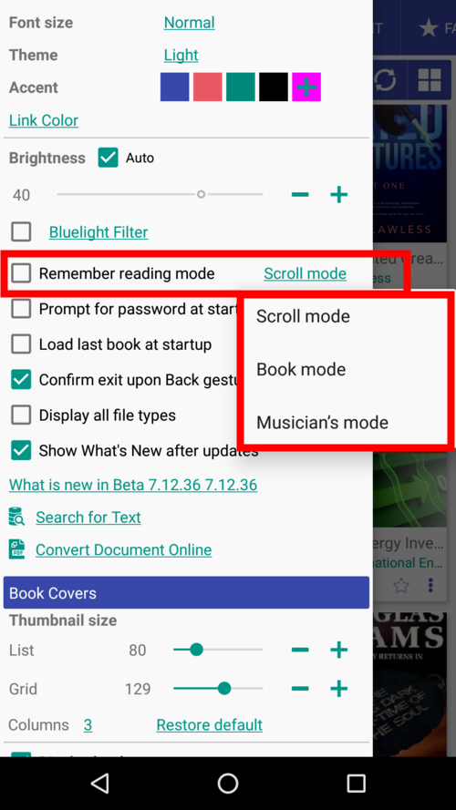
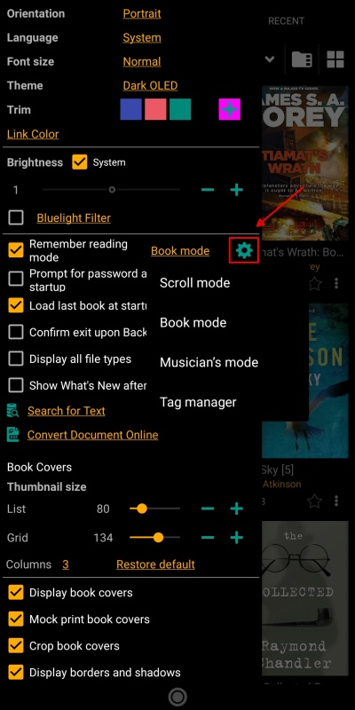
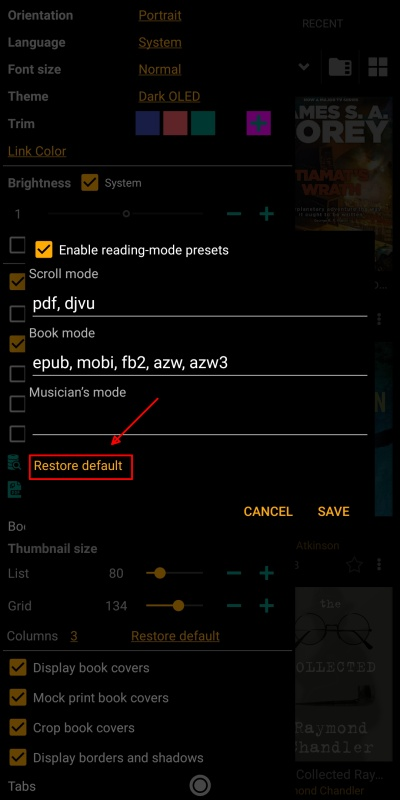
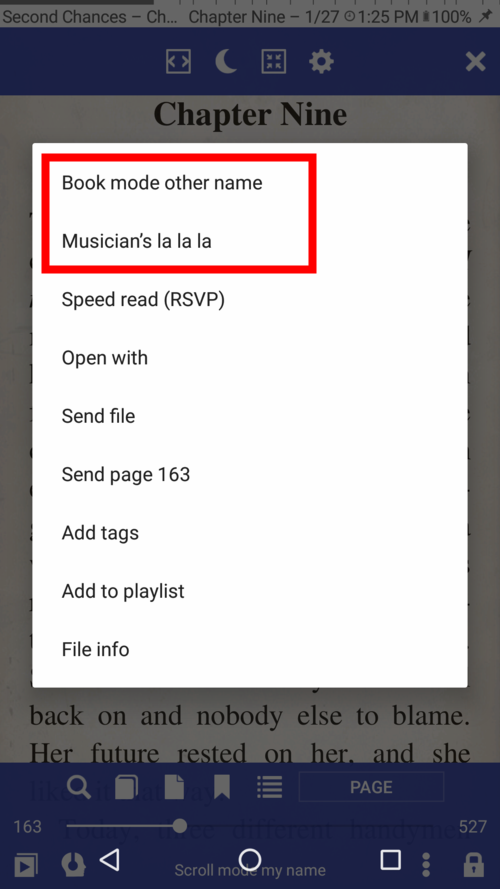
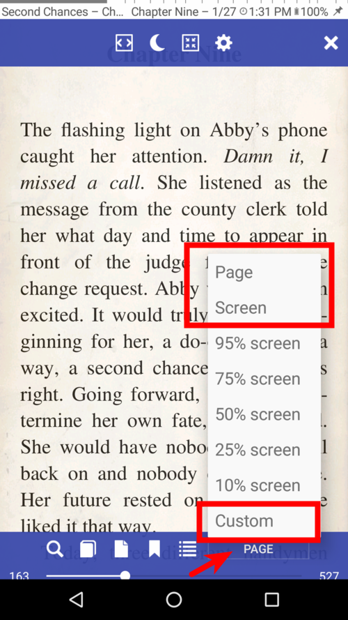
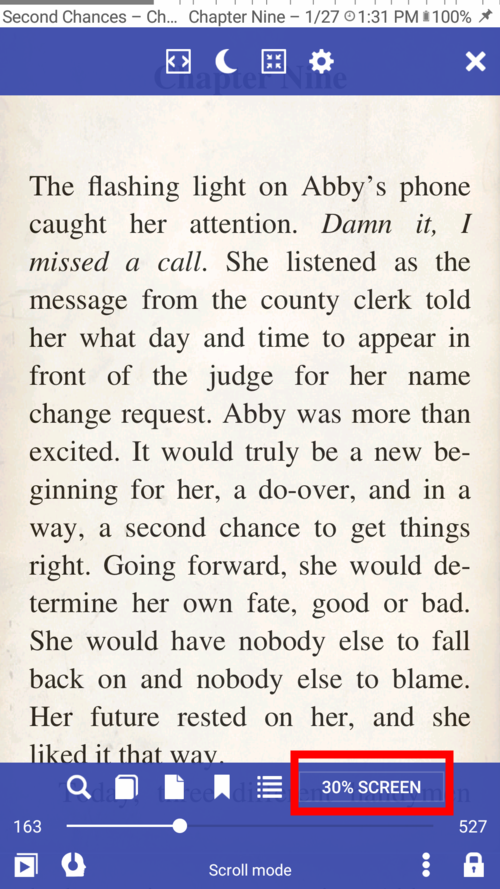
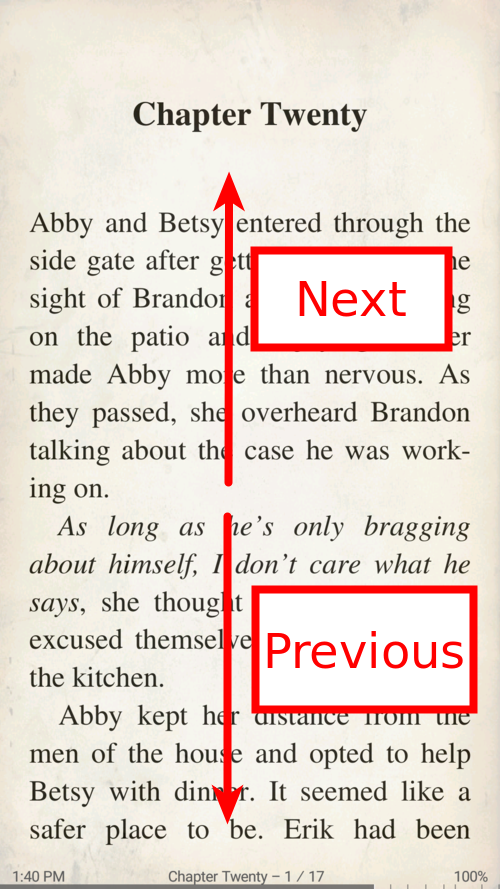

# Modos de lectura: desplazamiento, libro y músico

> **Librera** permite al lector elegir entre tres modos de lectura. Cada uno aborda requisitos particulares y el usuario puede cambiar de un modo a otro con bastante facilidad.

En **modo de desplazamiento**, las páginas del libro se desplazan hacia arriba y hacia abajo con deslizar el dedo

> También puede habilitar el desplazamiento automático y configurar su velocidad.

En **modo Libro**, las páginas se voltean horizontalmente con deslizamientos de dedo de izquierda a derecha o de arriba hacia abajo (o toques en los bordes de la pantalla)

**El modo de músico** es un caso del modo de desplazamiento automático diseñado específicamente para músicos.

* Un toque en un libro abrirá la ventana **Modo de lectura** para que pueda elegir un modo de lectura para este libro
* Marque la casilla _Recuerda el modo de lectura_ y seleccione su modo predeterminado para todos los libros
* Puede editar los nombres de los modos de lectura después de tocar _Editar_
* Una pulsación larga en _Edit_ restaurará los nombres predeterminados

||||
|-|-|-|
||||

**También puede especificar modos de lectura predeterminados para cada formato de libro electrónico.**

* Toque el icono de configuración para abrir el cuadro de diálogo de preajustes
* Marque la casilla para habilitar presets y editar las listas si es necesario
* No olvides tocar _SAVE_ si has realizado cambios
* Puede restaurar las listas a los valores predeterminados tocando _Restore default_

||||
|-|-|-|
||||

* Para cambiar el modo de lectura de un libro actual, toque la pantalla con el centro y luego toque el icono de tres puntos en la parte inferior
* Toque el modo preferido en el cuadro de diálogo
* Voilà!

||||
|-|-|-|
||||

## Modo de desplazamiento
* Elija el calibrador de sus desplazamientos de desplazamiento: por página, pantalla, valores predeterminados de porcentaje de pantalla o un valor personalizado

> **Desplácese con botones de volumen, teclas de hardware, botones en su dispositivo bluetooth, toques en la pantalla.**

||||
|-|-|-|
||||

## Modo libro
* Desliza horizontalmente para la página siguiente/anterior
* Desliza verticalmente para la página siguiente/anterior
* Cambia la respuesta a tus golpes verticales
> **Pase las páginas con botones de volumen, teclas de hardware, botones en su dispositivo bluetooth o toques en la pantalla.**

**¡Solo recuerda que tus zonas de toque son personalizables en términos de tamaño y acción!**

||||
|-|-|-|
||||

## Modo de músico
* Solo toque para iniciar/detener el desplazamiento automático
* Use los grifos en las zonas designadas para ir a la página siguiente/anterior
* Cambiar la velocidad de desplazamiento automático sobre la marcha
* Toque en la parte superior para mostrar los controles
* Toque el icono de rebobinado para volver al principio en cualquier momento

||||
|-|-|-|
||||
