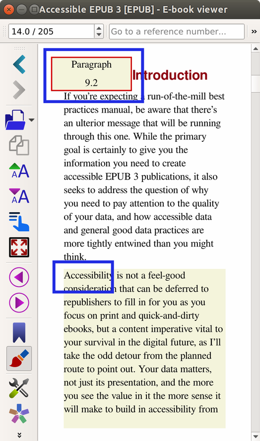

# Modo de referencia de estilo calibre

> Según un manual en línea de **Calibre Viewer**, en **Modo de referencia** se mostrará un número único al comienzo de cada párrafo, en referencia a este párrafo en particular. &quot;Este número es independiente del tamaño de la ventana del visor o del tamaño de la fuente&quot;. Los números podrían usarse para mapear el documento, crear una tabla de contenido, marcar, etc.

## Cómo habilitar el modo de referencia
* Abra la ventana **Preferencias** y toque _Configuración avanzada_ para abrir la pestaña
* Habilite el modo de referencia marcando su casilla
* Texto con los _Números de referencia_ mostrados

||||
|-|-|-|
||||
