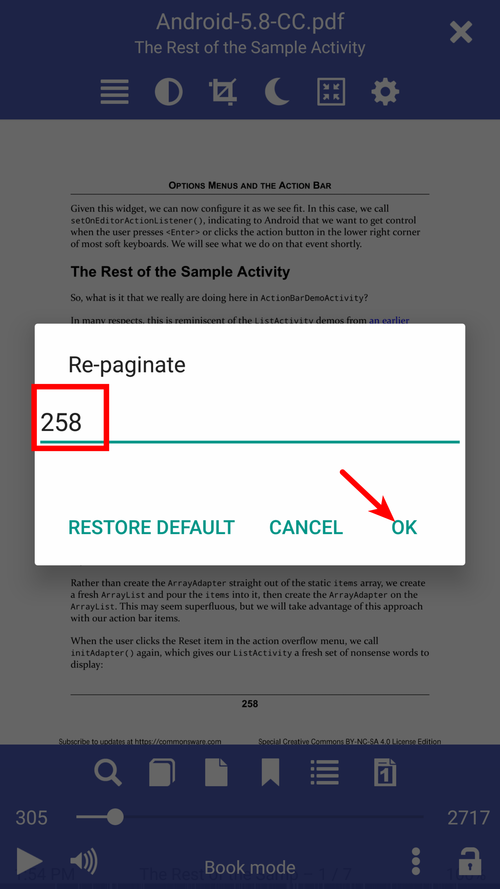

#重新分页文档以匹配书的页码

>通常，我们正在阅读的书被分为具有各自分页的部分，例如引言，作者或编者或任何人的前言，序言，评论等，而书本身也很好地融入了文档中。如果您有关于特定页面的书本注释，那么您会在文档中找不到方位。 **Librera**允许您重新分页，并使页码与您的笔记匹配。

**重新分页适用于所有书籍格式。但是，出于明显的原因，它主要用于PDF和DjVu文档。**

*点击中心屏幕以打开菜单
*长按当前页码
*在**重新分页**窗口中输入匹配的页码
*这本书的目录将自动重新分页

>您在这本书上的书签也会重新分页

*要取消重新分页模式，请调用**重新分页**窗口，然后点击_RESTORE DEFAULT_

|1|2|3|
|-|-|-|
||||
