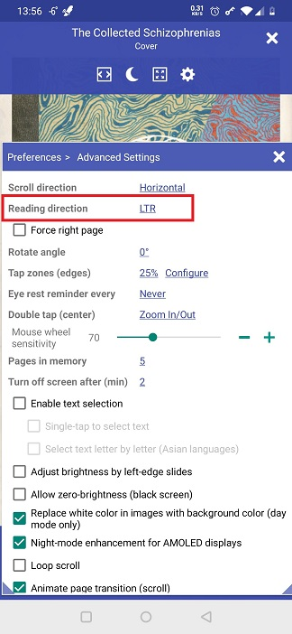
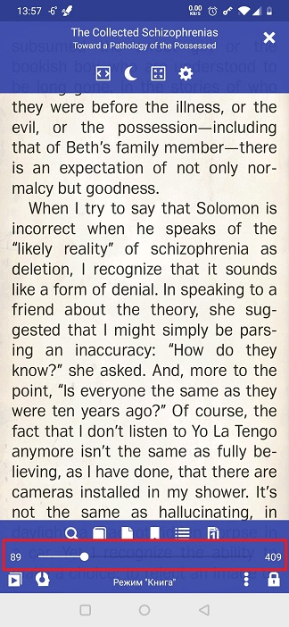
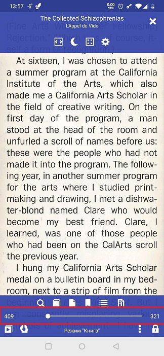

# Чтение на языках RTL

> **Librera** можно легко адаптировать для чтения текстов на языках слева направо, например, на арабском, иврите, фарси или урду. Вам просто нужно изменить направление чтения со значения по умолчанию для LTR.

Чтобы изменить направление чтения на RTL:

* Нажмите на значок **Настройки**, чтобы открыть окно **Настройки**
* Откройте вкладку _Advanced Settings_
* Нажмите на ссылку _Reading direction_ и выберите _RTL_
* Чтобы настроить двухстраничные макеты для чтения RTL, установите флажок _Force right page_

||||
|-|-|-|
||||

||||
|-|-|-|
||||
