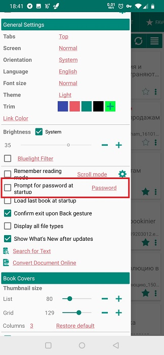
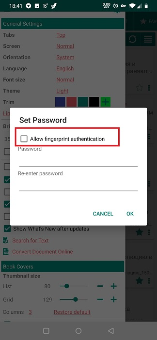
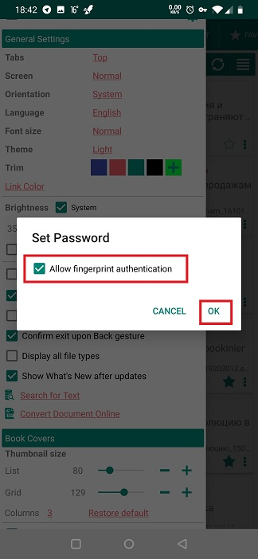
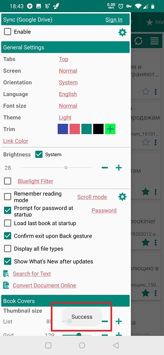
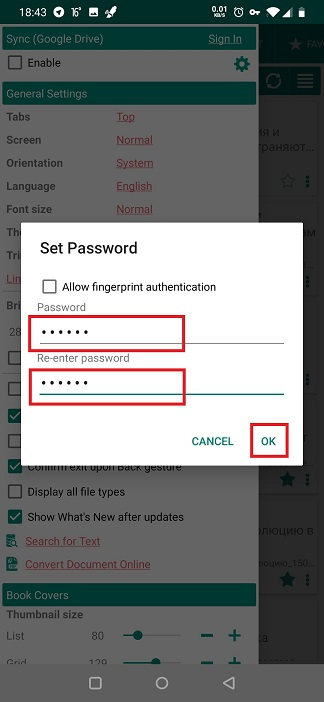
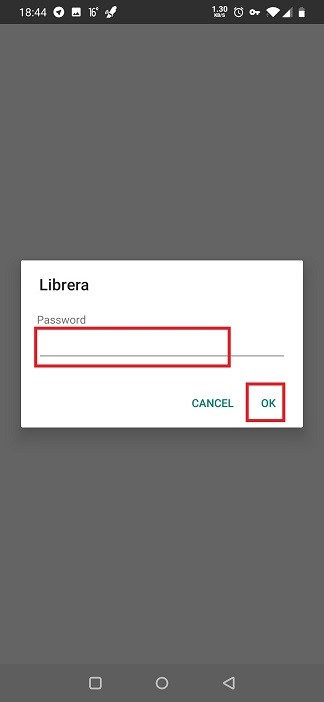
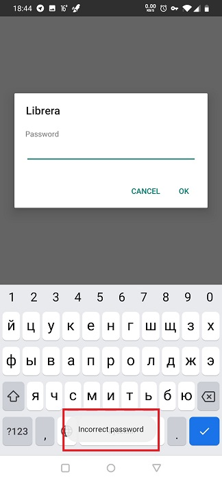

# Einrichten des Fingerabdruck- oder Passwortschutzes

> In **Librera** können Sie Ihre vertraulichsten Dokumente davor schützen, von nicht autorisierten Benutzern angezeigt zu werden, die versehentlich oder auf andere Weise Zugriff auf Ihr Gerät erhalten. Tatsächlich werden Sie ALLE Ihre Dokumente schützen, da Sie den Zugriff auf die App selbst einschränken.
Die Dokumente können entweder fingerabdruck- oder passwortgeschützt sein.

## Aktivieren der Startautorisierung

* Schließen Sie das Buch, das Sie gerade lesen
* Tippen Sie auf den Tab **Einstellungen** und blättern Sie zum Bereich _Allgemeine Einstellungen_
* Aktivieren Sie das Kontrollkästchen _Prompt for password_
> Wenn Sie das Fenster **Einstellungen** animiert haben, können Sie es aufrufen, indem Sie auf das Hamburger-Symbol in der oberen linken Ecke tippen oder mit dem Finger vom linken Bildschirmrand nach rechts streichen.

||||
|-|-|-|
||||

## Fingerabdruckschutz

> Um den Fingerabdruckschutz in **Librera** zu aktivieren, müssen Sie zuerst den Fingerabdruckzugriff auf Ihr Gerät einrichten.
* Aktivieren Sie im Fenster **Passwort festlegen** das Kontrollkästchen _Allow fingerprint authantication_
* Bestätigen Sie Ihre Auswahl, indem Sie auf **OK** tippen.

> Sie müssen **Librera** neu starten, um die Authentifizierung für den Fingerabdruckzugriff zu aktivieren.

||||
|-|-|-|
||||

## Passwortschutz

Passwort Login einrichten:

* Geben Sie Ihr Passwort in die entsprechenden Felder des Fensters **Passwort festlegen** ein, und wiederholen Sie die Eingabe. Klicken Sie dann auf **OK**.
> Die Passwörter sollten übereinstimmen!
* Bestätigen Sie Ihre Auswahl, indem Sie auf **OK** tippen.

> Sie müssen **Librera** neu starten, damit der Passwortschutz wirksam wird. Ab diesem Moment werden Sie auf einem leeren Bildschirm zur Eingabe eines Kennworts aufgefordert, wenn Sie ein Dokument in **Librera** öffnen.

||||
|-|-|-|
||||

> Um den Kennwort-/Fingerabdruckschutz zu entfernen, führen Sie **Librera** aus, authentifizieren Sie sich bei der Anwendung, rufen Sie das Kontrollkästchen _Prompt for password_ auf und deaktivieren Sie es.
