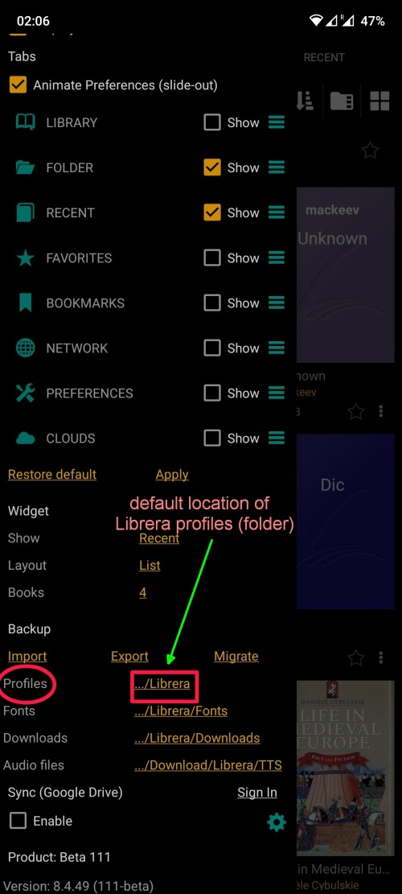
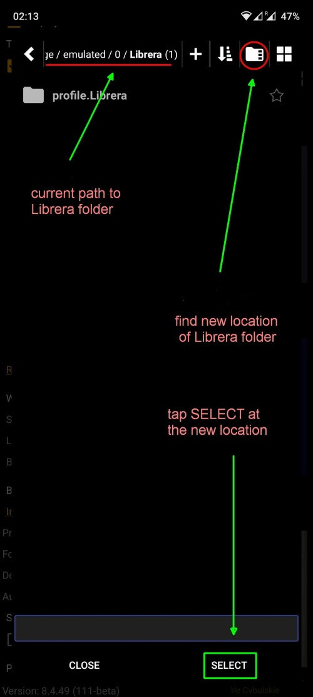
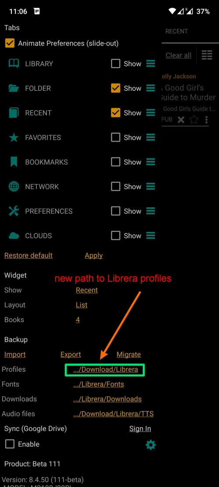

# Synchronisieren des Lese-Setups auf mehreren Geräten

> _Librera_ ist mit einem Synchronisierungstool ausgestattet, das nützlich sein sollte, wenn Benutzer mehr als ein Android-Gerät besitzen und dazu neigen, zwischen ihnen zu wechseln (auch sporadisch). Mit diesem Tool können Sie die Profile, den Lesefortschritt, die Lesezeichen und Ihre Leseeinstellungen von _Librera_ synchronisieren.

Für die Bequemlichkeit der meisten unserer Benutzer haben wir Google Drive als Synchronisierungs-Hub von _Librera_ ausgewählt.

* Um die Synchronisierung zu aktivieren, rufen Sie den Bereich _Sync_ auf der Registerkarte _Preferences_ auf und aktivieren Sie das entsprechende Kontrollkästchen
* Sie müssen sich in Ihrem Google Drive-Konto anmelden
 
> **Um eine ordnungsgemäße Synchronisierung sicherzustellen, müssen Ihre anderen Geräte bei demselben Konto angemeldet sein.**

||||
|-|-|-|
||||

## Synchronisierungsoptionen

* Wenn _Manuelle Synchronisierung_ aktiviert ist, müssen Sie mit dem Finger über den Bildschirm streichen, um die Synchronisierung zu starten (in der nativen Pull-to-Refresh-Methode von Android).
* Sie können verhindern, dass sich das Synchronisierungstool in Ihren Datenplan einfügt, indem Sie nur die WiFi-Synchronisierung aktivieren.
*Sie können sich mit Animationen zum Synchronisierungsfortschritt (drehendes Rad) unterhalten, indem Sie diese Option aktivieren
*Um das Synchronisierungsprotokoll anzuzeigen, tippen Sie einfach auf das Einstellungssymbol im Bereich _Sync_

||||
|-|-|-|
||||

> Hinweis: Google Drive wurde aus praktischen Gründen ausgewählt. Google-Konten sind kostenlos und für jeden verfügbar. Wenn Sie aus irgendeinem Grund eine andere Cloud-Lösung bevorzugen, fahren Sie fort und verwenden Sie sie.

## Synchronisierung über Apps von Drittanbietern

Die Gründe für Ihre Vorliebe für eine Synchronisierungsanwendung eines Drittanbieters können unterschiedlich sein. Obwohl wir ständig an der Feinabstimmung und Verbesserung Ihrer Erfahrungen mit der Synchronisierung über Google Drive arbeiten, geben wir zu, dass dies noch in Arbeit ist. Es arbeitet immer noch im experimentellen Modus und kann, wohlgemerkt, plötzlich auf Sie fallen.
Darüber hinaus können Sie auf die berühmte _Google Drive Access Denial_ stoßen, die absolut nicht die Schuld von _Librera_ ist, sondern eher auf Besonderheiten der Konfiguration Ihres Geräts zurückzuführen ist. (Weitere Informationen zu diesem Thema finden Sie leicht im Internet.)

Wenn Sie unsere Work-in-Progress-Warnung beachten und glauben, dass eine Synchronisierungs-App eines Drittanbieters robuster ist (oder Sie Google einfach nicht vertrauen), stellen Sie sicher, dass Ihre App:
1. Unterstützt Echtzeit-Synchronisierung
2. Speichert synchronisierte Verzeichnisse lokal (**NB!** 0offizielle Dropbox-App zum Beispiel macht **KEINE** davon!)

Wenn beide Voraussetzungen erfüllt sind:
*lassen Sie es den **Librera**-Ordner in Ihrem internen Speicher synchronisieren. Dieser Ordner enthält alle Ihre _Librera_ Einstellungen und Profile;
*oder Sie sollten diesen gesamten **Librera**-Ordner in den Ordner verschieben, der von Ihrer Synchronisierungs-App erstellt wurde, und den Pfad zu Ihren _Profilen_ in Librera entsprechend ändern.

(Im abgebildeten Beispiel unten haben wir:
*den Ordner **Downloads** ausgewählt, um Ihren synchronisierten Ordner zu imitieren,
*kopierte den **Librera**-Ordner mit all seinen Inhalten dorthin und
*hat den Pfad zu Ihren _Profilen_ in einen neuen Speicherort geändert.

||||
|-|-|-|
||||

**Um eine reibungslose Synchronisierung zu gewährleisten, ist es selbstverständlich, dass Sie auf allen Ihren Android-Geräten dieselbe Einrichtung haben sollten.**

> **PS** Von Online-Ressourcen heruntergeladene Bücher können Sie in Ordnern speichern, die über eine Drittanbieter-App synchronisiert wurden, und diese Ordner zur Bibliothek von _Librera_ hinzufügen.

