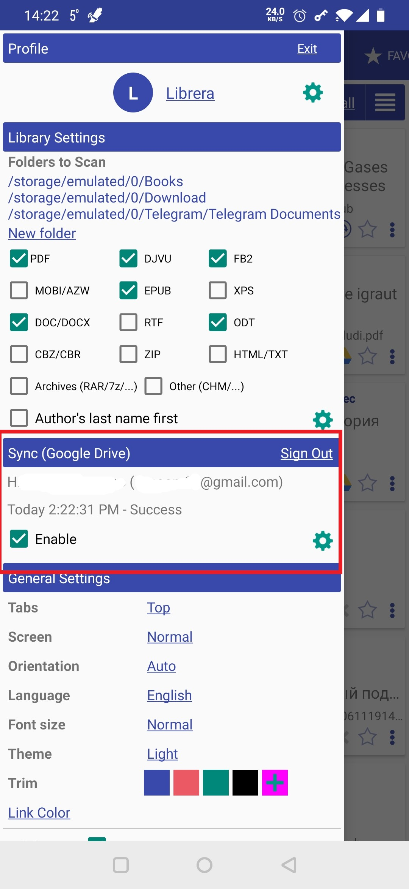
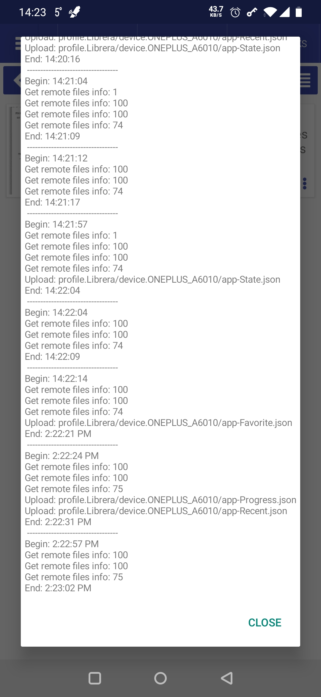

# Синхронизация настроек чтения на нескольких устройствах

> **Librera** оснащен инструментом синхронизации, который должен пригодиться в тех случаях, когда пользователи владеют более чем одним устройством Android и имеют тенденцию чередоваться между ними (даже время от времени). Используя этот инструмент, вы сможете синхронизировать профили **Librera**, прогресс чтения, закладки и настройки чтения.

Для удобства большинства наших пользователей мы выбрали Google Диск в качестве **Librera** в качестве центра синхронизации.

* Чтобы включить синхронизацию, перейдите на панель _Sync_ на выдвижной вкладке _Preferences_ и установите соответствующий флажок
* Вам необходимо войти в свой аккаунт Google Диска
 
> **Чтобы обеспечить правильную синхронизацию, другие ваши устройства должны быть зарегистрированы в той же учетной записи.**

||||
|-|-|-|
||||

## Варианты синхронизации

* Если установлен флажок _Manual sync_, вам нужно будет провести пальцем по экрану, чтобы начать синхронизацию (в обычном Android-режиме «тянуть-обновить»)
* Вы можете предотвратить включение инструмента синхронизации в свой тарифный план, включив только Wi-Fi-синхронизацию.
* Вы можете развлечь себя с помощью анимации прогресса синхронизации (вращающееся колесо), установив эту опцию
* Чтобы просмотреть журнал синхронизации, просто нажмите значок настроек (колесо) на панели _Sync_

||||
|-|-|-|
||||

> Примечание: Google Drive был выбран для его удобства. Аккаунты Google бесплатны и доступны для всех. Если по какой-либо причине вы предпочитаете любое другое облачное решение, используйте его:

> **Вам просто нужно синхронизировать папку _Librera_ (которая находится в вашем внутреннем хранилище) с вашим облаком. Вуаля!**

**PS** Что касается книг, загруженных с онлайн-ресурсов, вы можете хранить их в папках, синхронизированных с помощью стороннего приложения, и добавлять эти папки в библиотеку **Librera**.
