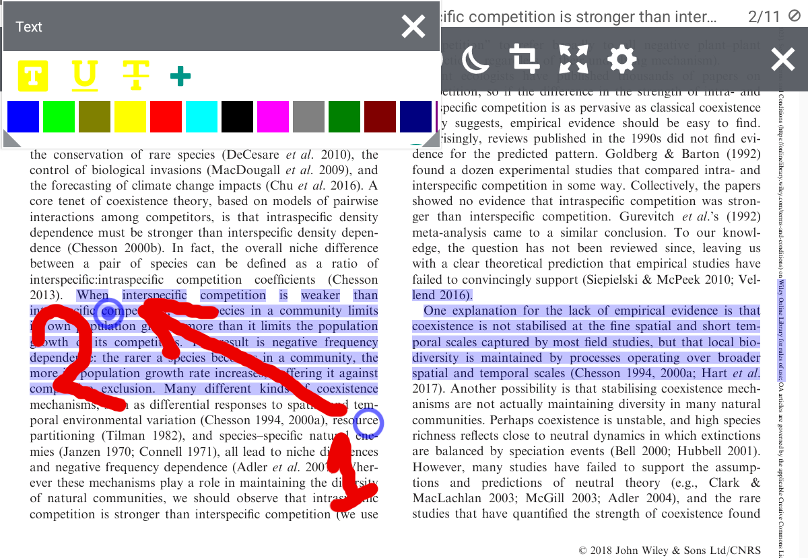
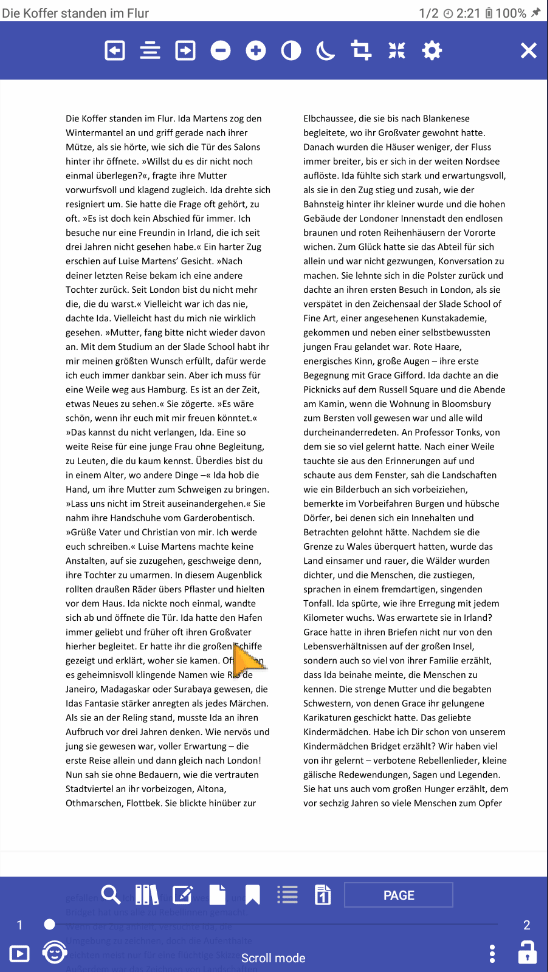

# Text selection in multiple columns in PDFs

There are two ways to select text in a column.

* The first way is to start selecting from the bottom right corner to the top left corner.

* The second way - you need to select a line in the column from the beginning to the end of the line (see screenshot #1).

After you have selected the line, you need to drag the dot marker down (or up) to select the text in the column (see screenshot #2).

If you have highlighted the text in the column and some words at the end of the line are not highlighted, you need to move another marker to the right to the width of the column (see screenshot #3, #4).

<iframe width="900" height="400" src="https://www.youtube.com/embed/Bdj3Z86uO38" title="Librera. Select text in columns in PDF files/ Виділення тексту в колонках. Лібрера" frameborder="0" allow="accelerometer; autoplay; clipboard-write; encrypted-media; gyroscope; picture-in-picture; web-share" allowfullscreen></iframe>

