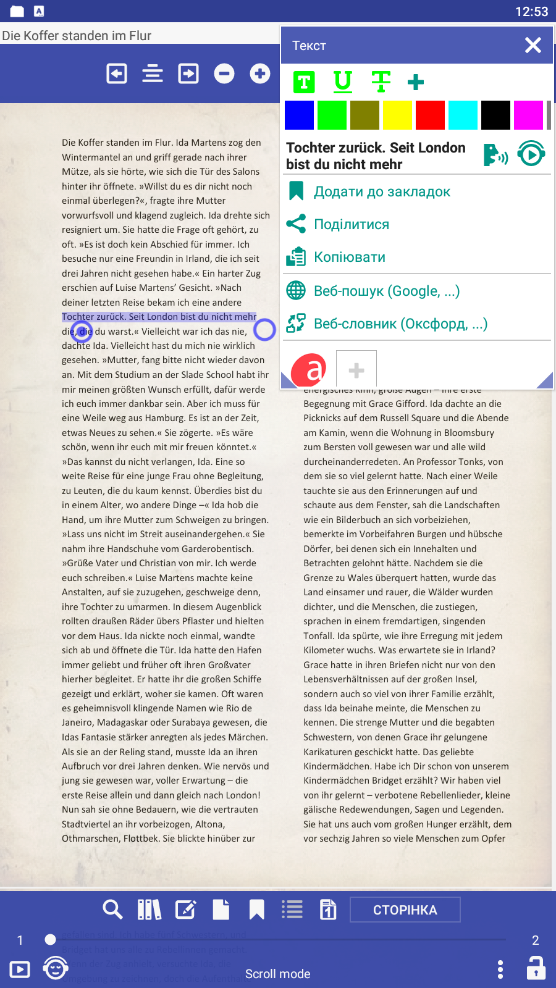

# PDF 多列文本选择

要选择列中的文本，请从右下角开始选择到左上角

<iframe width="900" height="400" src="https://www.youtube.com/embed/Bdj3Z86uO38" title="Librera. Select text in columns in PDF files/ Виділення тексту в колонках. Лібрера" frameborder="0" allow="accelerometer; autoplay; clipboard-write; encrypted-media; gyroscope; picture-in-picture; web-share" allowfullscreen></iframe>

