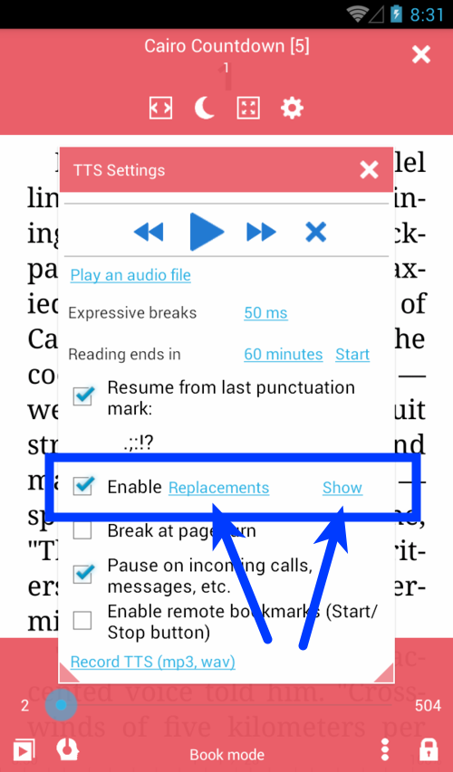
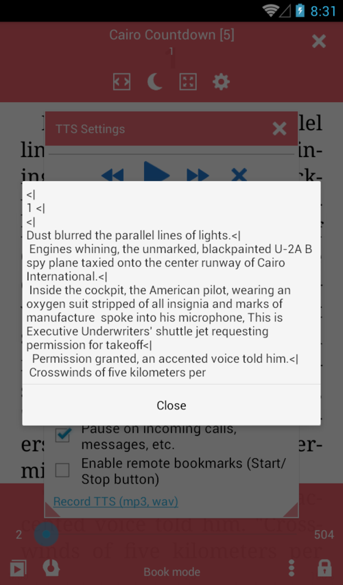
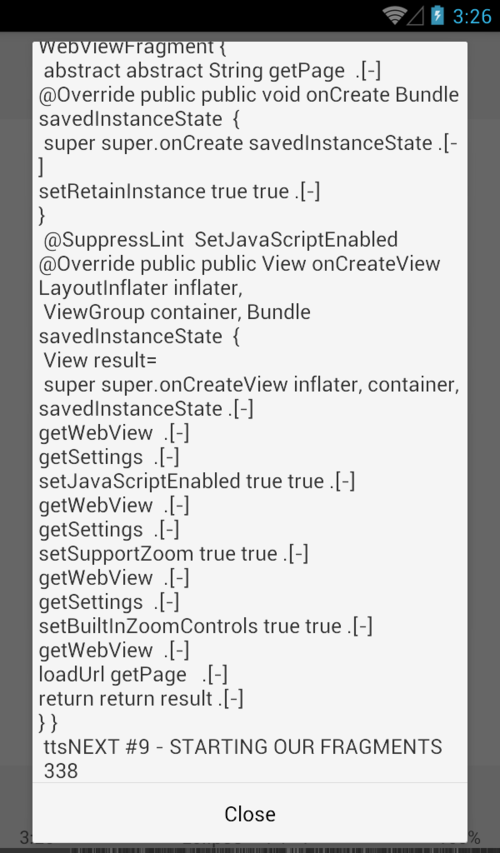

# Замена ТТС

> Замена текста в речь используется для изменения способа, которым движок произносит определенные слова, для пропуска определенных символов во время чтения или для установки правильных отметок ударения.

* Включить замены TTS
* Показать проезд с результатами замены
* Диалог **замен** для настройки правил замены

|1|2|3|
|-|-|-|
||||

Поддерживаются классические замены (прямое изменение одной строки на другую), или вы можете использовать регулярные выражения (RegExp).

## выражения

* «текст» - простой текст
* «* текст» - * правило RexExp
* «# текст» - отключенное правило
* «text256» - отключенное правило

## Примеры

* &quot;Lib.&quot; -&gt; «Либрера» - заменить Либ. с Либрерой
* «Либрера» -&gt; «Либрера» - добавить правильную отметку напряжения
* &quot;# Lib.&quot; -&gt; &quot;Librera&quot; - используйте &quot;#&quot; для отключения правила
* &quot;* (L | L) IB.&quot; -&gt; &quot;$ 1ibrera&quot; - заменить Lib. с Librera и Lib. с либрерой
* &quot;* [()&quot; «» * »«/[] &quot;-&gt;&quot; &quot;- пропустить символы
* &quot;* [?!:; - | - | -]&quot; -&gt; &quot;,&quot; - заменить символы на паузу (,)

## Команды TTS

* «текст» -&gt; ttsPAUSE - добавить паузу после «текста»
* «текст» -&gt; ttsSTOP - остановить TTS, если в предложении найден «текст»
* «текст» -&gt; ttsNEXT - перейти на следующую страницу, если в предложении есть «текст»
* «текст» -&gt; ttsSKIP - пропустить чтение предложения, если в предложении найден «текст»

## Добавить файл правил

**Librera** поддерживает файлы правил RegExp из **@Voice Reader**
Посмотрите этот пример **demo-replaceces.txt** ниже:

```
" живого " "живо́ва"
" как глаза " " как глаза́ "
" мне глаза" " мне глаза́"
" наклоняющая головы" "наклоня́ющая го́ловы"
" никакого стрелка" "никако́во стрелка́"
" ПОЖАРОБЕЗОПАСНУЮ СРЕДУ" "пожарабезопа́сную среду́."
" Стрелки!" "Стрелки́!"
" стрелки?" "стрелки́?"
", все так," ", всё так,"
"Зачем, стрелок?" "Зачем, стрело́к?"
"стрелок?" "стрело́к?"
*"(?i)\b\Q душа в душу\E\b" "душа́ в ду́шу"
*"(?i)\b\Q подогнулись\E\b" "падагну́лись"
*"(?i)\b\Q стрелки почувствовали\E\b" "стрелки́ почувствовали"
*"(?i)\b\Q стрелки продолжили\E\b" "стрелки́ продолжили"
*"(?i)\b\Q стрелку из\E\b" "стрелку́ из"
*"(?i)\b\Q стрелок\E\b" "стрело́к"
*"(?i)\b\Q стрелы\E\b" "стре́лы"
*"(?i)\b\Q*\E\b" "сно́ска"
*"(?i)\b\Q1 курса\E\b" "1-го курса"
*"(?i)\b\Q171 группы\E\b" "171-ой группы"
*"(?i)\b\Q1977\E\b" "1977-ой"
*"(?i)\b\QAcapela\E\b" "Акапэ́'ла"
*"(?i)\b\QBIOS\E\b" "БИ́“О́С"

*"(^| )(Д|д)-р" " доктор"
"(^| )(Г|г)-н" " господин"
*"(\d+)\s?-\s?я\b(?# ""я"" на границе слова)" "$1-я "
```
## Пропуск обрезанных областей в PDF документах
> Очень часто страницы в файлах PDF (книги, журнальные статьи, учебники и т. Д.) Имеют верхние и нижние колонтитулы, которые проходят по всему документу. Вы можете обрезать бегущие головки двумя пальцами, чтобы перейти к следующим (и предыдущим) страницам. Но ваш двигатель TTS не имеет ни малейшего представления о ваших манипуляциях. Итак, вы должны сказать ему, что делать (пропустите раздражающую вещь!), Читая документ вслух для вас.

В **Librera** мы ввели специальные замены (команды), которые позволят вам игнорировать обрезанные области и обеспечивать непрерывное, непрерывное чтение.
* В окне **Замены** введите слово или последовательность слов в левом столбце и _ttsSKIP_ в качестве замены. Эта замена скажет двигателю пропустить предложение с этой последовательностью слово/слово
* Введите слово или последовательность слов в левом столбце и _ttsNEXT_ в качестве замены. Замена скажет двигателю пропустить предложение с этой последовательностью слово/слово и немедленно перейти к следующей странице.
* Не забудьте нажать _APPLY_, чтобы заменить замены

|4|5|
|-|-|
|||

> **Пожалуйста, проверьте ваши изменения несколько раз, чтобы убедиться, что все работает как надо!**
