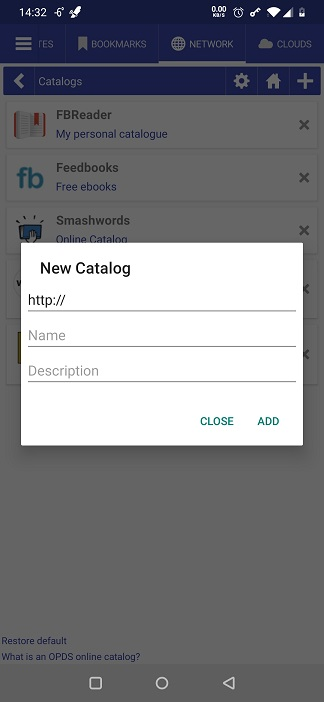
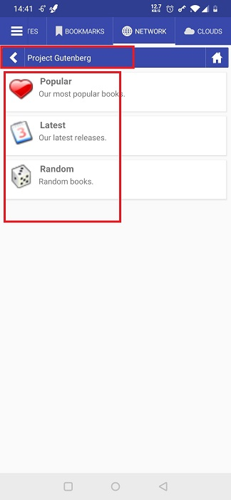
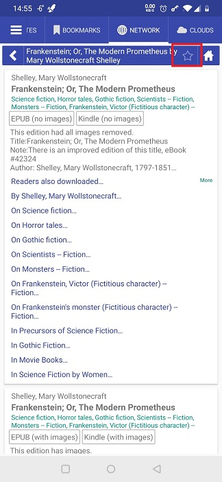
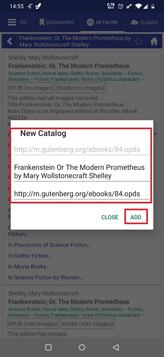
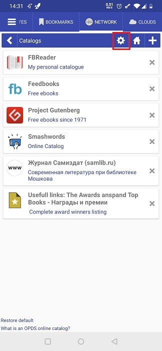

# العمل مع كتالوجات OPDS

> تنسيق نظام توزيع المنشورات المفتوحة (OPDS) هو تنسيق مشترك للمنشورات الإلكترونية. تتيح كتالوجات OPDS تجميع المنشورات الإلكترونية وتوزيعها واكتشافها واكتسابها (ويكيبيديا).

**Librera** يتيح للمستخدم فتح كتالوجات OPDS ، واستخدام محركات البحث الخاصة بهم للتنقل داخلها ، وتنزيل الكتب منها.

## فتح كتالوج
* **Librera** يأتي مع قائمة تم تكوينها مسبقًا من الفهارس في علامة التبويب _Networks_
* اضغط على عنصر قائمة لفتح كتالوج (بعضهم يحتاج إلى تسجيل ، لذلك تأكد من تسجيلك بالفعل مع هؤلاء)

## إضافة كتالوج إلى القائمة
* اضغط على أيقونة الإضافة (**+**) لفتح مربع الحوار _New Catalog_
* أدخل عنوان الكتالوج واسمه ووصفه (اختياري) ، ثم انقر فوق _ADD_
> **Librera** سيفتح مربع الحوار هذا مرة أخرى إذا فشل الاتصال. حدد _Add كمربع WEB site_ وحاول مرة أخرى

**لإزالة جميع كتالوجات OPDS التي قمت بإضافتها إلى القائمة الأصلية ، انقر فوق الرابط _Restore default_ في أسفل**

||||
|-|-|-|
||||

||||
|-|-|-|
||||

## تنزيل كتاب من كتالوج OPDS
* انتقل إلى الكتاب الذي تنوي تنزيله
* حدد تنسيق الكتاب المطلوب من خلال النقر عليه
* قم بتأكيد التنزيل
* سيتم تمييز إدخال الكتاب الذي قمت بتنزيله للتو
* افتح الكتاب واستمتع

||||
|-|-|-|
||||

## إضافة أدلة في كتالوجات OPDS إلى المفضلة
* انتقل إلى دليلك المفضل في كتالوج OPDS
* اضغط على أيقونة النجمة (المفضلة)
* قم بإجراء تغييرات ذات معنى على الاسم
* تأكيد الإضافة إلى القائمة بالنقر فوق _ADD_
* سيظهر الدليل في قائمة الفهارس

||||
|-|-|-|
||||

## تغيير الإعدادات
* اضغط على أيقونة الإعدادات
* يمكنك توجيه الاتصال بكتالوجات OPDS عبر خادم وكيل محدد في لوحة _Proxy Server Settings_ في نافذة الإعدادات
* يمكنك تغيير المجلد لتنزيلاتك من كتالوجات OPDS
* إذا كنت تفضل مشاهدة أغلفة الكتب الكبيرة أثناء تصفح الفهارس ، فحدد المربع المناسب

||||
|-|-|-|
||||
