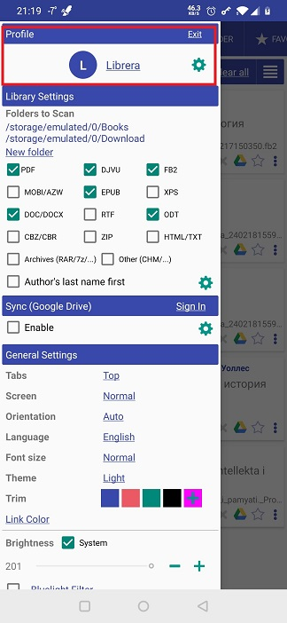
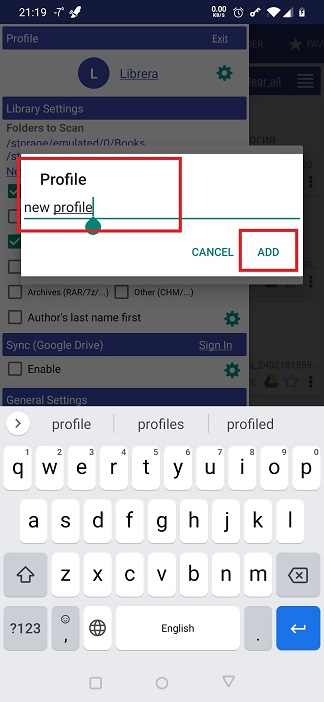
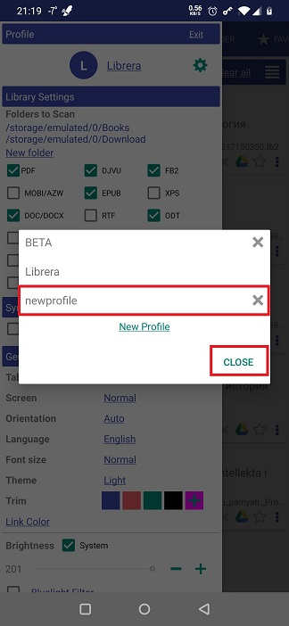
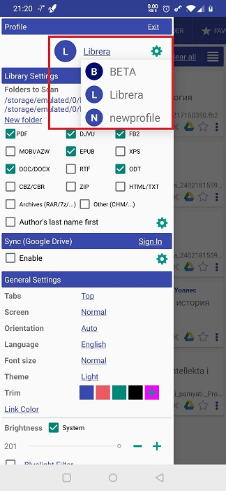
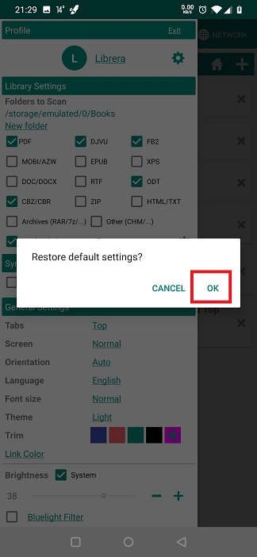

# Working with _Librera_'s Profiles

> **Librera** allows you to create multiple profiles. You can add one for anything, from day/night reading to your mood swings to book genres to your special attitude to a certain writer, etc. 
> And remember: Another profile (that might cheer you up) is just a couple of taps away (from your current one).

## Adding a New Profile
* Go to the slide-out **Preferences** tab and tap the settings icon in the _Profile_ panel (at the very top)
* Tap on the _New Profile_ link in the profile list window
* Specify a meaningful name for the new profile and _ADD_ it to the list
* Now you can configure the UI and reading settings for your new profile

||||
|-|-|-|
||||

## Switching Profiles
* In the _Profile_ panel of the **Preferences** tab, tap on the current profile name
* Select a profile you wish to switch to on the dropdown profile list
* Confirm profile switching in a popup dialog and enjoy

||||
|-|-|-|
||||

## Reseting a Profile
> If you need to revert your current profile's settings to their original (default) values, you should follow these easy steps:
 * Long-press on your current profile name in the _Profile_ panel of the **Preferences** tab
 * Confirm your intention in a popup dialog by tapping _OK_

**Note: Your bookmarks, tags, and reading progresses won't be deleted or reset!**

||||
|-|-|-|
||||

## Deleting a Profile
> Note: You must switch to another profile before deleting your current one.

* Tap on the settings icon in the _Profile_ panel of the **Preferences** window
* Click the _X_ next to the profile you intend to delete
* Confirm deletion by tapping _OK_

||||
|-|-|-|
||||
