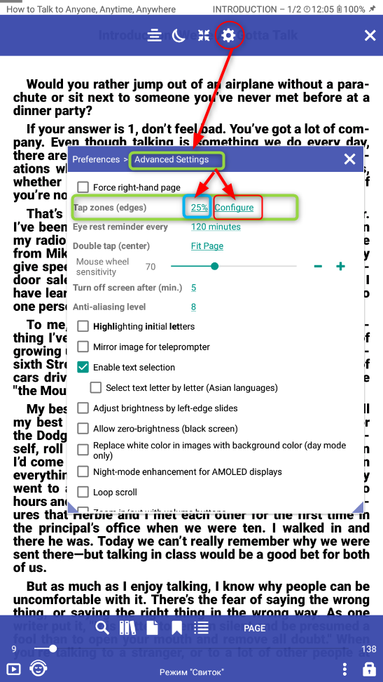
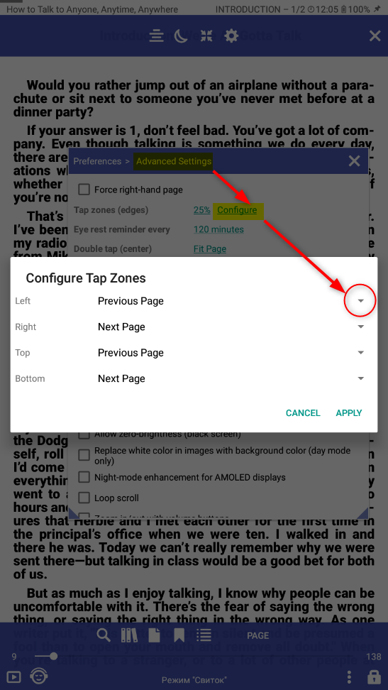
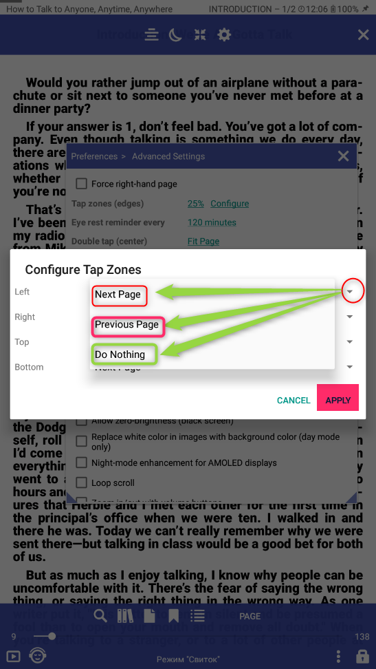
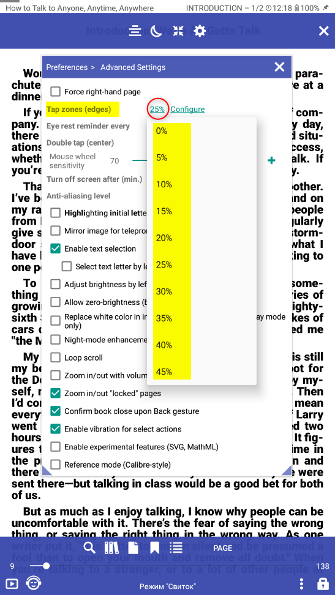

# Налаштування таб зон (зон листання) зліва/справа/зверху/знизу

> Для зручнсті читання ви можете налаштувати таб зони, а саме:
* вибрати дії при натискані на таб зони (зону листання)
* налаштувати ромір таб зони  

||||
|-|-|-|
||

Для того щоб налаштувати дії при натискані на таб зону (зону листання) вам необхідно відкрити **Налаштування** після чого перейти в **Розширені функції** знайтти розділ **Таб зони (зони листання)** та натиснути **налаштувати**. В спливаючому вікні навпроти необхідної таб зони натиснути на трикутник та вибрати необхідну дію. Після ланаштування не забутьте натиснути **Примінити**

||||
|-|-|-|
|||

Для того щоб налаштувати ромір таб зон (зон листання) вам необхідно відкрити **Налаштування** після чого перейти в **Розширені функції** знайтти розділ **Таб зони (зони листання)** та вибрати ромір таб зон 

||||
|-|-|-|
|||

