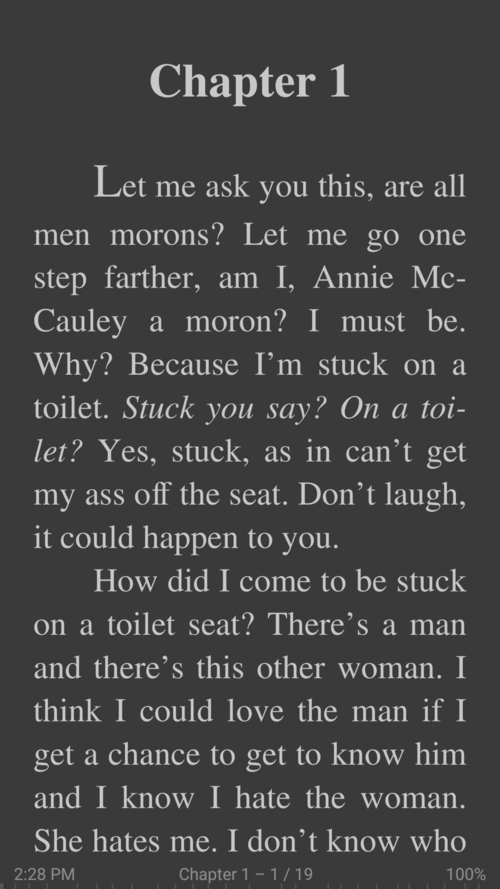
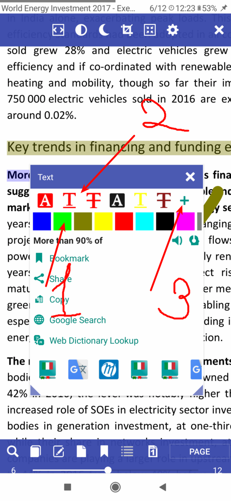
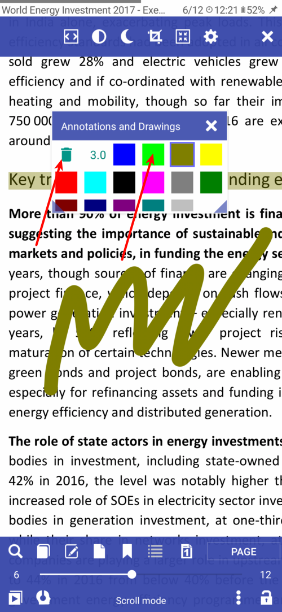

# Librera

> Полное руководство для программы Librera в одном файле.
  Также читайте [FAQ](/faq) для большей информации
 
<<Table of content generatnor>>

# <a name="about" /> О программе

Librera Reader - бесплатное приложение для чтения книг на Андроид
Поддерживает форматы PDF, EPUB, EPUB3, MOBI, DJVU, FB2, FB2.ZIP, TXT, RTF, AZW, AZW3, HTML, XPS, CBZ, CBR, TIFF, DOC, DOCX
 
Работат на версиях Андроид 4+

|-|-|-|
||||

# <a name="highlight_text" /> Выделение текста другим цветом 
Программа в первую очередь читалка и редактирование текста очень ограниченно реализовано.
Частично реализовано выделение, подчеркивание, зачеркивание, рисование для формата **PDF** в режиме **"Свиток"**.

* Выделите нужный участок текста
* В появившемся диалоге выберите желаемый цвет
* После нажмите на одну из иконок: Выделить, подчеркнуть, зачеркнуть

|-|-|-|
||||

Можно создать профили цветов для выделения

* Выбере желаемый цвет
* Нажмите "+"
* Выберите из списка действие

Также можно рисовать в тексте разными цветами и выбранной толщиной линии.

Чтобы удалить выделение или рисование, нажмите на иконку корзина и после кликните на желаемый эллемент на странице

Во время закрытия книги подвердите "Сохранить Изменения"

