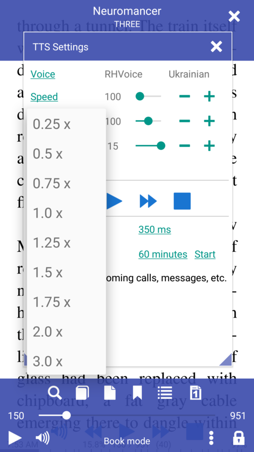
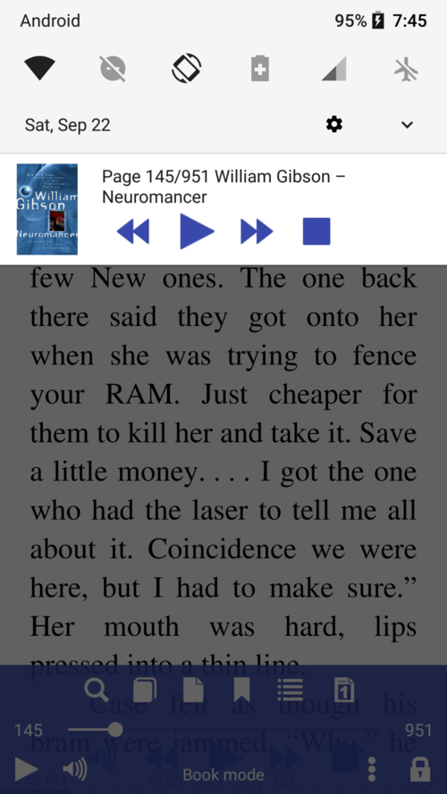
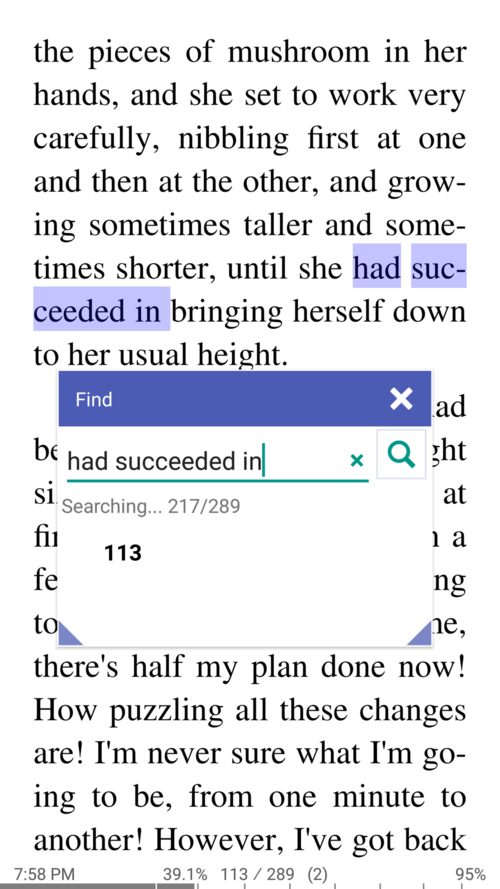
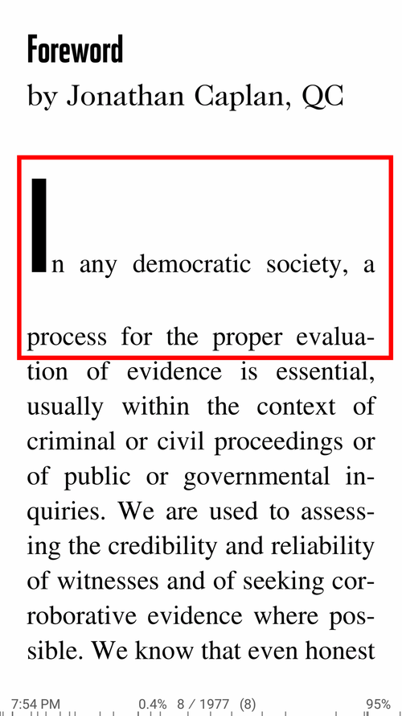
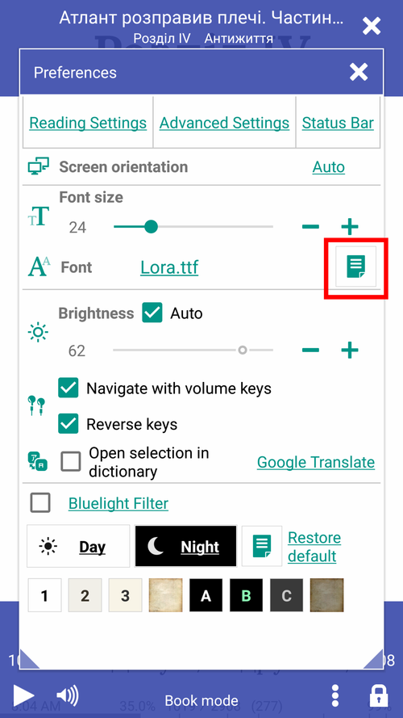
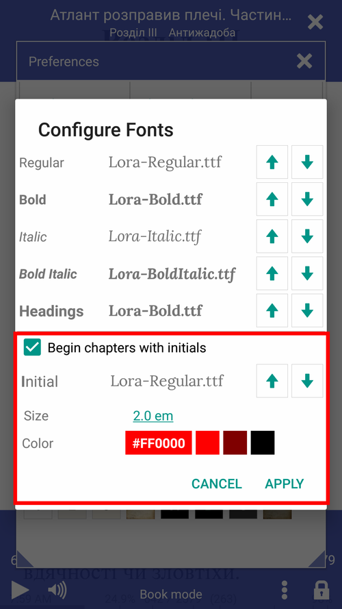

# 7.10

* Ein umfangreiches Update basierend auf Leseranfragen und Feedback
* Neue TTS-Oberfläche (Text-To-Speech)
* Verbesserte Unterstützung für die Wiedergabe von EPUB 3.0-Audiodateien
* Suchanfragen mit mehreren Wörtern in allen Formaten, einschließlich PDF
* Unterstützung für gekerbte Smartphones
* In der Statusleistenlegende stehen nun drei Optionen zur Auswahl: vollständig, kompakt und kapitelorientiert
* Weitere Rückmeldungen und Anfragen sind herzlich willkommen!

Abonnieren Sie den **Librera Reader-Telegramm** -Kanal [(https://t.me/LibreraReader)‹(https://t.me/LibreraReader), Neuigkeiten, Ankündigungen und viel Interessantes über die neue Funktionalität .

# Was ist neu in Librera 7.10?

Das TTS-Einstellungsfenster hat ein neues Aussehen und funktioniert jetzt besser im Hintergrund.
Das TTS-Lesen unterstützt einstellbare Pausen an Satzzeichen.

* TTS-Steuerelemente unten
* Einfache Geschwindigkeitsänderung
* Verbessertes Benachrichtigungsverhalten

||||
|-|-|-|
||||

Suchen Sie nach mehreren Wörtern in einem beliebigen Buchformat.
Die Option &quot;Schriftgröße normalisieren&quot; bewirkt, dass alle Schriftarten dieselbe Größe (Höhe) haben und Leerzeichen ohne Unterbrechungen in einzelne Leerzeichen reduziert werden.

* Suchanfragen mit mehreren Wörtern in einem Buch
* Deaktivieren Sie die Normalisierung der Schriftgröße
* Aktivieren Sie die Option zum Normalisieren der Schriftgröße

||||
|-|-|-|
||||

Öffnen Sie eine externe Audiodatei im Dialogfeld &quot;TTS-Einstellungen&quot; und hören Sie sie sich beim Lesen an.
Diese Funktion sollte für diejenigen, die Fremdsprachen lernen, oder für Musiker nützlich sein.
Librera-Player ist auch ein Versuch, Multimediabücher zu lesen.
Das Format der Statusleistenlegende kann von vollständig über kompakt zu kapitelorientiert geändert werden

* Eingebauter Audioplayer (zum Abspielen externer MP3-, MP4- und FLAC-Audiodateien beim Lesen eines Buches)
* Mediendateien in EPUB3-Büchern abspielen
* Drei Statusleisten-Legendenformate zur Auswahl

||||
|-|-|-|
||||

Führende Initialen in Kapiteln von **FB2** -Büchern können im Dialogfeld &quot;Schriftarten konfigurieren&quot; konfiguriert werden.

* Öffnen Sie das Fenster &quot;Schriftarten konfigurieren&quot;, nachdem Sie ein FB2-Buch geöffnet haben
* Aktivieren und konfigurieren Sie führende Initialen
* Sie können Schriftart, Farbe, Größe usw. ändern.

||||
|-|-|-|
||||

* Unterstützung für Telefone mit gekerbten Displays
* Inhaltsverzeichnis für EPUB 3.0-Bücher
