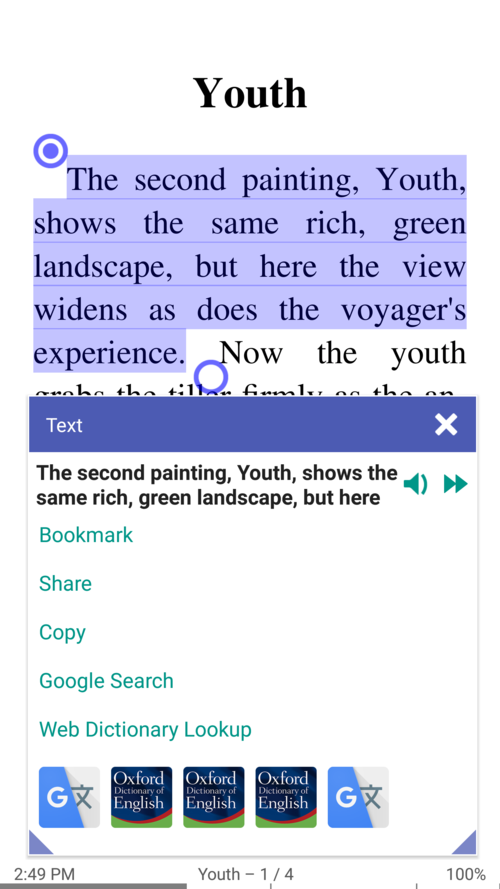
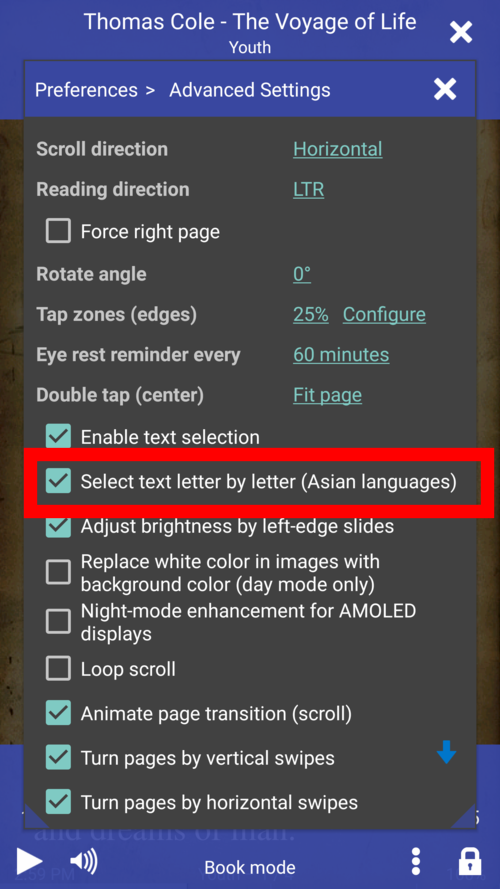

# 7.11

**Nouvelles fonctionnalités**

* Sélection de texte avec des marqueurs de début et de fin
* Mode de lecture rapide RSVP (Rapid Serial Visual Presentation) (w/a twist!)
* Sélection de texte et recherche dans les documents DjVu
* Option permettant de modifier la position de la barre d'état (haut ou bas) en mode Livre
* Les signets sont désormais liés à la lecture des valeurs de pourcentage de progression.
* Les dossiers peuvent maintenant être ouverts en tant que livres.
* Trier la bibliothèque de livres par langue

**Corrections**

* Génération de pages de couverture pour les gros livres AZW et AZW3
* Icône d'application adaptative conforme aux dernières tendances d'Android 8+
* Règles de césure pour plus de langues
* La lecture du STT s'arrête si votre périphérique Bluetooth est déconnecté.

Abonnez-vous au **lecteur Librera** du canal télégramme [https://t.me/LibreraReader](https://t.me/LibreraReader). Soyez le premier à connaître nos derniers développements, ne manquez jamais les dernières nouvelles, annonces et autres informations intéressantes concernant les nouvelles fonctionnalités de Librera.

**Poignées de sélection de texte**

* Si l'utilisateur sélectionne plus d'un mot, les poignées de sélection de texte apparaissent.
* Le texte peut être sélectionné de manière **lettre par lettre** ou **mot par mot**.
* Chaque poignée (début ou fin) peut être déplacée séparément, en temps réel

||||
|-|-|-|
||||

**Lecture RSVP (présentation visuelle en série rapide)/Lecture rapide**

La lecture rapide avec **Librera** vous permet d’accroître votre vitesse de lecture jusqu’à 700 mots par minute (WPM) en implémentant la méthode RSVP.
Suivez le lien pour trouver plus d'informations sur le sujet [section de lecture rapide](/manual/Rapid-Serial-Visual-Presentation/fr)

* Le mode RSVP peut être lancé à partir du menu du livre (Lecture rapide)
* Lecture rapide en un seul clic
* Ajuster la longueur de ligne minimale: jusqu'à 30 CPL

||||
|-|-|-|
||||

**Position de la barre d'état (haut ou bas) en mode Livre**

* La barre d'état est en bas par défaut
* Sélectionnez sa position dans la liste déroulante
* Barre d'état en haut

||||
|-|-|-|
||||

**Ouvrir un dossier avec des images sous forme de livre (relié dans un livre)**

Pour ouvrir un dossier sous forme de livre, naviguez jusqu'à celui-ci dans l'onglet Dossiers et appuyez sur son nom. S'il contient au moins un fichier image, l'option Liaison dans un livre apparaît.

* Ouvrir un dossier contenant des images et les lier dans un livre
* Dossier avec images ouvert en tant que livre virtuel
* Recadrer les espaces blancs, régler le contraste et la luminosité, etc.

||||
|-|-|-|
||||

**Trier les livres par langue**

* Voir toutes les langues disponibles dans la bibliothèque
* Trier les livres par langue

||||
|-|-|-|
||||

