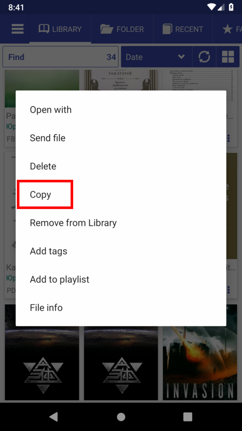
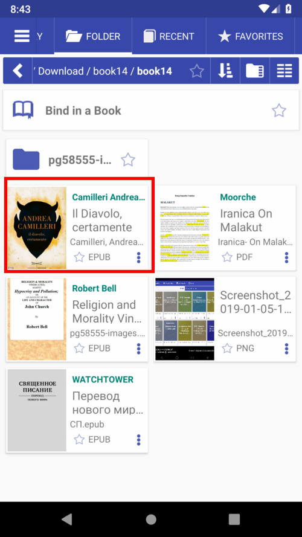
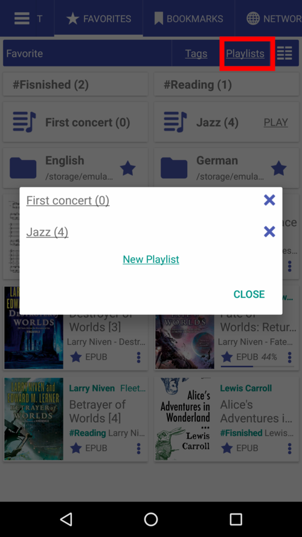
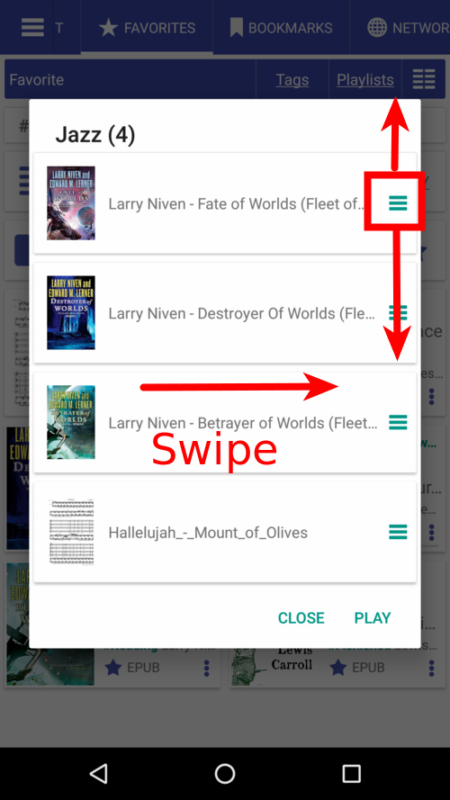
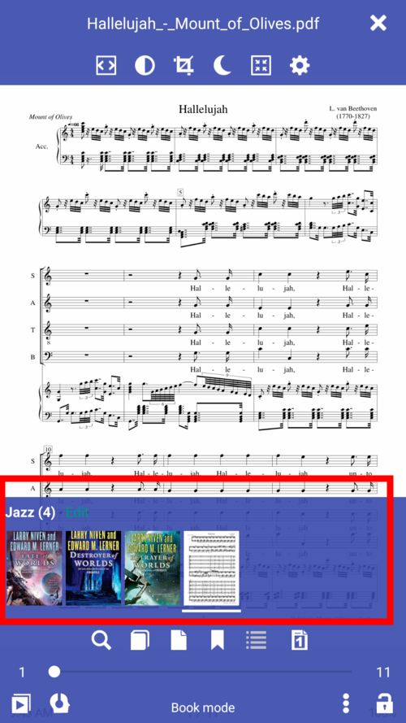
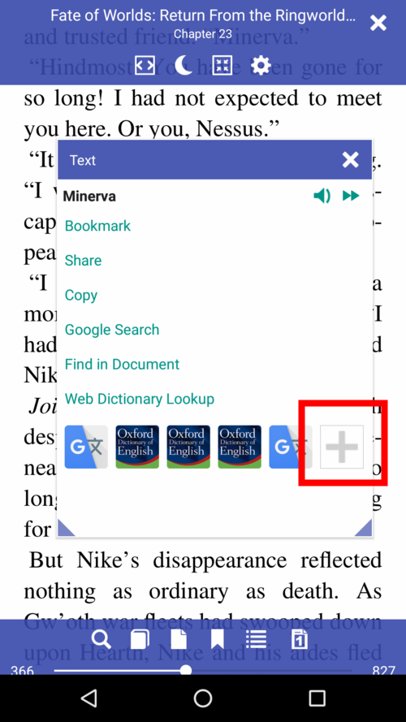
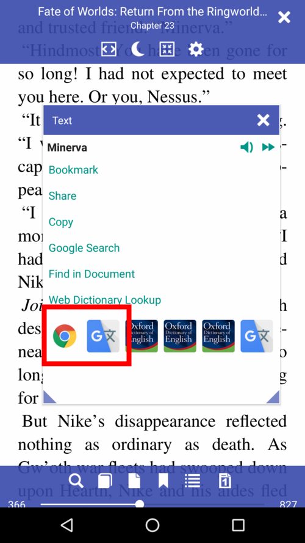
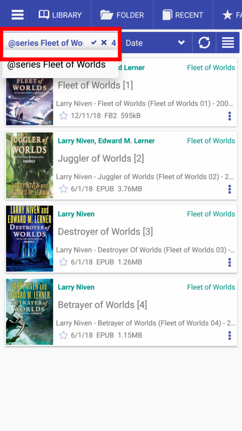
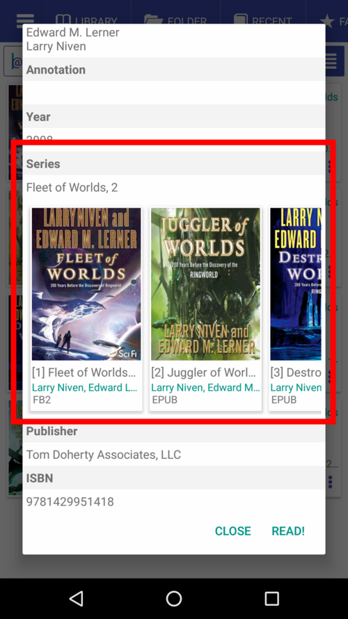
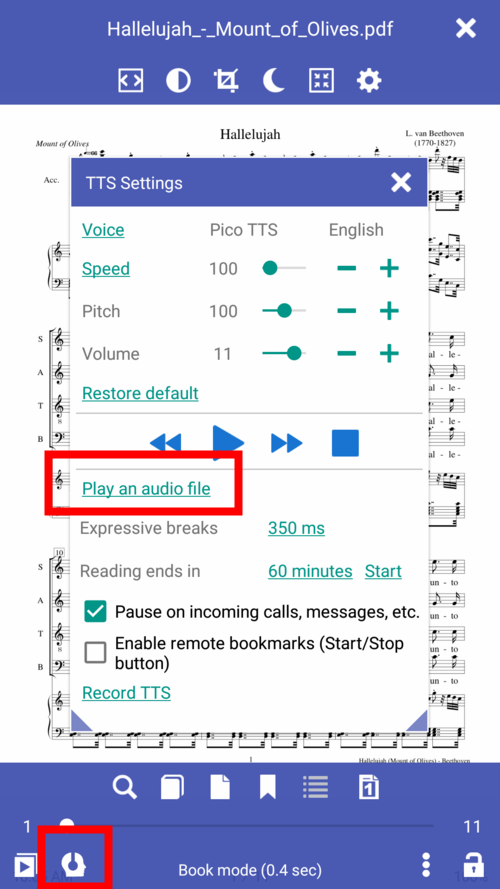

# 7.12

**Nouvelles fonctionnalités**

* Listes de lecture (groupes de livres)
* Ajouter des applications (dictionnaires) pour ouvrir le texte sélectionné dans la fenêtre Texte
* Lecture de fichiers et de dossiers mp3
* Série de livres à manipuler
* Option permettant d'afficher les notes de fin/de bas de page sous forme de notes dans le texte
* TTS peut maintenant lire les notes de fin/de bas de page
* Option permettant de reprendre la lecture de la synthèse vocale au dernier signe de ponctuation (mode par phrase)
* Partager des pages à partir d'autres applications (par exemple, des navigateurs) avec Librera Reader
* Prise en charge du chinois traditionnel et simplifié
* Ruban de signets pour la création de signets à la volée (par exemple, en mode Musicien)
* Gestionnaire de fichiers: copier, coller et déplacer des fichiers

**Ruban de signets**

* Ajouter des favoris en un seul clic
* Parcourir facilement les favoris
* Afficher/masquer le ruban en mode de lecture

||||
|-|-|-|
||||

**Copier, coller, déplacer des fichiers dans le gestionnaire de fichiers**

* Copier n'importe quel livre avec un menu Livre
* Paster ou déplacer le livre dans le dossier
* Cliquez sur le chemin du dossier ou sur l'espace noir.

||||
|-|-|-|
||||

**Onglet Favoris**

L'onglet **Favoris** a été repensé. Les **balises** et les **listes de lecture** sont désormais facilement accessibles.
Étiquetez les livres pour les regrouper selon n'importe quel critère commun, par exemple &quot;Math&quot;, &quot;Thriller&quot;, &quot;Mystère&quot;, etc. (Une étiquette peut également être ajoutée à partir de la fenêtre Informations sur le livre.)
Les listes de lecture sont principalement destinées aux musiciens: il est facile de garder les documents sélectionnés à portée de main et de manipuler la liste.

||||
|-|-|-|
||||

**Listes de lecture**

* Créer des listes de lecture
* Faites glisser les poignées pour modifier l'ordre des commandes.
* Balayez vers la droite/gauche pour supprimer un livre de la liste.
* Appuyez sur Modifier pour modifier la liste.

||||
|-|-|-|
||||

**Ajouter des applications utilisateur**

Appuyez sur **+** pour ajouter une application qui ouvrira le texte sélectionné.

||||
|-|-|-|
||||

**Gestion des séries de livres**

Il est facile de trouver tous les livres d'une série:

* Les séries sont &quot;cliquables&quot; dans la fiche de réservation
* Appliquer le filtre Série à la bibliothèque de livres
* Tous les livres de la série seront répertoriés dans la fenêtre Informations sur le livre.

||||
|-|-|-|
||||

**Lire des fichiers mp3**

Écoutez un fichier mp3 ou une sélection de fichier via le lecteur interne en parallèle avec la lecture du livre.
Pourrait être utile pour les musiciens et pour ceux qui étudient les langues étrangères.

||||
|-|-|-|
||||

