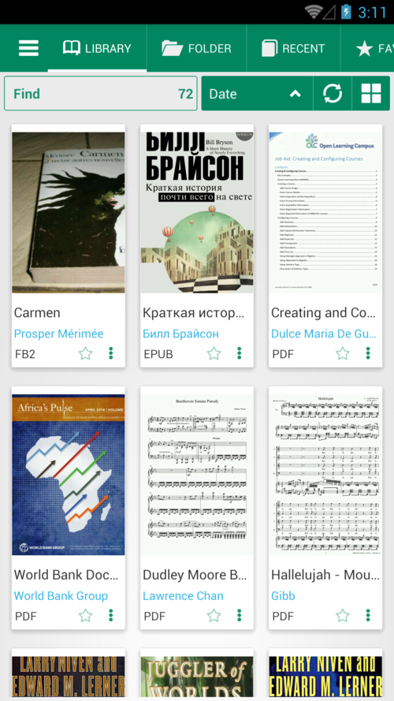
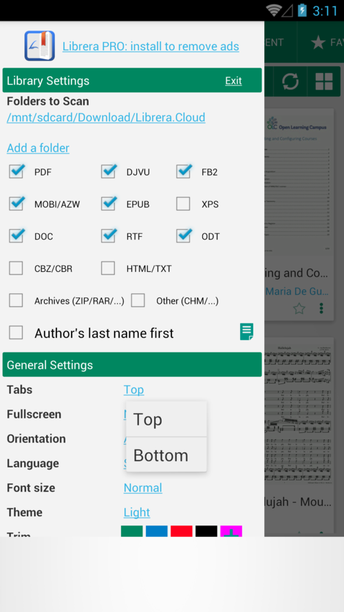
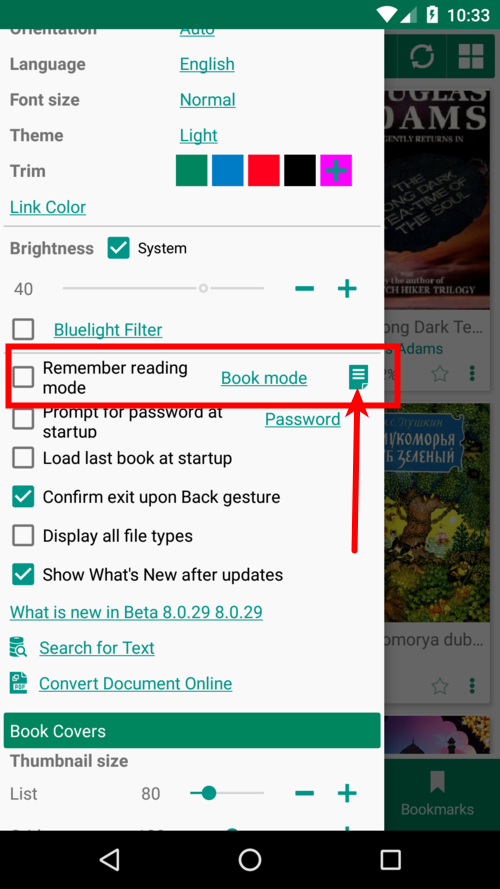
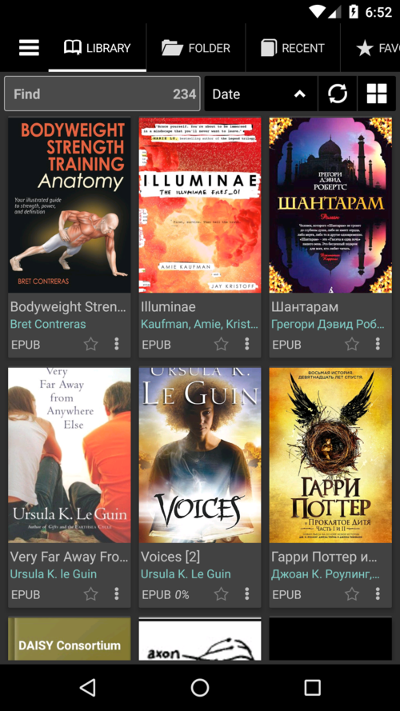

# 8.0

Usando questa app accetti i termini della [Informativa sulla privacy](/PrivacyPolicy/it)

**Miglioramenti generali**

* Tutte le librerie sono state aggiornate
* Il tema scuro è stato migliorato

**Nuove funzionalità**

* Opzione per cambiare la posizione delle schede
* Supporto del formato doc
* Supporto del formato Docx su dispositivi Android 8+
* Preimpostazioni in modalità lettura

**Correzioni di bug**

* I file e le cartelle eliminati non sono più _ghost_ Library
* I file aperti da altre app rimarranno nella Libreria fino a quando non verranno eliminati (e cancellata la cache)

**Scegli la posizione delle schede: in alto o in basso**

||||
|-|-|-|
||||

**Predefiniti in modalità lettura**

* Indica a **Librera** quale modalità di lettura predefinita preferisci per un particolare formato di libro
* Aggiungi manualmente qualsiasi formato desiderato

||||
|-|-|-|
||||

**Temi OLED Dark &amp; Dark**

* Scegli il tema OLED scuro con il colore nero pece

||||
|-|-|-|
||||

