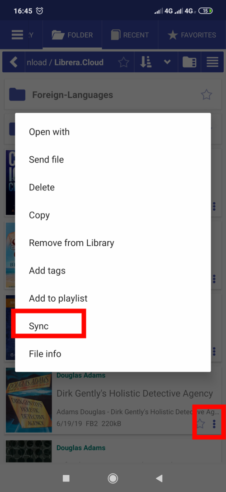
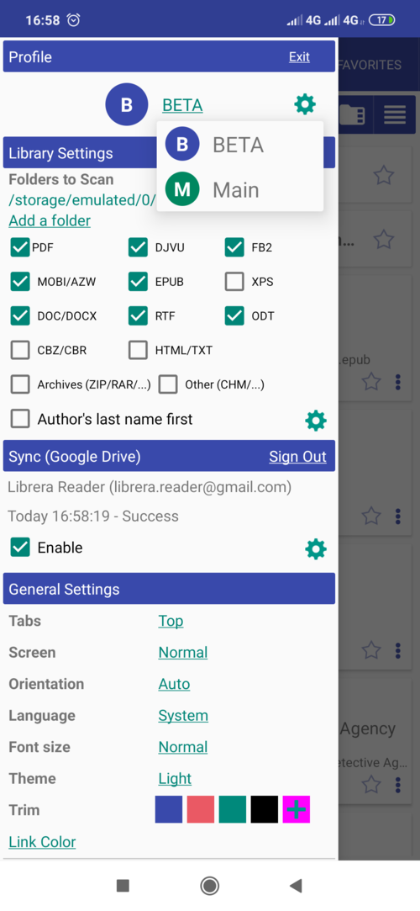
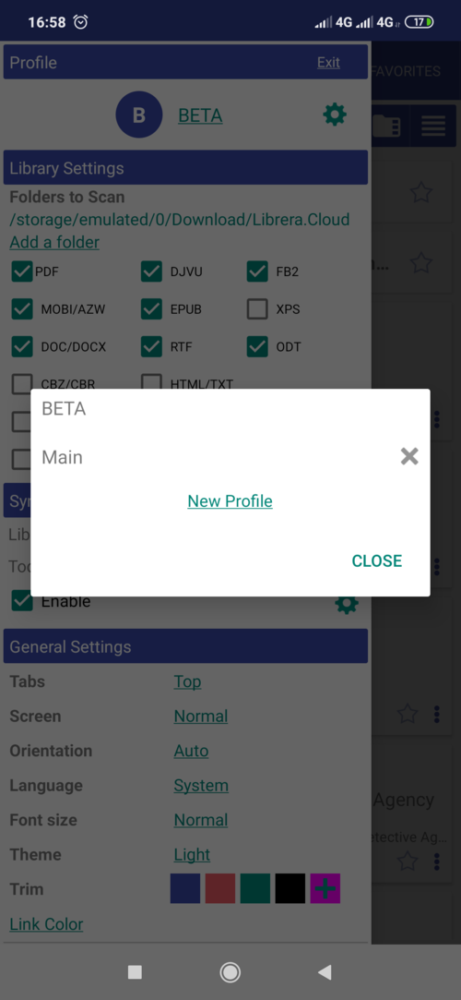
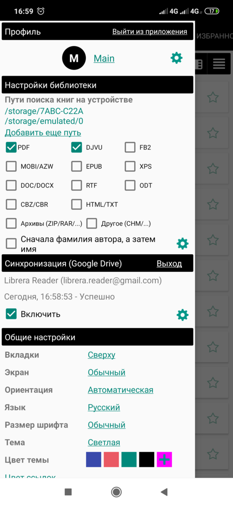
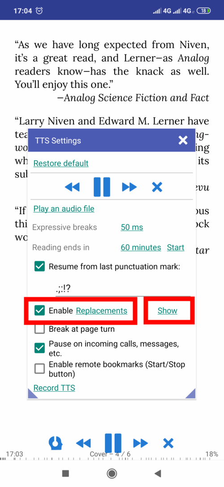
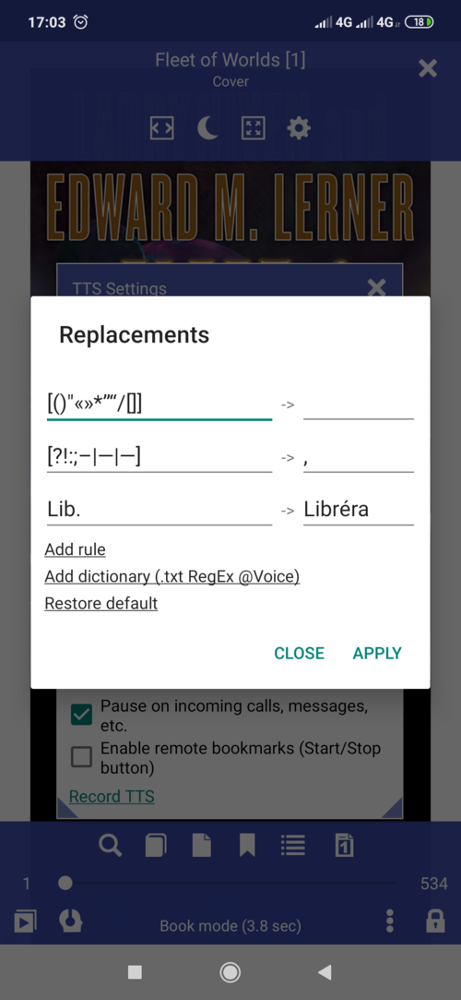
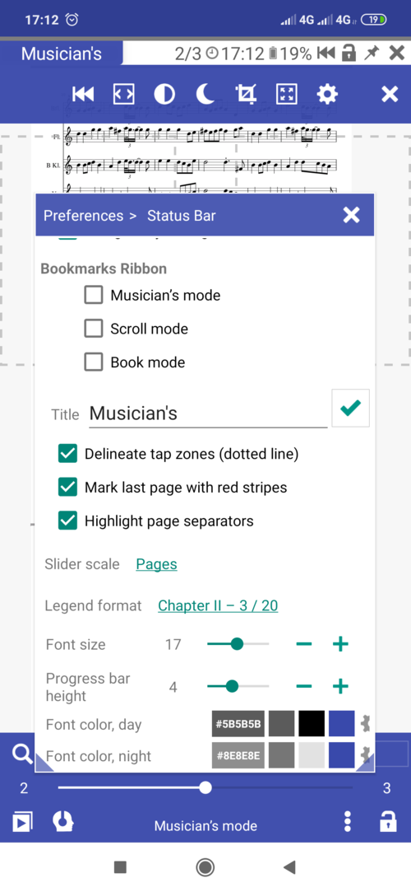
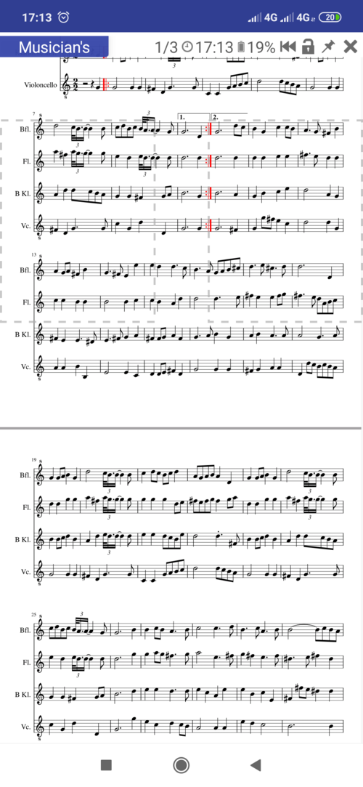
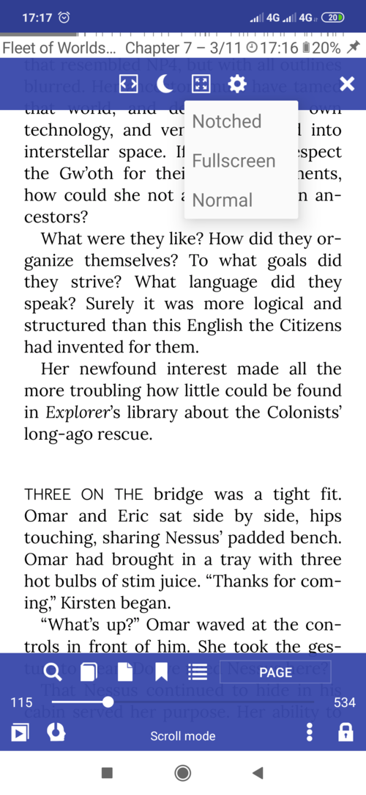

# 8.1

Используя это приложение, вы соглашаетесь с условиями [Политика конфиденциальности](/PrivacyPolicy/ru)

**Новые функции и улучшения**

* TTS: запись целых книг или диапазонов страниц в файлы MP3 (одна страница на файл)
* Синхронизация между устройствами Android через Google Drive (прогресс чтения, закладки и т. Д.)
* несколько профилей
* TTS: замена символов, ручные отметки напряжения, правила RegEx
* Дополнительные настройки и навигация в режиме музыканта
* Дополнительные функции доступны через интерфейс
* Различные улучшения пользовательского интерфейса и функциональности

# Синхронизация через Google Диск

Синхронизация предназначена для использования на нескольких устройствах Android, подключенных к Google Drive. Читая книгу, вы сможете взять трубку на планшете ночью там, где остановились на телефоне в течение дня. Синхронизация поддерживается **всеми** приложениями семейства Librera. И это БЕСПЛАТНО.

Вы можете синхронизировать следующие параметры:

* Процесс чтения для всех книг, которые вы сейчас читаете (синхронизированы или нет). Сохраняйте одинаковые имена файлов на всех ваших устройствах, и ваши книги будут синхронизироваться автоматически
* закладки
* Недавний список
* Избранное и теги

Примеры синхронизации

* Включить синхронизацию через Google Drive (необходимо иметь учетные данные Google под рукой)
* Чтобы синхронизировать книгу, вызовите ее меню и выберите _Sync_
* Все ваши книги на вкладке &quot;Избранное&quot; будут синхронизированы

||||
|-|-|-|
||||
 
 
# Профили

Использование профилей подобно тому, как на вашем устройстве установлено несколько экземпляров Librera, каждый со своими индивидуальными настройками, списками книг, процессами чтения и закладками. Вам разрешено создавать новые профили и удалять старые. Все приложения семейства Librera имеют эту функцию.

Профили хранятся во внутренней памяти устройства по адресу /sdcard/Librera/profile.[NAME]. Их настройки, закладки, прогресс чтения хранятся в файлах JSON, которые могут быть просмотрены любым просмотрщиком JSON (однако воздержитесь от их изменения!).

При длительном нажатии **** на имени профиля появится окно с предупреждением, в котором вы сможете восстановить его первоначальные (исходные) настройки (ваши закладки и прогресс чтения останутся без изменений).

||||
|-|-|-|
||||

# Замены и словари ТТС

* Нажмите «Замены» в **Настройки TTS** и добавьте новое правило чтения.
* Заменить набор символов (в скобках) одним символом для чтения или игнорирования
* Заменить одно слово на другое, например, &quot;lib&quot; -&gt; &quot;Librera&quot;
* Добавьте отметки напряжения вручную (если ваш движок TTS поддерживает это): «Librera» -&gt; «Libréra»
* Нажмите «Показать», чтобы увидеть результаты замен
* Добавить внешний словарь: Librera поддерживает файлы замены @Voice Aloud и .txt RegEx

||||
|-|-|-|
||||

# Дополнительные настройки в режиме музыканта

* Показать \ скрыть зоны нажатия (обозначены пунктирными линиями)
* Укажите последнюю страницу с красными полосами (узкими и широкими)
* Выделите разделители страниц для улучшения читабельности
* Перейдите с первой на последнюю страницу, коснувшись зоны «Предыдущая страница»
* Перейдите с последней на первую страницу, коснувшись зоны Следующая страница

||||
|-|-|-|
||||

# Дополнительные функции и улучшения пользовательского интерфейса

* Поделиться \ копировать страницы в виде изображений \ текста (нажмите и удерживайте эскиз страницы в окне _Go to Page_)
* Подставка для зубчатых экранов
* Новые параметры сортировки: сортировка по **издателю** и **дате публикации**

||||
|-|-|-|
||||

# Разное

* Поддержка форматов MathML и SVG. Включите его в дополнительных параметрах (может замедлить первоначальную загрузку книги)
* Возможность игнорировать метаданные в представлениях &quot;Библиотека&quot; и &quot;Папка&quot; (будут отображаться только имена файлов)
* Подвижная закладка с плавающим индикатором (автоматически закладывает вашу текущую позицию чтения и позволяет вам вернуться к ней через поплавок в правом нижнем углу после временных посещений других частей и разделов книги). Чтобы инициировать (добавить) подвижную закладку, установите флажок **Плавающая**
* Разрешить использование отпечатка пальца вместо пароля (Android 9+)
* Разрешить тайм-аут системы для отключения экрана

